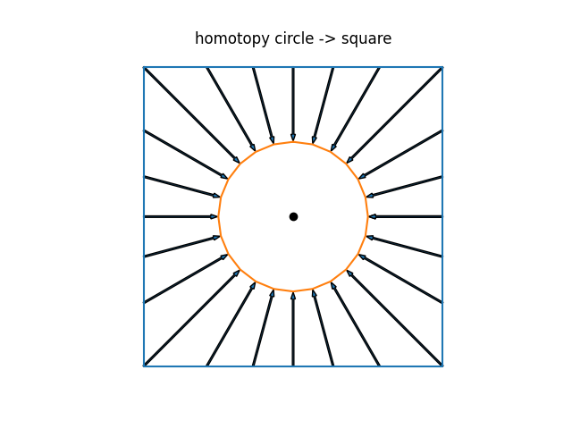
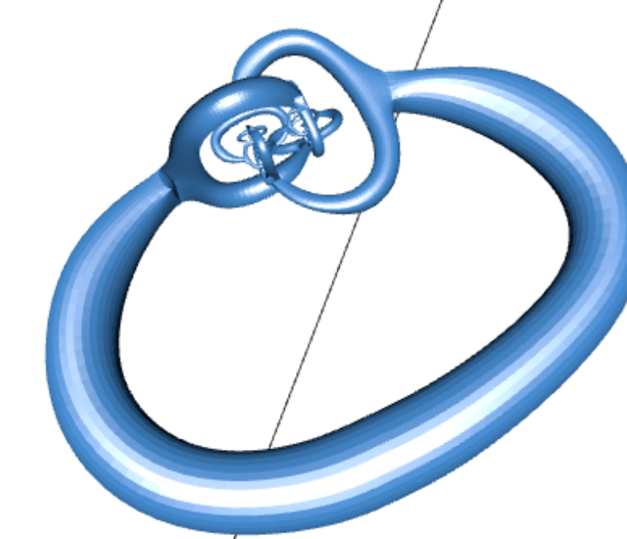
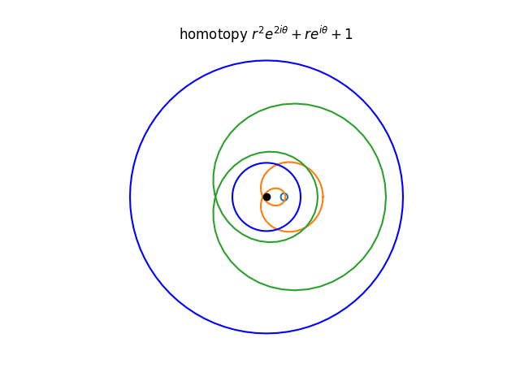
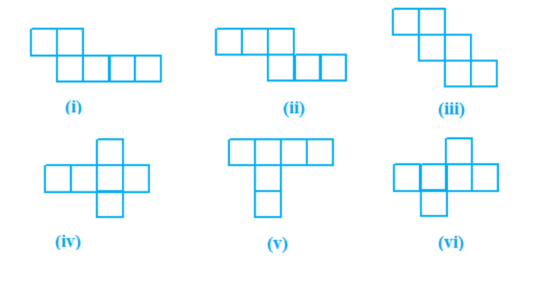
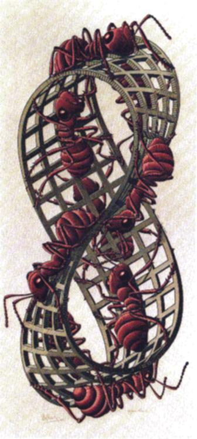
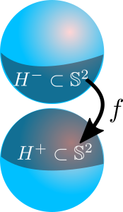
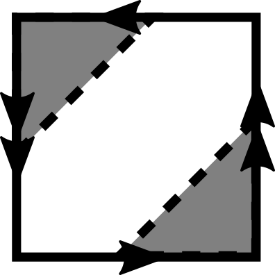
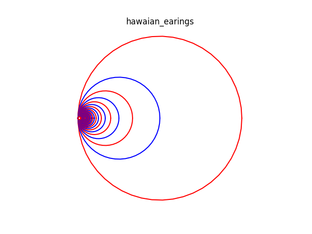
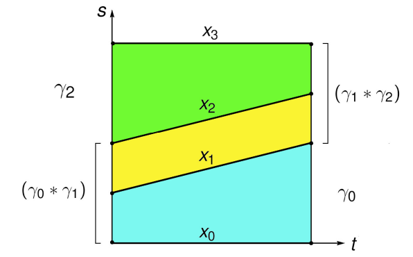

# Algebraic Topology
<!-- _transition: glow -->
greg mc shane

<!-- # -->
<!-- <!-1- _transition: cube -1-> -->

# Plan

- [Caractéristique d'Euler](#caractéristique-d'Euler)
- Indice d'un point par rapport à un lacet
- Revetements
- Groupes, homologie et homotopie

# 

### Acquis

- sphère $\mathbb{S}^n = \{\vec{x} = (x_0\dots x_n) , \|\vec{x}\| = 1  \} \subset \mathbb{R}^{n+1}$

- $\gamma:[0,1] \to \mathbb{C}^*$  courbe paramétrée
- $\gamma(t) = x(t) + iy(t)$
- $\gamma'(t) = \dot{x}(t) + i\dot{y}(t)$ vecteur tangent
- $\gamma$ est un **lacet** ssi $\gamma(0) = \gamma(1)$

#

### Applications continues

- $X$ est un espace topologique, $Y$ est un espace topologique, $f:X \to Y$ est une application continue.
- $f$ est **homéomorphisme** si elle est bijective 
et que $f$ et son inverse $f^{-1}$ sont continues.
- $f$ est **homotope** à $g$ si il existe une application continue
$H:X \times [0,1] \to Y$ telle que $H(x,0) = f(x)$ et $H(x,1) =
g(x)$. 
<!-- On note $f \simeq g$. -->

### Objectif : Classifier les espaces topologiques 
-
    - à homéomorphisme près
    - à homotopie près

#

<!--  -->

### Homeomorphisme

- $f:\text{carré} \to \text{cercle}$
- $\vec{v} \mapsto \frac{\vec{v}}{||\vec{v}||}$

#

<!--  -->

### Homotopie

 $H: (\vec{v},t) \mapsto (1-t)\vec{v} + t \frac{\vec{v}}{||\vec{v}||}$
#

### Cas pathologique I

<!--  -->

Plongement de $\mathbb{S}^1$ dans $\mathbb{R}^2$

[Koch -> triangle homotopie](https://github.com/macbuse/koch/blob/master/tt.gif)

#

- un courbe fermée simple 
= un lacet sans points doubles (auto-intersection)
= plongement de $\mathbb{S}^1$ dans $\mathbb{R}^2$

### **Théorème de Jordan–Schönflies :**
- Si $\gamma$ est une courbe fermée simple  dans le plan,
alors le plan est divisé en exactement deux régions : 
- une **intérieure** **homéomorphe** à un disque ouvert.
- une **extérieure** **homéomorphe** à un disque  épointé

#

### Cas pathologique II
<!--  -->

Plongement de $\mathbb{S}^2$ dans $\mathbb{R}^3$

[horned sphere](https://github.com/macbuse/horned-sphere/blob/master/alexanderSphere2019.stl)

#

### Solides de Platon

- $X \subset \mathbb{R}^3$ est un solide de Platon si $X$ est convexe,
compact et que les faces de $X$ sont des polygones réguliers
identiques.

- $f:\vec{v} \mapsto \frac{\vec{v}}{||\vec{v}||}, X \to
\mathbb{S}^2$ est un homéomorphisme.

#

### Indice d'un point par rapport à un lacet

<!-- **Définition informelle** --> 
= nombre de fois que le lacet s'enroule autour du point [animation](https://commons.wikimedia.org/wiki/File:Winding_Number_Animation_Small.gif?uselang=fr)

<!-- - $\gamma_1:[0,1] \to \mathbb{C}^*, t \mapsto exp(2\pi it)$ --> 
<!-- - $\gamma_2:[0,1] \to \mathbb{C}^*, t \mapsto exp(4\pi it)$ -->
<!-- - $\gamma_3:[0,1] \to \mathbb{C}^*, t \mapsto \exp(2\pi it) + 3\cdot exp(4\pi it)$ -->

|lacet | indice de 0|
|---|---|
|$\gamma_1:[0,1] \to \mathbb{C}^*, t \mapsto exp(2\pi it)$ |1 tour|
|$\gamma_2:[0,1] \to \mathbb{C}^*, t \mapsto exp(4\pi it)$|2 tours|
|$\gamma_3:[0,1] \to \mathbb{C}^*, t \mapsto \exp(2\pi it) + 3\cdot exp(4\pi it)$|2 tours|

#

|lacet | indice de 0|couleur|
|---|---|--|
|$\gamma_1$|1 tour||
|$\gamma_2$|2 tours| noir|
|$\gamma_3$|2 tours| bleu|

# La mauvaise réponse de la maitresse

- [caractéristique d'Euler](https://analysis-situs.math.cnrs.fr/-Caracteristique-d-Euler-Poincare-92-.html)
- **solides de Platon** et les éléments classiques selon le *Timée* de Platon   
- [the 5 elements according to the Timaeus](https://en.wikipedia.org/wiki/Timaeus_(dialogue)#The_elements)

# 

| **Solide**     | **Élément**    | **Description**                                              | **Faces** | **Faces**       | 
|--------------------------|----------------|--------------------------------------------------------------|-----------|---------------------------|
| **Tétraèdre**             | Feu            | Pointu et énergique                 | 4         | Triangle équilatéral       | Transformation, énergie et chaleur             |
| **Cube (Hexaèdre)**       | Terre          | Solide et immuable | 6         | Carré                      |
| **Octaèdre**              | Air            | Léger, mobile,  | 8         | Triangle équilatéral       | 
| **Icosaèdre**             | Eau            | Fluide, coulant et adaptable | 20        | Triangle équilatéral       | 
| **Dodécaèdre**            | Éther (ou Cosmos) | Représentant l’univers et les cieux                        | 12        | Pentagone régulier         | 

# Notes supplémentaires :
- **L’éther** (ou **aether**) était souvent considéré comme le « cinquième élément » ou la **quintessence**, représentant la substance des sphères célestes et du divin.  
- Le **nombre de faces** et leurs propriétés symétriques rendaient ces solides uniques et leur donnaient des correspondances avec les caractéristiques des éléments.  
- Le **dodécaèdre** était particulièrement mystique pour les Grecs, car il symbolisait l’ensemble du cosmos.

# Viruses

To maximise its information, the volume of the protective capsid must be as large as possible, and must be formed by just a few different proteins  and clusters of them are distributed over the polyhedral capsid, as symmetric as possible.

This insight led Watson and Crick to the ‘genetic economy’-proposal that most sphere-like viruses will have an icosahedral capsid because the icosahedron is the Platonic solid with the largest volume and rotational symmetry group. They argued that the capsid is most likely constructed from a single subunit (capsomere), which is repeated many times to form the protein shell.

[Viruses](http://www.neverendingbooks.org/gov-1-geometry-of-viruses/)

# 
- **Définition** Un polyèdre convexe est un **solide de Platon** 
si et seulement si

1. Toutes ses faces sont des polygones 
réguliers convexes isométriques
1. Aucune de ses faces ne se coupe, 
excepté sur les arêtes
1. Le même nombre de faces se rencontre 
à chacun de ses sommets.

<!-- - p = le nombre de côtés de chaque face (ou le nombre de sommets sur chaque face) et -->
<!-- - q = le nombre de faces se rencontrant à chaque sommet (ou le nombre d'arêtes se rencontrant à chaque sommet). -->

#

| Solide Platonicien   | Nombre de Faces | Nombre d'Arêtes | Nombre de Sommets |
|-----------------------|-----------------|------------------|-------------------|
| Tétraèdre             | 4               | 6                | 4                 |
| Cube (Hexaèdre)       | 6               | 12               | 8                 |
| Octaèdre              | 8               | 12               | 6                 |
| Dodécaèdre            | 12              | 30               | 20                |
| Icosaèdre             | 20              | 30               | 12                |
| Sphère             | ???             | ???              | ???
|

# Caractéristique d'Euler

- La caractéristique d'Euler $\chi$ est une **invariante topologique** des polyèdres convexes et d'autres objets géométriques. 

|Formule de la caractéristique d'Euler|
|-------------------------------------|
|$\chi = S - A + F$|

| Où :  |
|-------------------------------------|
| ( S ) est le nombre de sommets (vertices)|
| ( A ) est le nombre d'arêtes (edges) |
| ( F ) est le nombre de faces (faces) |

<!-- - \( S \) est le nombre de sommets (vertices), -->  
<!-- - \( A \) est le nombre d'arêtes (edges), -->  
<!-- - \( F \) est le nombre de faces (faces). -->  

#

Pour un polyèdre convexe, la caractéristique d'Euler vaut toujours $\chi = 2$, conformément au théorème d'Euler.

- Exemple avec un cube (hexaèdre) :  
  S = 8  ,  A = 12  ,   F = 6 .   
En appliquant la formule :  $\chi = S - F+ A = 8 - 12 + 6 = 2$

# Cas des autres polyèdres convexes :

| Solide Platonicien   | Caractéristique d'Euler |
|-----------------------|-----------------|
| **Tétraèdre** | $\chi = 4 - 6 + 4 = 2$  |
| **Octaèdre** | $\chi = 6 - 12 + 8 = 2$  |
| **Dodécaèdre** | $\chi = 20 - 30 + 12 = 2$  |
| **Icosaèdre** | $\chi = 12 - 30 + 20 = 2$  |

La caractéristique d'Euler est aussi utile pour les surfaces plus complexes, mais sa valeur peut varier en fonction de la topologie   (par exemple, pour un tore, $\chi = 0$)

# L'erreur de la maitresse

| Solide Platonicien   | Nombre de Faces | Nombre d'Arêtes | Nombre de Sommets |
|-----------------------|-----------------|------------------|-------------------|
| Cube (Hexaèdre)       | 6               | 12               | 8                 |
| Sphère (maitresse)             | 1|0|0 |
| Sphère (ballon)             | 1|0|1 |
| Sphère (carte)             | 2|1|1 |
| Cercle|0|1|1|

#

# Craster parabolic

#
## indice d'un point par rapport à un lacet

# Definition et formule

Le **indice** d’une courbe fermée $\gamma$ autour de l’origine $(0, 0)$ 
est défini comme le nombre de fois que la courbe s’enroule 
autour de l’origine dans le sens antihoraire. 

La formule pour le "nombre d’enroulements" est :

$$\text{indice} = \frac{1}{2\pi} \int_{\gamma} \frac{x \, dy - y \, dx}{x^2 + y^2}$$

#

- $\gamma$ est donnée sous forme paramétrique par 
- $\gamma(t) = (x(t), y(t))$ pour $t \in [a, b]$, 

<!-- | | -->
<!-- |-------------------------------------| --> 
<!-- |$\text{indice} = \frac{1}{2\pi} \int_{a}^{b} \frac{d\theta(t)}{dt} \, dt$| -->

 $$\text{indice} = \frac{1}{2\pi} \int_{a}^{b} \frac{d\theta(t)}{dt} \, dt$$

où $\theta(t) = \tan^{-1}\left(\frac{y(t)}{x(t)}\right)$ est l’angle polaire du point $(x(t), y(t))$.

$$\frac{d}{dt}\theta(t) =\frac{d}{dt} \tan^{-1}
\left(\frac{y(t)}{x(t)}\right) 
= \frac{\left(\frac{y(t)}{x(t)}\right)' }{1 + \left(\frac{y(t)}{x(t)}\right)^2}

=  \frac{x \dot{y} - y \dot{x}}{x^2 + y^2}$$

#

### Exemple : cercle de rayon $R$

- $\gamma$ est un cercle de centre l'origine, de rayon $R>0$
- $\gamma(t) = R(\cos(t),\sin(t))$ pour $t \in [0,2\pi]$, 
- $\gamma'(t) = (\dot{x},\dot{y}) = R(-\sin(t),\cos(t))$ 

 $$\frac{d}{dt}\theta(t) =  \frac{x \dot{y} - y \dot{x}}{x^2 + y^2} =
\frac{\cos^2(t) + \sin^2(t)}{\cos^2(t) + \sin^2(t)} = 1$$

$$\Rightarrow \text{indice} = \frac{1}{2\pi} \int_{0}^{2\pi} 1\, dt  = 1$$

# 

[animation](https://commons.wikimedia.org/wiki/File:Winding_Number_Animation_Small.gif?uselang=fr)

# 

L'origine de l'indice est une lettre de Gauss à un ami, le
mathématicien allemand Bessel:

$$x\in \mathbb{R}_+,\, \int_1^x \frac{du}{u} = \log(x) \text{ et }
\exp(\log(x)) = x $$
$$z\in \mathbb{C}^*,\,\int_1^z \frac{dw}{w} = \log(z) = \log(|z|) + i\arg(z)$$
<!-- $$\gamma(t) = x(t) + iy(t)$$ --> 

<!-- $$ -->
<!-- \text{indice} = \frac{1}{2\pi i} \int_{a}^{b} \frac{\gamma'(t)}{\gamma(t)} \, dt -->
<!-- $$ -->

<!-- où $\gamma'(t)$ désigne la dérivée de $\gamma(t)$ par rapport à $t$. -->

Cette dernière forme est souvent utilisée en analyse complexe. Elle calcule combien de fois la courbe entoure l’origine en intégrant la dérivée logarithmique de la fonction complexe le long de la courbe.

#

$$z\in \mathbb{C}^*,\,\int_1^z \frac{dw}{w} = \log(z) = \log(|z|) + i\arg(z)$$

- Gauss comprend que l’intégrale,
le logarithme complexe $\log z$, est multivaluée. 
Ceci contraste avec son inverse $\exp(z)$ qui est définie de façon univoque.
- Le graphe de $\arg z$ est un **revetement** de $\mathbb{C}^*$.
<!-- - Le graphes de $\log z$ est une surface de Riemann, un **revetement** de $\mathbb{C}^*$. -->

# 

## D'Alembert Gauss

<!-- - **D'Alembert** a démontré que l'indice est un entier. -->
<!-- - **Gauss** a démontré que l'indice est un entier relatif. -->

- **Théoreme :** Soit $P(z)$ un polynôme complexe non constant. 
Alors $P$ admet une racine dans $\mathbb{C}$. 

- Soient $P(z) = a_nz^n + \cdots + a_1z + a_0$, $R = (n-1)\cdot{\rm max}(|a_0|, \cdots, |a_{n-1}|)\cdot r^{n-1}$
- si $a_0 = 0$, alors $0$ est une racine de $P$. On suppose que $a_0 \neq 0$ 
- On considère le lacet $\gamma_r(t) = P(re^{2\pi it})$ pour $t \in [0,1], r\geq 0$.
    - si $r=0$ alors $\gamma_r$ est constante et l'indice est $0$.
    - si $r$ est suffisamment grand, alors $\gamma_r$ est une courbe fermée contenue dans un anneau $|a_n|r^n - R\leq |z| \leq |a_n|r^n + R$.

#

## Exemple

- $P(z) = z^2 + z + 1$
    - $r=0.2$ bleu clair
    -  $r=2$ orange, 
-  $|a_n|r^n - R\leq |z| \leq |a_n|r^n + R$
- $1 \leq |(2 e^{it})^2 + 2 e^{it} + 1 | \leq 5$

<!--  -->

#

- $r=1$ la courbe rouge 
- $(e^{it})^2 + e^{it} + 1$
passe par l'origine.

# Exercices

[deplier un cube on Wolfram](https://demonstrations.wolfram.com/UnfoldingPolyhedronNets/)

1. Determiner les 4 figures qui se recollent pour former un cube.

1. Trouver les 11 facons de déplier un cube en un plan.

<!-- [solution](https://github.com/TotallyReal/Polyhedron-Nets) -->

#

3. Soit $P(z)$ un polynôme complexe non constant. 
Montrer que $P : \mathbb{C} \to \mathbb{C}$ est surjective.

4. On considere $f: z \mapsto z^2 - z + 1$ de $\mathbb{C} \to \mathbb{C}$.
    - Montrer que l'image de $\exp(it),\, t\in [0,2\pi]$ est une courbe avec un point d'auto-intersection.

# Bibliographie

- [prove me wrong](https://prove-me-wrong.com/mathematical-art/math-visualization-portfolio/)

# D'Alembert Gauss
<!-- _transition: glow -->
greg mc shane

# Homotopies

-  $f$ est **homotope** à $g$ 
s il existe une application continue
$H:X \times [0,1] \to Y$ 
telle que $H(x,0) = f(x)$ et $H(x,1) =
g(x)$. 

1. [keyframes and transitions](https://www.youtube.com/watch?v=VdH4TBDeCnI)
1. [tweening](https://en.wikipedia.org/wiki/Inbetweening)
1. transitions, morphing, interpolation
1. [student project](https://ccrma.stanford.edu/~jacobliu/368Report/index.html)

#

| **Théoreme :**|
|---|
|Soit $P(z)$ un polynôme complexe non constant. 
Alors $P$ admet une racine dans $\mathbb{C}$. |

#

- **Définition :** une application $f:X \to Y$ est **nul homotope** 
si il existe une homotopie $H : X \times [0,1]
\to Y$
telle que $H(x,0) = f(x)$ et $H(x,1) = c$ 
pour une constante $c$.

### Exemple 

- Si $f: X \to \mathbb{R}^n$ est continue, alors $f$ est nul homotope.
- Il suffit de prendre $H(x,t) = (1-t)f(x) + tc$.
- Tout lacet $\gamma:[0,1] \to \mathbb{C}$ est nul homotope.
- Le cercle $\{e^{is}, s\in[02\pi]\}\subset  \mathbb{C}^*$ n'est pas nul homotope.

#

### Encore des definitions

- $H(x,t) = (1-t)x + tc, H: X=\mathbb{R}^n\times [0,1] \to X$
est une **homotopie de rétraction**.
- $X$ est **rétractile** ssi l'application identité est nul homotope.
- $Y$ est **simplement connexe** ssi tout lacet $\gamma:[0,1] \to Y$ est nul homotope.

- $\mathbb{S}^2$ est simplement connexe, $\mathbb{C}^*$ ne l'est pas.
- $\mathbb{S}^2$ n'est pas rétractile.

#

| **Lemme (Cauchy)** |
|---|
|L'indice est invariant par homotopies.|

- $\gamma_0, \gamma_1 : [0,1] \to \mathbb{C}^*$ sont deux courbes fermées, homotopes par un chemin lisse de courbes fermées lisses.
Alors les indices de $\gamma_0$ et $\gamma_1$ sont égaux.

# 

- On suppose que $\gamma_1$ est un cercle de rayon $1$ centré en $0$
parcouru $n$ fois dans le sens trigonométrique.
$$\gamma_1(s) = e^{2\pi i  n s},\,
\dot{\theta(\gamma_1(s) )}
=  \frac{x \dot{y} - y \dot{x}}{x^2 + y^2} = 2\pi n$$
- et que $H(s,t)$ est une homotopie entre $\gamma_0$ et $\gamma_1$ de classe $C^1$.
- $(s,t) \mapsto \dot{\theta(H(s,t))}, [0,1] \times [0,1] \to \mathbb{R}$ est continue.
- $[0,1] \times [0,1]$ est compact, donc $\dot{\theta}$ est uniformément continue.

<!-- = (1-t)\gamma_0(s) + t\gamma_1(s)$ est une homotopie. -->
<!-- = \frac{\left(\frac{y(s)}{x(s)}\right)' }{1 + \left(\frac{y(s)}{x(s)}\right)^2} -->

#

- Pour tout $0< \epsilon <2\pi$, il existe $\delta > 0$ tel que
$|s - s'| + |t - t' | < 2\delta \Rightarrow | \dot{\theta(H(s,t))} - \dot{\theta(H(s',t'))} | < \epsilon$
    - $\Rightarrow \;\;\;\;\;\;\;|t - t' | < 2\delta \Rightarrow | \dot{\theta(H(s,t))} - \dot{\theta(H(s,t'))} | < \epsilon$

- Pour $\delta$ assez petit:
- $| Ind(\gamma_t) - Ind(\gamma_{t+\delta}) |$
 $= \frac{1}{2\pi} | \int_0^1 \dot{\theta(\gamma_t(s))} ds - \int_0^1 \dot{\theta(\gamma_{t + \delta}(s))} ds |$
$\leq \frac{1}{2\pi}\int_0^1 |\dot{\theta(\gamma_t(s))} -  \dot{\theta(\gamma_{t +
\delta}(s))} |ds$
$< \frac{1}{2\pi}\int_0^1 \epsilon ds 
< 1$ 

# 

<!-- - **D'Alembert** a démontré que l'indice est un entier. -->
<!-- - **Gauss** a démontré que l'indice est un entier relatif. -->

- **Théoreme :** Soit $P(z)$ un polynôme complexe non constant. 
Alors $P$ admet une racine dans $\mathbb{C}$. 

- Soient $P(z) = a_nz^n + \cdots + a_1z + a_0$, $R = (n-1)\cdot{\rm max}(|a_0|, \cdots, |a_{n-1}|)\cdot r^{n-1}$
- si $a_0 = 0$, alors $0$ est une racine de $P$. On suppose que $a_0 \neq 0$ 
- On considère le lacet $\gamma_r(s) = P(re^{2\pi is})$ pour $s \in [0,1], r\geq 0$.
    - si $r=0$ alors $\gamma_r$ est constante et l'indice est $0$.
    - si $r$ est suffisamment grand, alors $\gamma_r$ est une courbe fermée contenue dans un anneau $|a_n|r^n - R\leq |z| \leq |a_n|r^n + R$.

#

## Exemple

- $P(z) = z^2 + z + 1$
    - $r=0.2$ bleu clair
    -  $r=2$ orange, 
<!-- -  $|a_n|r^n - R\leq |z| \leq |a_n|r^n + R$ -->
- $1 \leq |(2 e^{is})^2 + 2 e^{is} + 1 | \leq 7$
- $|P(2e^{is})  - 4 e^{2is}|=  | 2 e^{is} + 1 | \leq 3$
- $H(s,t) = 2 ((e^{is})^2 + (1-t)(2 e^{is} + 1)$

<!--  -->

#

- $|P(2e^{is})  - 4 e^{2is}|=  | 2 e^{is} + 1 | \leq 3$
- $H(s,t) = (2 e^{is})^2 + (1-t)(2 e^{is} + 1)$
    - $1 \leq |H(s,t)| \leq 7$
    - $H(s,0) = P(2e^{is})$
    - $H(s,1) = 4 e^{2is}$

$\Rightarrow$ l'indice de $H(s,t)$ est $2$.

#

- $r=1$ la courbe rouge 
- $(e^{it})^2 + e^{it} + 1$
passe par l'origine.

# Animations

(the proxy is too slow)

- [homotopy](https://htmlpreview.github.io/?https://github.com/macbuse/ALG_TOP/blob/master/SCRIPTS/Homotopy_to_a_circle.html)
- [not homotopy](https://htmlpreview.github.io/?https://github.com/macbuse/ALG_TOP/blob/master/SCRIPTS/Homotopy_to_a_circle.html)
<!-- https://htmlpreview.github.io/? -->

#

### Exos
1. Montrer que la sphère $\mathbb{S}^2$ est simplement connexe.
    - Projection stéréographique
    - Courbe de Peano
1.  Montrer que la courbe est nul homotope.

<!--  -->
<!--  -->

# Revêtements

$$z \mapsto \exp(z), \mathbb{C} \to \mathbb{C}^*$$
$$z \mapsto z^2, \mathbb{C}^* \to \mathbb{C}^*$$

#

- Une **application de revêtement** (ou **revêtement topologique**) est un type de fonction continue entre espaces topologiques qui, intuitivement, représente une version « dépliée » ou « en couches » d’un espace. 

- $p: \tilde{X} \to X$ surjective est appelée **application de revêtement** 
 si, pour tout point $x \in X$, il existe un voisinage ouvert $U \subset X$ (appelé **voisinage trivialisant**) tel que $p^{-1}(U)$ soit une union disjointe d'ouverts de $\tilde{X}$, chacun étant envoyé **homéomorphiquement** sur $U$ par $p$.  

- **L’application exponentielle** : $p: \mathbb{C} \to \mathbb{C}^*$ définie par $p(z) = e^{2\pi i z}$ est une application de revêtement où chaque point de $S^1$ possède une infinité de préimages.  

#

### Propriétés clés :  
1. **Structure localement homéomorphe** : Autour de chaque point de $X$, l’image réciproque sous $p$ ressemble à plusieurs « copies » d’un voisinage de $X$.  
2. **Fibres discrètes** : L’image réciproque $p^{-1}(x)$ est un **ensemble discret** de points.  
3. **Uniformité** : Le nombre de préimages de chaque point est constant sur les composantes connexes de $X$, supposant que $\tilde{X}$ est connexe.  

#

### Exemples :  
1. **L’application exponentielle** : La fonction $p: \mathbb{R} \to S^1$ définie par $p(t) = e^{2\pi i t}$ est une application de revêtement du réel $\mathbb{R}$ sur le cercle unité $S^1$, où chaque point de $S^1$ possède une infinité de préimages.  
2. **Le revêtement du tore sur la bouteille de Klein** : Le tore $\mathbb{T}^2 = \mathbb{R}^2 / \mathbb{Z}^2$ est un revêtement double de la bouteille de Klein.  
3. **Revêtement ramifié (non régulier)** : Une application comme $p: \mathbb{C} \to \mathbb{C}$, définie par $p(z) = z^n$, n'est pas un véritable revêtement car elle échoue à être localement homéomorphe en $z = 0$, où plusieurs « feuilles » fusionnent.  

#

2. **Le revêtement du tore sur la bouteille de Klein** : Le tore $\mathbb{T}^2 = \mathbb{R}^2 / \mathbb{Z}^2$ est un revêtement double de la bouteille de Klein.  

- [asteroids](https://en.wikipedia.org/wiki/Asteroids_(video_game))
- [play](https://www.echalk.co.uk/amusements/Games/asteroidsClassic/ateroids.html)

#

### Espaces quotients
- On considère un espace topologique Y ainsi que relation
d’équivalence ∼ entre les points de Y. On note
$p : Y \rightarrow Y/∼$
la surjection canonique de Y sur son espace quotient.
- On définit une topologie sur Y/∼ en décrétant que 
$U \subset Y/∼$ est ouvert si $p^{-1}(U) \subset Y$ est ouvert
- Pour cette topologie, la surjection canonique p est
tautologiquement continue.

#

- L’espace quotient Y/∼ n’est pas nécessairement séparé.
- Un espace topologique est dit SÉPARÉ si tout couple de
points distincts admet des voisinages disjoints.
- Le **saturé** d’un ensemble F ⊂ Y est l’ensemble
$p^{-1}(p(F))$, c’est-à-dire tous les points de Y qui sont en
relation par ∼ à un point de F.
- La relation d’équivalence ∼ est dite FERMÉE si le saturé
de toute partie fermée est fermée.

| Propriété |
|---|
| Si Y est compact et la relation d’équivalence ∼ fermée   alors Y/∼ est séparé.|
#

| Propriété |
|---|
| Si Y est compact et la relation d’équivalence ∼ fermée   alors Y/∼ est séparé.|

**Exemples**

- $H < G$ un sous-groupe fermé de $G$ 
 $x \sim y  \Leftrightarrow x^{-1}y \in H$
alors $G/H$ est séparé.
- $\mathbb{R}/\mathbb{Z} = \mathbb{S}^1$ est séparé.
- $\mathbb{R}^n/\mathbb{Z}^n = \mathbb{T}^n$ est séparé.
- $\mathbb{R}/\mathbb{Q}$ n'est pas séparé.

# 

### Espaces quotients

- La compacité est une hypothèse contraignante. 
Elle peut être remplacée par une propriété plus faible, 

- **Définition.** Un espace topologique X est dit *localement
compact* 
    1. s’il est séparé 
    1. et si tout point x élément de X admet un voisinage compact (autrement dit si x appartient à un ouvert relativement compact)

- Exemples. Sont relativement compacts, tous les
compacts, tous les espaces homéomorphes à $\mathbb{R}^n$ , toutes
les variétés topologiques, tous les espaces discrets.

# 
Propriété bis (rappel).– Si Y est relativement compact et
la relation d’équivalence ∼ fermée alors Y/∼ est séparé.

#

- **Proposition de transfert de continuité au quotient.**
Soit f : Y → Z une application continue telle que 
pour tout $(y_1, y_2) \in Y$  on ait $y_1 ∼ y_2 \Rightarrow   f(y_1) = f(y_2)$
Alors l’application $\bar{f} : Y/∼ \,\rightarrow   Z$ donnée par $\bar{f}([y]) = f(y)$ 
est bien définie et continue.

- **Démonstration.** Le caractère bien défini provient du fait
que f est constante sur chaque classe d’équivalence.
- Soit U un ouvert de Z. L’image réciproque $\bar{f}^{-1}(U) \subset Y/~$ est  ouvert  si et seulement si $p^{−1}(\bar{f}^{−1}(U)) \subset Y$ est ouvert. 
Or par construction :
$p^{−1}(\bar{f}^{−1}(U)) = (\bar{f}\circ p)^{−1}(U) = f^{−1}(U)$ est ouvert car f continue.

#
### Exemple : le cercle $\mathbb{S}^1$

- Soit Y = [0, 1] et ∼ la relation d’équivalence définie par
    - x ∼ y ⇔ x = y ou x = 0 et y = 1 ou x = 1 et y = 0.

| proposition |
|---|
| L’espace quotient Y/∼ est homéomorphe au cercle $\mathbb{S}^1$.|

- **Démonstration.** L’application $f : Y \rightarrow    \mathbb{S}^1$ définie par 
f(x) = exp(2iπx) est continue et constante sur les classes
d’équivalence. Elle induit donc une application continue.

#

- Soit Y un espace topologique et soit $A \subset Y$. 
On considère la relation d’équivalence suivante
$$y_1 ∼ y_2 \Leftrightarrow y_1 = y_2 \text{ ou } (y_1, y_2) \in A$$

- L’espace quotient Y/∼ est donc formé 
    - de la classe [a] où a ∈ A 
    - et des classes d’équivalence [y] avec y ∈ Y \ A.

- **Définition**.– L’espace quotient est noté Y/A et est appelé espace quotient de $Y$ par $A$.

#

- Soient X et Y deux espaces topologiques, A ⊂ Y et
f : A → X une application continue. 
On définit une relation d’équivalence ∼ 
sur la somme disjointe $Z = X \sqcup Y$ par $z_1 ∼ z_2$

- si $z_1 = z_2$
- ou $(z_1 ∈ A \text{ et } z_2 = f(z_1))$
- ou $(z_2 ∈ A \text{ et } z_1 = f(z_2))$

- **Définition**– L’espace quotient est noté $X \cup_f Y = X \sqcup Y/∼$
et s’appelle le RECOLLEMENT DE X À Y LE LONG DE f.

# Exercices

# Bibliographie

- [prove me wrong](https://prove-me-wrong.com/mathematical-art/math-visualization-portfolio/)

#

### Exos
1. Montrer que la sphère $\mathbb{S}^2$ est simplement connexe.
    - Projection stéréographique
    - Courbe de Peano
1.  Montrer que la courbe est nul homotope.
1.  [11 nets de cubes](https://www.open.edu/openlearncreate/mod/oucontent/view.php?id=153807&section=2.5)

<!--  -->
<!--  -->

#

1. revetements
1. quotients
1. recollement

- **IMPORTANT :** $X$ est toujours un espace topologique  **separé**
 càd tout couple de points distincts admet des voisinages disjoints.

# 

<!-- _transition: cube -->

### Compacité

- La compacité est une hypothèse **contraignante**.
Elle peut être remplacée par une propriété plus faible, 

- **Définition.** Un espace topologique X est dit **localement
compact**
    1. s’il est séparé 
    1. et si tout point x élément de X admet un voisinage compact (autrement dit si x appartient à un ouvert relativement compact)

- **Exemples :** Sont localement compacts, tous les
compacts, tous les espaces homéomorphes à $\mathbb{R}^n$. 

# Shape of the world

<!-- _transition: slide -->

#

<!-- _transition: slide -->

# ... shape of the universe

<!-- _transition: slide -->
- compact ? ouvert ? simplement connexe ? plat ?

[shape of the universe](https://en.wikipedia.org/wiki/Shape_of_the_universe)
- In a universe with **zero curvature**, the local geometry is flat. The most familiar such global structure is that of Euclidean space, which is infinite in extent. Flat universes that are finite in extent include the **torus** and **Klein bottle.** 
- In three dimensions, there are 10 finite compact flat 3-manifolds, of which 6 are orientable and 4 are non-orientable.

#
<!-- _transition: cube -->

-  Flat universes that are finite in extent include the torus and Klein bottle. Moreover, in three dimensions, there are 10 finite closed flat 3-manifolds, of which 6 are orientable and 4 are non-orientable.

- [J. Weeks dodecahedral space](https://arxiv.org/abs/astro-ph/0310253)
- [Wiki page](https://fr.wikipedia.org/wiki/Espace_dod%C3%A9ca%C3%A9drique_de_Poincar%C3%A9)

# Revêtements

<!-- _transition: slide -->

|application|symmetrie|
|---|---|
|$z \mapsto \exp(z), \mathbb{C} \to \mathbb{C}^*$| $z \mapsto z + 2\pi i$ |
|$z \mapsto z^2, \mathbb{C}^* \to \mathbb{C}^*$| $z \mapsto -z$|

#

**Définition :**
- Une **application de revêtement** (ou **revêtement topologique**) est un type de fonction continue entre espaces topologiques qui, intuitivement, représente une version « dépliée » ou « en couches » d’un espace. 

- $p: \tilde{X} \to X$ surjective est appelée **application de revêtement** 
 si, $\forall x \in X, \exists U_x \subset X$ un voisinage ouvert (**voisinage trivialisant**) tel que $p^{-1}(U_x)$ soit une union disjointe d'ouverts de $\tilde{X}$, chacun étant envoyé **homéomorphiquement** sur $U_x$ par $p$.  

<!-- - $p: \tilde{X} \to X$ surjective est appelée **application de revêtement** --> 
<!--  si, pour tout point $x \in X$, il existe un voisinage ouvert $U \subset X$ (appelé **voisinage trivialisant**) tel que $p^{-1}(U)$ soit une union disjointe d'ouverts de $\tilde{X}$, chacun étant envoyé **homéomorphiquement** sur $U$ par $p$. -->  

#

### Exemples
- $z \mapsto e^{2\pi i z}, \mathbb{C} \to \mathbb{C}^*$ est une application de revêtement où chaque point possède une infinité de préimages.  
- $n \neq 0$
  - $z \mapsto z^n, \mathbb{C}^* \to \mathbb{C}^*$ est une application de revêtement où chaque point possède exactement $n$ préimages.
- $n \neq 0,\pm 1$
  - $z \mapsto z^n, \mathbb{C} \to \mathbb{C}$ 
n'est pas un véritable revêtement car elle échoue à être localement homéomorphe en $z = 0$, où plusieurs « feuilles » fusionnent autrement dit $0$ n'as pas de voisinage trivialisant 
  ( **revêtement ramifié** )

#

### Exercices

1. Completer le tableau suivant

|  $f$|$\tilde{X}\to X$|$f^{-1}(re^{i\theta})$                                     | vois triv |
|--------------------------------|--------------------------|---------------------------------------------------------------|-----------------------------------------|
| $e^{z}$  | $\mathbb{C} \to \mathbb{C}^*$  | $\log(r) + i(\theta + 2\pi  k), k\in \mathbb{Z}$                      |   |
| $z^n$           | $\mathbb{C}^* \to \mathbb{C}^*$ |  | |

<!-- | $z^n$           | $\mathbb{C}^* \to \mathbb{C}^*$ | $e^{2\pi i (\theta +  k)/n},\, 0 \leq k \leq n-1$ | | -->

2. Montrer que $0$ ne possede pas de voisinage trvilisant pour $z \mapsto z^n, \mathbb{C} \to \mathbb{C}$.

#

### Propriétés clés :  
1. **Structure localement homéomorphe** : Autour de chaque point de $X$, l’image réciproque sous $p$ ressemble à plusieurs « copies » d’un voisinage de $x$
2. **Fibres discrètes** : L’image réciproque $p^{-1}(x)$ est un **ensemble discret** de points.  
3. **Uniformité** : Le nombre de préimages de chaque point est constant sur les composantes connexes de $X$, supposant que $\tilde{X}$ est connexe.  

- **Définition** $X$ est connexe $\text{card}(p^{-1}(x))=$  degré du revêtement.

# 

### Principe

- $\{ \tilde{X} \text{ revetements de X} \} \longleftrightarrow \{ \text{sous-groupes }
 H < \pi_1(X) \}$
    - $\pi_1(X)$ est **le groupe fondamental de $X$.**
$:=\{ \text{lacets } \gamma, \gamma(0) = x_0 \}/\text{homotopies}= \{ [\gamma] \}$
    - $[\gamma_0] = [\gamma_1] \Leftrightarrow \exists H(s,t),$
    $H(0,t) = \gamma_0(s), H(1,t) = \gamma_1(s)$

- $\pi_1(X)$ est un invariant topologique de $X$.
    - $\pi_1(\mathbb{C}^*) \simeq \pi_1(\mathbb{S}^1) \simeq \mathbb{Z}$
    - $\pi_1(\mathbb{S}^2)$ comme pour tout espace 
    simplement connexe est trivial.
#

<!-- _transition: cube -->
### Exemples 

- Tout revetement de $\mathbb{S}^2$ est homéomorphe à $\mathbb{S}^2$.
- Le cylindre $\mathbb{S}^1 \times \mathbb{R}$ est un revêtement du tore  $\mathbb{T}^2 = \mathbb{S}^1\times \mathbb{S}^1$.
- L'anneau est  revetement double d'une bande de Möbius (model ??)
- Le tore $\mathbb{T}^2 = \mathbb{R}^2 / \mathbb{Z}^2$ est revêtement double de la bouteille de Klein.  

- [video game asteroids](https://en.wikipedia.org/wiki/Asteroids_(video_game)) and  [play](https://www.echalk.co.uk/amusements/Games/asteroidsClassic/ateroids.html) and [abel douzal](https://arxiv.org/pdf/2306.02041)

# Espace quotient I

<!-- _transition: cube -->

#

<!-- _transition: slide -->
- **Definition :** une **relation d'équivalence** $(\sim)$ 
sur un ensemble $X$ est une relation binaire 
qui satisfait les 3 propriétés suivantes $\forall x, y, z \in X$ :  

1. **Réflexivité** : $x \sim x$ 
1. **Symétrie** : si $x \sim y$, alors $y \sim x$ 
1. **Transitivité** : Si $x \sim y$ et $y \sim z$, alors $x \sim z$ 

- Une relation d'équivalence divise $X$ en **classes d'équivalence**$[x]:= \{ y\in X, y \sim x\}$, 
Les classes forment un **ensemble quotient** 
$X / \sim\, :=\{[x],\, x\in X \}$.

#
<!-- _transition: cube -->
### Exemples

1. $X = \mathbb{Z}$, $x \sim y \Leftrightarrow x - y \in 2\mathbb{Z}$
1. $X = \mathbb{R}$, $x \sim y \Leftrightarrow x - y \in \mathbb{Z}$
1. $X = G$ un groupe, $H < G$ un sous-groupe, $x \sim y \Leftrightarrow
x^{-1}y \in H$
1. $X = \mathbb{S}^2$ et $x \sim y \Leftrightarrow x = y$ 
    1. ou $x$ et $y$ sont dans l'hemisphère sud.
    1. ou $x$ et $y$ sont dans l'equateur.

#

<!-- _transition: cube -->
### Espace quotient
- On considère un espace topologique Y ainsi que relation
d’équivalence ∼ entre les points de Y. On note
$p : Y \rightarrow Y/∼$
la surjection canonique de Y sur son espace quotient.
- On définit une topologie sur Y/∼ en décrétant que 
$U \subset Y/∼$ est ouvert si $p^{-1}(U) \subset Y$ est ouvert
- Pour cette topologie, la surjection canonique $p$ est
**tautologiquement continue.**

#

<!-- _transition: slide -->
## 4 types d'espaces quotients

1. quotient par un sous ensemble $A \subset Y$.
1. recollement de $X$ à $Y$ le long de $f$.
1. quotient par un groupe d'homéomorphismes.
1. suspension d'un homéomorphisme.

#

<!-- _transition: cube -->
- Soit Y un espace topologique et soit $A \subset Y$. 
On considère la relation d’équivalence suivante
$y_1 ∼ y_2 \Leftrightarrow y_1 = y_2 \text{ ou } (y_1, y_2) \in A$

- L’espace quotient Y/∼ est donc formé 
    - de la classe [a] où a ∈ A 
    - et des classes d’équivalence [y] avec y ∈ Y \ A.

- **Définition**.– L’espace quotient est noté Y/A 
et est appelé **espace quotient de $Y$ par $A$.**

-  **Exemple(s)** : $X = \mathbb{S}^2$ et 
    1. $A$ = l'equateur.
    1. $A$ = l'hemisphère sud.

#
<!-- _transition: cube -->

-  **Exemple(s)** : $X = \mathbb{S}^2$ et 
    1. $E$ = l'equateur.
    1. $H$ = l'hemisphère sud.

#
<!-- _transition: slide -->

-  **Exemple(s)** : $X = \mathbb{S}^2$ et 
    1. $E$ = l'equateur.

### Not right!!!!

#

<!-- _transition: cube -->

-  **Exemple(s)** : $X = \mathbb{S}^2$ et 
    1. $E$ = l'equateur.
    1. $H$ = l'hemisphère sud.

#

<!-- _transition: slide -->
- Soient X et Y deux espaces topologiques,
$A \subset Y$ et $f : A \to X$ une application continue. 
On définit une relation d’équivalence ∼ 
sur la somme disjointe $Z = X \sqcup Y$ par $z_1 ∼ z_2$

- si $z_1 = z_2$
 ou $(z_1 ∈ A \text{ et } z_2 = f(z_1))$
 ou $(z_2 ∈ A \text{ et } z_1 = f(z_2))$

- **Définition**– L’espace quotient est noté $X \cup_f Y = X \sqcup Y/∼$
et s’appelle le **recollement de $X$ à $Y$ le long de f.**

#

<!-- _transition: cube -->

<!--  -->
-  **Exemple** : somme connexe de deux spheres
    - $H^-$ = l'hemisphère sud 
    - $H^+$ = l'hemisphère nord 

#
<!-- _transition: cube -->

-  **Exemple** : somme  de deux spheres
    - $H^-$ = l'hemisphère sud 
    - $H^+$ = l'hemisphère nord 

= **the double bubble**

# Exercices

1. Démontrer la proposition : 

| Propriété |
|---|
| Si Y est compact et la relation d’équivalence ∼ fermée   alors Y/∼ est séparé.|

1. 

# Quotients II

#

<!-- _transition: slide -->
## 4 types d'espaces quotients

1. quotient par un sous ensemble $A \subset Y$.
1. recollement de $X$ à $Y$ le long de $f$.
1. quotient par un groupe d'homéomorphismes.
1. suspension d'un homéomorphisme.

#

<!-- _transition: slide -->
### Exemple : action d'un groupe

<!-- Propriété bis (rappel).– Si Y est relativement compact et -->
<!-- la relation d’équivalence ∼ fermée alors Y/∼ est séparé. -->

- Soient $X$ un espace muni d'une action d'un groupe $G$ 
par homéomorphisme. L'action est :

- **libre** si pour tout $x \in X$,
$g \in G$ on a $g \neq e \Rightarrow g.x \neq x$.
- **propre** si pour tout compact $K \subset X$,
l'ensemble $\{g \in G, g.K \cap K \neq \emptyset\}$ est compact (fini).
- **l'orbite de $x$ sous $G$** est noté $G\cdot x := \{g.x, g \in G\}$.
- **les orbites de l'action** noté $G/X$ est l'espace quotient de $X$ par $G$.

#

<!-- _transition: slide -->
- L’espace quotient Y/∼ n’est pas nécessairement séparé.
- Un espace topologique est dit **séparé** si tout couple de
points distincts admet des voisinages disjoints.
- Le **saturé** d’un ensemble F ⊂ Y est l’ensemble
$p^{-1}(p(F))$, c’est-à-dire tous les points de Y qui sont en
relation par ∼ à un point de F.
- La relation d’équivalence ∼ est dite **fermée** si le saturé
de toute partie fermée est fermée.

| Propriété |
|---|
| Si Y est compact et la relation d’équivalence ∼ fermée   alors Y/∼ est séparé.|

#

<!-- _transition: cube -->
| Propriété |
|---|
| Si Y est compact et la relation d’équivalence ∼ fermée   alors Y/∼ est séparé.|

**Exemples**

- $H < G$ un sous-groupe fermé de $G$ 
 $x \sim y  \Leftrightarrow x^{-1}y \in H$
alors $G/H$ est séparé.
- $\mathbb{R}/\mathbb{Z} = \mathbb{S}^1$ est séparé.
- $\mathbb{R}^n/\mathbb{Z}^n = \mathbb{T}^n$ est séparé.
- $\mathbb{R}/\mathbb{Q}$ n'est pas séparé.

# Le cercle $\mathbb{S}^1$

- Soit Y = [0, 1] et ∼ la relation d’équivalence définie par
    - x ∼ y ⇔ x = y ou x = 0 et y = 1 ou x = 1 et y = 0.

| proposition |
|---|
| L’espace quotient Y/∼ est homéomorphe au cercle $\mathbb{S}^1$.|

- **Démonstration.** L’application $f : Y \rightarrow    \mathbb{S}^1$ définie par 
f(x) = exp(2iπx) est continue et constante sur les classes
d’équivalence. Elle induit donc une application continue.

# Ruban de Möbius

<!-- _transition: cube -->
<!-- -  l'anneau $X = \{ z \in \mathbb{C}, 1/2 \leq |z| \leq  2\}$ --> 
<!-- est un revêtement double du ruban de Möbius --> 
<!-- - $G = \langle  z\mapsto 1/z \rangle$ est un groupe de homéomorphismes de $X$. -->

- bande $X = \{-1 < \text{Im }(z) < 1\}\subset \mathbb{C}$ (pas un groupe)
- $G = \langle g:z \mapsto \bar{z} + 2\pi  \rangle$ est un groupe de homéomorphismes de $X$.
    - $X/G$ est un ruban de Möbius 
    - $X/H,\,H= \langle g^2 \rangle$ un cylindre.
- take a paper strip and twist it once before joining the ends.

$$
\begin{matrix}
  X &  &  \\
  \downarrow{p_H} & \searrow{p_G}  &\\ 
 X/H  \xrightarrow{\bar{p}} & X/G
\end{matrix}
\;p_G = \bar{p}\circ p_H$$  

# 
#### My mother's mirrors
<!-- _transition: cube -->

- The infinity mirror (also sometimes called an infinite mirror) is a configuration of two or more parallel or angled mirrors, which are arranged to create a series of smaller and smaller reflections that appear to recede to infinity.
    - [wiki](https://en.wikipedia.org/wiki/Infinity_mirror)
    - [flat universe](https://www.youtube.com/watch?v=QcLfb0PhfO0&t=623s)

#

## Le plan projectif

- Le plan projectif réel $\mathbb{RP}^2$ est l’espace quotient de
$\mathbb{R}^3 \setminus \{0\}$ par la relation d’équivalence ∼
définie par :
$$x ∼ y \Leftrightarrow x = λy, λ > 0$$

- L’espace quotient $\mathbb{RP}^2$ est homéomorphe à la 
'espace quotient de sphère $\mathbb{S}^2$  par l’antipodalité.

#

- **Proposition de transfert de continuité au quotient.**
Soit f : Y → Z une application continue telle que 
pour tout $(y_1, y_2) \in Y$  on ait $y_1 ∼ y_2 \Rightarrow   f(y_1) = f(y_2)$
Alors l’application $\bar{f} : Y/∼ \,\rightarrow   Z$ donnée par $\bar{f}([y]) = f(y)$ 
est bien définie et continue.

$$
\begin{matrix}
  Y & &  \\
  \downarrow{\pi} & \searrow{f}  &\\ 
Y / \sim & \xrightarrow{\bar{f}} & Z
\end{matrix}
\;f = \bar{f}\circ \pi$$  

#

- **Démonstration.** Le caractère bien défini provient du fait
que f est constante sur chaque classe d’équivalence.
- Soit U un ouvert de Z. L’image réciproque $\bar{f}^{-1}(U) \subset Y/~$ est  ouvert  si et seulement si $\pi^{−1}(\bar{f}^{−1}(U)) \subset Y$ est ouvert. 
Or par construction $f = \bar{f}\circ \pi$  :
$$\pi^{−1}(\bar{f}^{−1}(U)) = (\bar{f}\circ \pi)^{−1}(U) = f^{−1}(U)$$
- est **ouvert** car f **continue**. $\Box$

# 

## Suspension d'un homéomorphisme

- **Définition.** Soit $f : X \rightarrow X$ un homéomorphisme.
La suspension de f est l’espace quotient de $X \times [0, 1]$ 
par la relation d’équivalence ∼ définie par :
$$(x, 0) ∼ (f(x), 1)$$

# Exercices

1. Montrer que à homotopy près, il y a exactement 2 homéomorphismes de l'intervalle $[0, 1]$ dans lui-même qui fixent les
extrémités. Et $\mathbb{S}^1$ ?

1. Montrer que le ruban de mobius est la suspension d'un
   homéomorphisme de l'intervalle.

1. Démontrer la proposition : 

| Propriété |
|---|
| Si Y est compact et la relation d’équivalence ∼ fermée   alors Y/∼ est séparé.|

#

Pour les courbes dans la figure ci-dessous, 
1. dire si l'application $z \mapsto z/|z|$ est un revetement sur lecercle.
1. si oui calculer le degré 

#

- Un graphe est le donnée d'un ensemble de sommets $V$ et d'un
ensemble d'arêtes $E$.
Soient $p:\tilde{X} \rightarrow X$ un revêtement ou $X$ est une surface (tore, sphere, bouteille de Klein etc) et $\Gamma\subset X$ un graphe plongé dans $X$ de sorte que le complementaire de $\Gamma$ dans $X$ est une réunion de disques ouverts.

- Justifier la formule suivante :

$$\chi(\tilde{X}) = \text{degré de p} \times \chi(X)$$

#

Regarder les vidéos suivantes :

1. [crosscap video](https://www.youtube.com/watch?v=gx7P8lf6JXQ)

1. [crosscap](https://www.youtube.com/watch?v=RV-0uao7RdY)

#

- Calculer le caractère d'Euler du carré avec les identifications.

- On admet que le premier carré avec les identifications est
homéomorphe à un tore.

- Quelle est la nature topologique du second carré avec les
identifications ? et du troisième ?

#

Découper et faire les identifications suivantes :

# Complexes
<!-- _transition: glow -->
greg mc shane

#

- Hatcher pp 110 (pdf)
- Exo recollement du carré pp 111 (pdf)

1. Simplicial complexes
1. CW-complexes
1. [exos](./exos_simplicial.pdf)

# Simplicial Complexes

[examples](https://www.google.com/search?sca_esv=6fe806cc0ee527f3&rlz=1CARGFB_enFR1045FR1045&sxsrf=AHTn8zpQKuoBL19lt_5sBH4RyrcqbCkWsQ:1739903884191&q=simplicial+complexes&udm=2&fbs=ABzOT_CWdhQLP1FcmU5B0fn3xuWpA-dk4wpBWOGsoR7DG5zJBr1qLlHFB6ZBcx-Arq68_wc6NXO-nGlA3Ez9ZCbR-p2q5Xyuflpa2GIzOHuZ2yzzMC6M16uJyoElFnWbazryb4-qpeOV-ae4bedTiIOAuMRemV38jVBPHLD3RKDlHlVE9hn1PNw&sa=X&ved=2ahUKEwizi9eH782LAxUrV6QEHQSlDFQQtKgLegQIGRAB#vhid=0nsdpvV6a5dQMM&vssid=mosaic)

<!-- # -->
<!-- <!-1- _transition: cube -1-> -->

# Définition $n$-simplexe

Un **simplexe** est le type de polytope le plus simple dans une dimension donnée. Plus précisément, un simplexe est l'enveloppe convexe de  $\{ p_0,\ldots p_n\}$ points affinement indépendants dans $\mathbb{R}^n$. Il généralise la notion de triangle ou de tétraèdre à des dimensions arbitraires.

- **Simplexe de dimension 0** : Un point  
- **Simplexe de dimension 1** : Un segment de droite  
- **Simplexe de dimension 2** : Un triangle  
- **Simplexe de dimension 3** : Un tétraèdre  
- **Simplexe de dimension $n$** : Un $n$-simplexe avec $n+1$ sommets

#

- **sommets** : Les points $p_0,\ldots p_n$ sont appelés les Sommets
- **faces** : Les faces d'un simplexe sont les sous-ensembles de ses sommets. Par exemple, un tétraèdre a 4 faces : les triangles formés par 3 sommets.
- **le $n$-simplexe standard** est l'ensemble des points
$(x_0,\ldots,x_n)\in \mathbb{R}^n$ tels que $\sum x_i = 1$ et $x_i \geq 0$ pour tout
$i$.

# 

### Définition : Complexe simplicial  
- Un **complexe simplicial** $K$ est une famille de simplexes
qui satisfait les deux conditions suivantes :
1. **Fermeture par faces** : Si un simplexe $\sigma \in K$, alors toutes les faces de $\sigma$ appartiennent également à $K$. Une face d’un simplexe est tout sous-ensemble de ses sommets.
2. **Propriété d’intersection** : Si deux simplexes $\sigma_1, \sigma_2 \in K$ alors, leur intersection est 
    - soit vide, 
    - soit une face commune aux deux simplexes.

# 

### Exemples de complexes simpliciaux :

1. Un ensemble de points (simplexes de dimension 0) forme un complexe simplicial.
2. Un graphe (complexe simplicial de dimension 1) peut être vu comme un ensemble de sommets (simplexes de dimension 0) et d’arêtes (simplexes de dimension 1).
3. Une surface triangulée, où la surface est divisée en triangles (simplexes de dimension 2) partageant des arêtes et des sommets, constitue un complexe simplicial de dimension 2.
4. Un maillage tétraédrique, utilisé en modélisation 3D, forme un complexe simplicial de dimension 3.

[surface meshes](https://plotly.com/python/trisurf/)

<!-- ### Applications : -->
<!-- - **Topologie computationnelle** : Utilisés dans des algorithmes pour des tâches comme la reconnaissance de formes et l’analyse de données (par exemple, l’homologie persistante en analyse topologique des données). -->

#

## Notations

- On appelle COMPLEXE SIMPLICIAL K une collection de simplexes
$K = \{\sigma_\alpha\}_{\alpha \in A}$ telle que
- $\sigma_\alpha \in K \Rightarrow$ toutes les faces de $\sigma_\alpha$ sont dans K
- $\sigma_\alpha, \sigma_\beta \in K \Rightarrow$
    - $\sigma_\alpha \cap \sigma_\beta = \emptyset$  
    - ou $\sigma_\alpha \cap \sigma_\beta$ est une face de $\sigma_\alpha$ et de $\sigma_\beta$.

- La réalisation géométrique de K est le POLYÈDRE 
|K| de $\mathbb{R}^\infty$ définit par $|K| = \bigcup_{\alpha \in A} \sigma_\alpha$.

# 

## Dimension

- **Définition**.– Si $\sup \{\text{dim } \sigma_\alpha\} = k < +\infty$ 
on dit que K est un complexe simplicial de dimension k.

- un complexe simplicial de dimension k.
    - Un complexe simplicial de dimension 0 est espace
topologique discret
    - Un complexe simplicial de dimension 1 est un graphe

#

| Solide Platonicien   |  complexe simplicial | 
|-----------------------|-----------------|
| Tétraèdre             |  OUI| 
| Cube (Hexaèdre)       |                | 
| Octaèdre              |                |
| Dodécaèdre            |               | 
| Icosaèdre             |               | 
| Sphère             | OUI/NON             | 

# Bouquets

#

### Espace quotient

- Soient X et Y deux espaces topologiques,
$A \subset Y$ et $f : A \to X$ une application continue. 
On définit une relation d’équivalence ∼ 
sur la somme disjointe $Z = X \sqcup Y$ par $z_1 ∼ z_2$

- si $z_1 = z_2$
 ou $(z_1 ∈ A \text{ et } z_2 = f(z_1))$
 ou $(z_2 ∈ A \text{ et } z_1 = f(z_2))$

- **Définition**– L’espace quotient est noté $X \cup_f Y = X \sqcup Y/∼$
et s’appelle le **recollement de $X$ à $Y$ le long de f.**

#

- **Définition.**– La donnée d’un espace topologique X et d’un
point base $x_0\in X$ est appelé un ESPACE POINTÉ et noté $(X, x_0)$.
- **Définition.**– Étant donnés deux espaces pointés 
$(X, x_0)$ et $(Y, y_0)$, on appelle BOUQUET DE X ET DE Y et 
$X \vee Y$ le recollement $X \cup_f Y$ où $A = \{y_0\}$ et $f(y_0) = x_0$
 On dit également que X ∨ Y est la SOMME POINTÉE de X
et de Y.

#

- **Exemple 1**.– Soit K un complexe simplicial connexe et fini de dimension 1 (graphe) et S l’ensemble de ses sommets (=face de
dimension 0). L’espace |K|/S est homéomorphe à un
bouquet de cercles dont le nombre de cercles est celui des
arêtes (=face de dimension 1) de K.
- **Exemple 2**.– Soit $A \subset \mathbb{S}^2$ un grand cercle,
$\mathbb{S}^2/A$ est un bouquet de deux sphères $\mathbb{S}^2 \vee \mathbb{S}^2$.
.
- **Exemple 3**.– Soit $A \subset \mathbb{S}^2$ l’ensemble des l’ensemble des arêtes de la triangulation par l’icosaèdre. L’espace $\mathbb{S}^2/A$ est un bouquet de 
vingt sphères.

# CW-complexes

#

- **Définition**.– Un CW -COMPLEXE X est un espace topologique
défini par la donnée d’une suite croissante (finie ou non)
$\emptyset \subset X^0 ⊂ X^1 ⊂ · · · ⊂ X^N = X$
d’espaces topologiques ($X^n$, n ∈ I) avec I = {0, 1, . . . , N} ou  $I = \mathbb{N}$,
- et telle que :
    -  $X = \bigcup_{n \in I} X^n$
    -  $X_0$ est un espace discret non vide
    - $X^n$ est obtenu en recollant $X^{n−1}$ avec une famille $(e^n_α)_{α \in A_n}$ 
    de n-cellules fermées par des applications continues $\phi_α : \partial e^n_α → X^{n−1}$, 

-  Une partie F est un fermé de X ssi son intersection avec $X^n$ est fermée pour tout $n \in I$.

#

-  Les espaces $X^n$ sont appelés les n-SQUELETTES,
les n-boules $e^n_α$ sont appelées les n-CELLULES.
-  Si I est finie, le dernier axiome est une conséquence
directe du fait que les inclusions entre les squelettes sont
des applications continues.
-  La topologie de X est la plus faible pour laquelle les
inclusions $X^n \subset X$ sont continues, autrement dit la TOPOLOGIE FAIBLE.
-  Cette topologie n’est par reliée à la TOPOLOGIE INITIALE
des espaces vectoriels topologiques, dite elle aussi,
TOPOLOGIE FAIBLE.
<!-- C’est la topologie de la limite directe $X = \varinjlim X^n \to X$. -->

#

- **Exemple 1** On considère le CW-complexe de dimension 1
donné par $X_0 = 1$ et
$X_1 =  X_0 \cup_\phi e_1$ où 
$e_1 = B_1 = [-1, 1]$ et $\phi : \partial e_1 \to X_0$ est
l’application constante.
    - D’après ce que l’on a établi plus haut
$X_1 \equiv e_1/\partial e_1 \equiv S_1$.
Ceci montre que le cercle $\mathbb{S}^1$ est un CW-complexes
ayant un point et une 1-cellule.

- **Exemple 2**– Plus généralement, la sphère $\mathbb{S}^n$ 
n admet une
structure de CW-complexe ayant un point et une n-cellule.   :

#

- **Exemple 3**.– L’espace projectif $\mathbb{R}P^2$ admet une structure de CW-complexe ayant un point, une 1-cellule et une 2-cellule.
Le 1-squelette est homéomorphe à $\mathbb{S}^1$ et le 2-squelette
est obtenu en attachant la 2-cellule avec 
$\phi : \partial e^2 \to X^1 \text{ donn\'ee par } z \mapsto z^2$

- **Exemple 4**.– Un complexe simplicial |K| a une structure
naturelle de CW-complexe donnée par sa filtration $|K^n|$ par
les n-simplexes.
    - Le point clé est que tout n-simplexe $\sigma_\alpha$ est (homéomorphe à) une n-boule. 
    - L’application de recollement $\phi_\alpha : \partial e^n_\alpha \to |K^{n-1}|$ est l’inclusion naturelle

#

- **Proposition**.– Soit X un CW-complexe alors
    -  X est séparé,
    -  l’adhérence de toute cellule $e_\alpha$ ne rencontre qu’un
nombre fini d’autres cellules,
    - X est compact ssi il se compose d’un nombre fini de
cellules.
- **Démonstration**– Voir le Hatcher, p. 521-523.
    - On peut comprendre maintenant la dénomination de ces
espaces. Les lettres "CW" sont les initiales de
Closure-finiteness et de Weak topology.
    - Les CW-complexes sont les « bons » espaces
topologiques. Kirby et Siebenmann démontrent que toute
variété topologique compacte de dimension n 6= 4 possède
une structure de CW-complexe.

# Homotopie
<!-- _transition: glow -->
greg mc shane

# 

**Hatcher Chapitre 0**

- homotopies d'applications
- équivalences d'homotopie
- rétractes
- rétraction
- rétraction par déformation
- [exos](./exos_homotopy.pdf)

#

## Idée

- homotopie = chemin continu qui relie 
deux fonctions continues ($f \simeq g$)
- $[X,Y]:= (C^0(X, Y)/\simeq)$ est l'ensemble des classes d'homotopie
-  = composante connexe par arc de $C^0(X, Y)$

# Homotopies d'applications

#

- **Définition**.– Soient X et Y deux espaces topologiques et
$f, g : X \to Y$ deux applications continues. 
Une HOMOTOPIE ENTRE f ET g est une application continue
$H : X × [0, 1] \to  Y$ telle que
    - $\forall x \in X, H(x, 0) = f(x)$
    - $\forall x \in X, H(x, 1) = g(x)$

- Soit A ⊂ X. On dit que l’homotopie H est RELATIVE À A si
de plus
    - $\forall x \in A, \forall t \in [0, 1], H(x, t) = f(x) = g(x)$
- Observons que pour qu’une telle homotopie soit possible il
faut nécessairement $f|_A = g|_A$.

#

- **Proposition.**– Deux applications $f, g : X \to \mathbb{R}^n$
 sont toujours homotopes. Autrement dit, l’ensemble $[X, \mathbb{R}^n]$ est l'unique composante connexe par arc de $C^0(X, \mathbb{R}^n)$.

- **Démonstration.** Il suffit de considérer
$$H(x, t) = t f(x) + (1 − t)g(x)$$
- Cette démonstration reste valide si les applications
$f, g : X \to Y$ ou $Y \subset R^n$ sous-espace convexe

- Si $Y$ n’est pas un sous-espace convexe
alors l’interpolation linéaire entre f et g ne fournit plus une homotopie. Il faut en chercher une autre, si elle existe.

#

- **On définit** une relation binaire $\simeq$  dans 
$C^0(X, Y)$ par $f \simeq g \Leftrightarrow$ il existe une homotopie entre f et g
- Similairement, $f \simeq_A g$ si l’homotopie est relative à A.

- **Proposition**.– Les relations $\simeq$ et $\simeq_A$ sont des relations d’équivalence.
**Démonstration** : Notons que $\simeq$ est un cas particulier de
$\simeq_A$ avec $A = \emptyset$. On ne considère donc que $\simeq_A$.
- La relation est **réflexive**. Il suffit de prendre H(x, t) := f(x).
- La relation est **symétrique**. Si H est une homotopie
relative joignant f à g alors $\tilde{H}(x, t) = H(x, 1 − t)$
est une homotopie relative joignant g à f.

#

### Transitivité

-  $H_1$ est une homotopie joignant $f$ à $g$, 
-  $H_2$ est une homotopie joignant $g$ à $h$, 
    - On suppose que $H_1$ et $H_2$ sont définies comme suit :
$
\quad H_1(x,t) \text{ avec } H_1(x,0) = f(x) \text{ et } H_1(x,1) = g(x)
$
$
\quad H_2(x,t) \text{ avec } H_2(x,0) = g(x) \text{ et } H_2(x,1) = h(x)
$

- construire une homotopie $H$ joignant $f$ à $h$ 
en **concaténant** $H_1$ et $H_2$.

#

### Concaténation

- On définit $H$ sur $X \times [0,1]$ par :
$$H(x,t) =
\begin{cases}
H_1(x, 2t), & \text{si } 0 \leq t \leq \frac{1}{2} \\
H_2(x, 2t - 1), & \text{si } \frac{1}{2} \leq t \leq 1
\end{cases}$$
- L'idée est que :
    - Pour $0 \leq t \leq \frac{1}{2}$, on suit $H_1$ mais en "accélérant"
    le temps ($t$ est multiplié par 2).
    - Pour $\frac{1}{2} \leq t \leq 1$, on suit $H_2$ en ajustant aussi 
    le paramètre de temps.

#
$$H(x,t) =
\begin{cases}
H_1(x, 2t), & \text{si } 0 \leq t \leq \frac{1}{2} \\
H_2(x, 2t - 1), & \text{si } \frac{1}{2} \leq t \leq 1
\end{cases}$$

### **Vérifications**
* $H(x,0) = H_1(x,0) = f(x)$ ✅
* $H(x,1) = H_2(x,1) = h(x)$ ✅
* $H(x,\frac{1}{2}) = H_1(x,1) = g(x) = H_2(x,0)$,
* donc la transition entre $H_1$ et $H_2$ est bien continue ✅

#

### Groupes d'homotopie des sphères

- $\pi_n(\mathbb{S}^m):= [\mathbb{S}^n, \mathbb{S}^m]$ admet une structure de groupe abélien.

[Source](https://fr.wikipedia.org/wiki/Groupes_d%27homotopie_des_sph%C3%A8res)

|$\pi_n(S^m)$  | $n < m$  | $n = m$  | $n = m+1$  | $n > m+1$ (quelques cas) |
|----------------|-------------|-------------|-------------|------------------|
| $\pi_1(S^1)$  | $\mathbb{Z}$ | - | - | - |
| $\pi_2(S^2)$  | $0$ | $\mathbb{Z}$ | - | - |
| $\pi_3(S^2)$  | $\mathbb{Z}$ | - | $\mathbb{Z}$ | - |
| $\pi_3(S^3)$  | $0$ | $\mathbb{Z}$ | $\mathbb{Z}$ | - |

#

La structure générale suit les règles suivantes :
- $\pi_n(S^m) = 0$ pour $n < m$.
- $\pi_m(S^m) = \mathbb{Z}$ grâce à l'application identité.
- $\pi_{m+1}(S^m) = \mathbb{Z}$ (fibration de Hopf pour $S^2$ et $S^3$).
- Pour $n > m+1$, les groupes deviennent beaucoup plus compliqués, avec des termes de torsion.

[hopf fibration](https://www.youtube.com/watch?v=PYR9worLEGo)

# Équivalence d’homotopie 

#
- **Définition.** Soit $f \in C^0 (X, Y).$ On dit que f est 
une **équivalence d’homotopie** s’il existe une application
$g \in C^0 (X, Y).$ telle que $f \circ g \simeq id_Y$ et $g \circ f \simeq id_X$ .

- Si une telle application existe, on dit 
    - que g est un **inverse homotopique** de f 
    - et que X et Y ont **même type d’homotopie**
    ou qu’ils sont **homotopiquement équivalents.** 
    - on note $X \simeq Y$.

#

### FAIT

Deux espaces sont homotopiquement équivalents si et seulement s'ils sont tous deux **rétracts par déformation** d'un même espace.

[Source](https://fr.wikipedia.org/wiki/%C3%89quivalence_d%27homotopies)

- Un cercle est homotopiquement équivalent au plan privé d'un point et au ruban de Möbius.
- Le tore $\mathbb{T}^2$ privée d'un point est homotopiquement équivalente à un bouquet de deux cercles.

#

- **Exemple 1**.– L’espace $\mathbb{R}^n$ et le singleton $\{O\} \subset \mathbb{R}^n$ ont même type d’homotopie :  
l’inclusion $i : {O} \hookrightarrow \mathbb{R}^n$ est une équivalence d’homotopie 
dont un inverse homotopique est l’application constante 
$r : \mathbb{R}^n \to {O}$ telle que $r(x) = O$.

- **Exemple 2.**– Les espaces $\mathbb{R}^n \setminus \{O\}$ et $S^{n−1}$ 
ont même type d’homotopie : l’inclusion $i : S^{n−1} \hookrightarrow \mathbb{R}^n \setminus \{O\}$ 
est une équivalence d’homotopie dont un inverse homotopique 
est l’application $r : \mathbb{R}^n \setminus \{O\} \to S^{n−1}$ telle que $r(x) = \frac{x}{||x||}$.

# Rétractions

#

- **Définition.**– Soit $i : A \hookrightarrow X$ une inclusion, $r \in C^0 (X, A)$ est 
    - une RÉTRACTION PAR DÉFORMATION si $i \circ r \simeq id_X$ 
    - une RÉTRACTION **FORTE** PAR DÉFORMATION si $i \circ r \simeq_A id_X$ .

-  Toutes les applications notées r dans les exemples
précédents sont des rétractions fortes par déformation.

- **Proposition.**– $r : X \to A$ est une rétraction par déformation
alors c'est une équivalence d'homotopie et donc $A \simeq X$.

- **Démonstration.**– Soit $i : A \in X$ l’inclusion. On a 
$i \circ r \simeq id_X$ par hypothèse. Par transitivité, on a $r
\simeq i$. 
Puisque i est une équivalence d’homotopie, $r \circ i \simeq id_A$ 
et donc que r est une équivalence d’homotopie.

#

- **Exemple d’application 1.**– Si $r : X \to A$ est une rétraction
et si A n’a pas le type d’homotopie de X alors r n’est pas
une rétraction par déformation.

-  En particulier si $x \in X$ et si X n’est pas connexe alors
l’application constante $c : X \to \{x\}$ est une rétraction qui
n’est pas une rétraction par déformation.
- En effet, si c’était le cas alors {x} et X auraient le même
type d’homotopie. D’après une propriété vue plus haut,
puisque {x} est connexe, ceci impliquerait que X est
connexe. Contradiction

#

- **Exemple d’application 2.** Les trois CW-complexes
figurés ci-dessus ont même type d’homotopie. En effet, ce
sont tous les trois des  rétracts par déformation la sphère
privée de trois disques disjoints. On peut les décrire
$$X := S^2 \setminus (D^2_1 \cup D^2_2 \cup D^2_3)$$

# Espaces contractiles

#

- **Définition.** -  On dit qu’un espace X est CONTRACTILE s’il a
le type d’homotopie d’un singleton $\{pt\}$.

## Exemples.

- **Exemples.** – Les domaines étoilés sont contractiles, en p

#

- **Lemme**-  X est contractile ssi il existe 
$x_0 \in X$ telle que l’application constante 
$x \mapsto  c_X (x) = x_0$ est homotope à $id_X$.

- **Démonstration**.  
X contractile signifie qu’il existe $x_0 \in X$ 
telle que l’inclusion $i : \{x_0\} \to X$ 
est une équivalence d’homotopie.

- L’inverse homotopique ne peut être que l’application
$r : X \to \{x_0\}$ et par conséquent $i \circ r \simeq id_X$ .
Puisque $i \circ r$ est précisément l’application constante $c_X$, 
on en déduit que celle dernière est homotope à $id_X$. 
La réciproque est tout aussi aisée.

# 

- **Proposition.** – Si Y est contractile et si $f, g \in C^0(X, Y)$ 
alors f et g sont homotopes $f \simeq g$. 
Autrement dit, l’ensemble $[X, Y]$ est un singleton.

- **Remarque.** – Cette proposition généralise le résultat
obtenu en début de leçon énonçant que si Y est partie
convexe de $\mathbb{R}^n$ alors deux applications $f, g \in C^0(X, Y)$ sont toujours homotopes.

#

- **Lemme**-  X est contractile ssi il existe 
$x_0 \in X$ telle que l’application constante 
$x \mapsto  c_X (x) = x_0$ est homotope à $id_X$.

- **Proposition.** – Si Y est contractile et si $f, g \in C^0(X, Y)$ 
alors f et g sont homotopes $f \simeq g$. 

- **Démonstration.** – Supposons Y contractile. D’après le lemme, il existe 
    - $y_0  \in Y$ et une homotopie
    - $H : Y × [0, 1] \to Y$ joignant $id_Y$ à application constante $y \mapsto y_0$.

- Alors $(x,t) \mapsto H(f(x), t)$ est une homotopie joignant f à
l’application constante $x \mapsto c_X(x) = y_0$. Ainsi
$f \simeq c_X$. De meme $g \simeq c_X$ et par transitivité $f \simeq g$

# Exercices

#

1. On suppose que X et Y sont homéomorphes. Montrer
qu’ils ont même type d’homotopie. Réciproque ?
2. a) Soit [a, b] un segment de $\mathbb{R}$. Montrer que [a, b] est un rétract de $\mathbb{R}$.
    - b) Soit X un espace topologique (séparé), montrer que la diagonale $\Delta_X = \{(x, x)| x \in X\} \subset X × X$ est un fermé de X × X.
    - c) Soit r : X → X une rétraction sur A ⊂ X. Montrer que
l’ensemble de coïncidence S de $id_X$ et de r :
    $S = \{x \in X | r(x) = id_X(x)\}$ est un fermé de X.
    - d) En déduire que A est un fermé de X.
    - e) Montrer que ]a, b[ n’est le rétract d’aucun intervalle le contenant strictement.

# Homotopie
<!-- _transition: glow -->
greg mc shane

# 

## Lacets et chemins

**Hatcher pp 25-39**

1. $X$ espace topologique, separé,  connexe par arcs, localement compact.
1. $\pi_1(X, x_0) := \Omega(X, x_0)/ \simeq_\partial = 
\text{lacets}/\text{homotopie}$
    1. $\tilde{X}$ espace recouvrant universel de $X$
    1. $X = \tilde{X}/\pi_1(X, x_0)$
1. Exos :
    - Hatcher pp 47 (pdf)
    - [Borelli en francais](./exos_gpe_fonda.pdf)

#

1. $\mathbb{S}^1 = \mathbb{R}/\mathbb{Z}$.
1. $\mathbb{T}^2 = \mathbb{S}^1 \times \mathbb{S}^1 = \mathbb{R}^2 / (\mathbb{Z}\times\mathbb{Z})$
1. $\mathbb{S}^1 \vee \mathbb{S}^1 = \text{un arbre} / (\mathbb{Z}*\mathbb{Z}).$
    - $\mathbb{Z}\times\mathbb{Z}$ groupe libre abélien de rang 2.
    - $\mathbb{Z}*\mathbb{Z}$ groupe libre (non abélien) de rang 2.

- CW complexe de dimension 1
    - 1 0-cellule
    - 2 1-cellules

#

- un **arbre** est un graphe acyclique et connexe
- tout arbre est un CW complexe de dimension 1 contractile.

- [Bass, Serre : arbres, amalgames et $sl_2$](http://www.numdam.org/item/AST_1983__46__1_0.pdf)
- [geometric group theory](https://en.wikipedia.org/wiki/Geometric_group_theory)

#

$\pi_1$ est un groupe libre.

#

[hawaiian earings](https://fr.wikipedia.org/wiki/Boucle_d%27oreille_hawa%C3%AFenne) pas localement connexe,
$\pi_1$ n'est pas  un groupe libre.

# La concaténation des chemins

#

- **Définition**.– Soit X un espace topologique et $x_0, x_1 \in X$. 
- On appelle **chemin joignant** $x_0$ à $x_1$ tout application continue 
$\gamma : [0, 1] \to X$ telle que $\gamma(0) = x_0$ et $\gamma(1) = x_1$.
- On appelle **lacet basé en** $x_0$ tout chemin tel que
$\gamma(0) = \gamma(1) = x_0$.

#

- **Notations.**– On note
    - $L(X, x_0, x_1)$ l’ensemble des chemins joignant $x_0$ à $x_1$ et
    - $\Omega(X, x_0)$ l’ensemble des lacets basés en $x_0$.

- **Définition.–** On dit qu’un espace topologique X est
**connexe par arcs** si tout couple de point 
$(x_1, x_2) \in X \times X$
peut être joint par un chemin X, autrement dit si 
$L(X, x_1, x_2)$ est non vide.

#

- **Notations.**– On note
    - $L(X, x_0, x_1)$ l’ensemble des chemins joignant $x_0$ à $x_1$ et
    - $\Omega(X, x_0)$ l’ensemble des lacets basés en $x_0$.

- Sur ces espaces, on note $\simeq_\partial$ la relation d’**homotopie pointée,** 
- $\gamma_1 \simeq_\partial \gamma_2$ signifie qu’il existe une homotopie $H : [0, 1] \times [0, 1] \to X$ telle que :
    - $\forall t \in [0, 1], H(0, t) = x_0$ et $H(1, t) = x_1$
    - et $H(s, 0) = \gamma_1(s)$ et $H(s, 1) = \gamma_2(s)$.

# 4 propositions

- homotopie respecte la concaténation
- concatenation avec le chemin inverse triviale
- associativité de la concaténation
- élément neutre

#

- Soit $x_0, x_1, x_2 \in X$. 
    - Si $\gamma_1 : [0, 1] \to X$ est un chemin de $x_0$ à $x_1$ 
    - et $\gamma_2 : [0, 1] \to X$ est un chemin de $x_1$ à $x_2$,
- alors la concaténation de $\gamma_1$ et $\gamma_2$ est 
le chemin $\gamma_2 * \gamma_1 : [0, 1] \to X$ défini par
$
\gamma_2 * \gamma_1(t) = \begin{cases}
\gamma_1(2s) & \text{si } 0 \leq s \leq \frac{1}{2}, \\
\gamma_2(2s-1) & \text{si } \frac{1}{2} \leq s \leq 1.
\end{cases}
$

- **Proposition 1.**– Soient 
$\gamma_1, \delta_1 \in L(X, x_0, x_1)$ et $\gamma_2, \delta_2 \in L(X, x_1, x_2)$. 
Alors $
(\gamma_1 \simeq_\partial \delta_1 \text{ et } \gamma_2 \simeq_\partial \delta_2) \Rightarrow \gamma_1 * \gamma_2 \simeq_\partial \delta_1 * \delta_2.
$

#

- **Proposition 1.**– Soient 
$\gamma_1, \delta_1 \in L(X, x_0, x_1)$ et $\gamma_2, \delta_2 \in L(X, x_1, x_2)$. 
Alors $
(\gamma_1 \simeq_\partial \delta_1 \text{ et } \gamma_2 \simeq_\partial \delta_2) \Rightarrow \gamma_1 * \gamma_2 \simeq_\partial \delta_1 * \delta_2.
$

- **Démonstration**.– Soient 
    - $H_1$  l’homotopie entre $\gamma_1$ et $\gamma_2$ 
    - $H_2$  entre $\delta_1$ et $\delta_2$
- L’application

$$
H(s, t) = \begin{cases}
H_1(2s, t) & \text{si } s \in [0, \frac{1}{2}], \\
H_2(2s - 1, t) & \text{si } s \in [\frac{1}{2}, 1]
\end{cases}
$$

- définit une homotopie entre $\gamma_1 * \gamma_2$ et $\delta_1 *  \delta_2$. $\blacksquare$

#

- **Notations.** 
    1. On note $c_{x_0} \in \Omega(X, x_0)$ le **lacet constant** :
$c_{x_0}(s) = x_0,\,\forall s \in [0, 1]$

    2.  Soit $\gamma \in L(X, x_0, x_1)$, on note $\bar{\gamma}$ le **chemin inversé** :
$\bar{\gamma}(s) = \gamma(1 - s),\,\forall s \in [0, 1]$

- **Proposition 2.**– Soit $\gamma \in L(X, x_0, x_1)$. 
Alors $\gamma * \bar{\gamma} \simeq_\partial c_{x_0} \text{ et } \bar{\gamma} * \gamma \simeq_\partial c_{x_1}.$

#

### Inverses de chemins

- **Proposition 2.**– Soit $\gamma \in L(X, x_0, x_1)$. 
Alors $\gamma * \bar{\gamma} \simeq_\partial c_{x_0} \text{ et } \bar{\gamma} * \gamma \simeq_\partial c_{x_1}.$

- **Démonstration**.– L’application 

$$H(s, t) = \begin{cases}
\gamma(2s) & \text{si } s \leq  \frac{t}{2}, \\
\gamma(t) & \text{si } \frac{t}{2}\leq s \leq 1 - \frac{t}{2}, \\
\bar{\gamma}(2s - 1) & \text{si } s \geq 1 - \frac{t}{2}
\end{cases}$$

- définit une homotopie entre $\gamma * \bar{\gamma}$ et $c_{x_0}$. $\blacksquare$

#

- Description visuelle de l’homotopie H. 
    - La couleur rouge souligne les points envoyés sur $x_0$. 
    - La verticale t = 0 correspond à $c_{x_0}$
    - et la verticale t = 1 à la concatenation $\gamma * \bar{\gamma}$.

#

### Associativité de la concaténation

- **Proposition 3 .** Soient 
$\gamma_0 \in L(X, x_0, x_1)$, $\gamma_1 \in L(X, x_1, x_2)$ et $\gamma_2 \in L(X, x_2, x_3)$. 
Alors $
(\gamma_0 * \gamma_1) * \gamma_2 \simeq_\partial \gamma_0 * (\gamma_1 * \gamma_2).$

- **Démonstration**.– L’application $H: [0, 1] \times [0, 1] \to X$ définie par

$$
H(s, t) = \begin{cases}
\gamma_0(2s) & \text{si } s \leq \frac{1}{2} - \frac{t}{4}, \\
\gamma_1(4s - t - 1) & \text{si } \frac{1}{2} - \frac{t}{4} \leq s
\leq \frac{1}{2} + \frac{t}{4}, \\
\gamma_2(4s - t - 2) & \text{si } s \geq \frac{1}{2} + \frac{t}{4}
\end{cases}
$$
- est une homotopie entre $(\gamma_0 * \gamma_1) * \gamma_2$ et $\gamma_0 * (\gamma_1 * \gamma_2)$. $\blacksquare$

#

Description visuelle de l’homotopie H.

#

### élément neutre

- **Proposition 4.**– Soit $\gamma \in L(X, x_0, x_1)$ 
Alors $\gamma * c_{x_1} \simeq_\partial \gamma \text{ et } c_{x_0} \gamma \simeq_\partial \gamma.$

- On va démontrer la première égalité
<!-- l’autre étant similaire. -->

- **Démonstration.** L’application $H: [0, 1] \times [0, 1] \to X$ définie par 
$H(s, t) = \begin{cases}
\gamma_0(\frac{2s}{t+1}
) & \text{si } s \in [0,\frac{t+1}{2}], \\
x_1 & \text{si } s \in [\frac{t+1}{2}, 1]
\end{cases}$
est une homotopie entre $(\gamma * c_{x_1})$ et $\gamma$

#

Description visuelle de l’homotopie H.

#

- **Démonstration.** L’application $H: [0, 1] \times [0, 1] \to X$ définie par 
$H(s, t) = \begin{cases}
\gamma_0(\frac{2s}{t+1}
) & \text{si } s \in [0,\frac{t+1}{2}], \\
x_1 & \text{si } s \in [\frac{t+1}{2}, 1]
\end{cases}$
est une homotopie entre $(\gamma * c_{x_1})$ et $\gamma$

- D’après la proposition 2 :
$c_{x_0} * \gamma \simeq_\partial \gamma^- * \gamma
\simeq_\partial c_{x_1} * \gamma \simeq_\partial \gamma$

- D’après la proposition 3:
$\gamma * c_{x_1} 
\simeq_\partial \gamma *( {\bar{\gamma}*\gamma}) 
\simeq_\partial (\gamma * {\bar{\gamma})*\gamma} 
\simeq_\partial  c_{x_0} * \gamma \simeq_\partial \gamma$
$\blacksquare$

# Le groupe fondamental

#

###  Définition

- On note : $\pi_1(X, x_0) := \Omega(X, x_0)/ \simeq_\partial$
et on munit cet ensemble d'un produit ” · ” par
$$[γ_1] \cdot [γ_2] := [γ_1 ∗ γ_2].$$

-  La **Proposition 1** montre que ce produit est bien défini, il
ne dépend pas des éléments choisis pour représenter
chaque classe.

#

$$\pi_1(X, x_0) := \Omega(X, x_0)/ \simeq_\partial$$

- **Théorème 1.** – L’ensemble $\pi_1(X, x_0)$ muni du produit $\cdot$ est un groupe (non commutatif en général).

- **Démonstration**. 
    - **Proposition 3** assure l’associativité du produit.
    - **Proposition 4** montre que l’élément neutre est la classe $[c_{x_0}]$ du lacet constant. 
    -  **Proposition 2** que tout élément $[γ]$ a pour inverse $[\bar{γ}]$ 
    $\blacksquare$

#

- Notons que l’on ne dit pas : "le groupe fondamental de la
paire (X, x0)". Ceci est justifié par la proposition suivante.

- **Proposition 5**.– Soit $u : [0, 1] \to X$ un chemin joignant $x_0$ à $x_1$.
On note $x_0 := u(0)$ et $x_1 := u(1)$. Alors, l’application
$$\beta_u :\pi_1(X, x_0) \to \pi_1(X, x_1)$$
$$[γ] \mapsto [\bar{u} ∗ γ ∗ u]$$
- est isomorphisme de groupes.

Démonstration : admise

#

- **Corollaire 1**.– Soient X connexe par arcs et $x_0, x_1 ∈ X$. 
Alors $\pi_1(X, x0)$ et $\pi_1(X, x1)$ sont isomorphes.
- **Observation.** En général, cet isomorphisme n’est pas
canonique car $\beta_u$ dépend de la classe dans $L(X, x_0, x1)$ du
chemin u choisi pour joindre $x_0$ à $x_1$.

- **Définition.** Un espace topologique X est dit **simplement connexe** s’il est connexe par arcs et s’il existe 
$x_0 ∈ X$ tel que $\pi_1(X, x_0) = {[c_{x_0}]}$

#

- **Remarque.**– D’après le corollaire 1, si X est simplement
connexe, alors pour tout point $x \in X$, on a $\pi_1(X, x) = {[c_{x}]}$.

- **Exemple 1.**– L’espace $X = \{x_0\}$ est simplement connexe.
- **Exemple 2.**– Tout espace contractile X est simplement
connexe. L’homotopie joignant $\gamma ∈ \Omega(X, x_0)$ à $c_{x_0}$ est induite par l’homotopie joignant $id_X$ à la fonction constante $c_{x_0}: x\mapsto x_0$.

<!-- idX à i ◦ r où i : {x0} ⊂ X et -->
<!-- r : X → {x0}. -->

#

- Soient $f : X → Y$ une application continue,
et $x_0 ∈ X$ et $y_0 = f(x_0)$. On définit une application
$$f_* : \pi_1(X, x_0) \to \pi_1(Y, y_0)$$
$$f([\gamma]) := [f \circ \gamma].$$
- cette application est bien définie 
car si $\gamma \simeq_\partial \delta$ alors $f \circ \gamma \simeq_\partial f \circ \delta$.

- **Proposition 6.**– L’application $f_∗$ est un morphisme de
groupes.

#

- **Proposition 7.**– On a $(id_X)_∗ = id_{\pi_1(X, x_0)}$ 

- Soient $f_1, f_2 ∈ C^0((X, x_0), (Y, y_0))$ Alors
$$f_1 \simeq_\partial f_2 \Rightarrow f_{1*} = f_{2*}$$
- Soient $f ∈ C^0((X, x_0), (Y, y_0))$ et $g ∈ C^0((Y, y_0), (Z, z_0))$ alors
$$(g \circ f)_∗ = g_∗ \circ f_∗$$
- En particulier, si f est inversible alors $f_∗$ l’est et
$$f_{∗}^{-1} = (f^{-1})_{∗}$$

#

- **Théorème 2.**– Soient X et Y connexes par arcs. 
Si X et Y ont même type d’homotopie alors 
$\pi_1(X, x_0)$ et $\pi_1(Y, y_0)$ sont isomorphes 
pour tout choix $(x_0, y_0) ∈ X \times Y$ .

-  En particulier si X et Y sont homéomorphes (et c.p.a.)
alors leurs groupes fondamentaux sont isomorphes.

#

- **Démonstration**.– Puisque $X \simeq Y$, il existe 
$f ∈ C^0(X, Y)$ et $g ∈ C^0(Y, X)$ tels que
$g \circ f \simeq id_X$ et $f \circ g \simeq id_Y$.
Nous
allons montrer que
    - $g_∗ ◦ f_∗ : \pi_1(X, x_0) → \pi_1(X, g(f(x_0)))$
    -  $f_∗ ◦ g_∗ : \pi_1(Y, y_0) → \pi_1(Y, f(g(y_0)))$

sont des isomorphismes. Ceci implique en effet que $f_∗$ et 
$g_∗$ sont des isomorphismes.

#

- Montrons d’abord que $g_∗ \circ  f_∗ = \beta_u$ 
où u le chemin joignant $x_0$ à $g(f(x_0))$ 
défini par $u(s) = H(x_0, 1 − s)$
 où H est l’homotopie joignant $g \circ f$ à $id_X$ .
- Soit $\gamma \in \Omega(X, x_0)$. L’application F définie par

$$F(s, t) = \begin{cases}
\bar{u}(3s) & \text{si } s \leq \frac{t}{3}, \\
H(\gamma(\frac{3s − t}{3-2t})) & \text{si } \frac{t}{3} \leq s \leq 1 −
\frac{t}{3}, \\
u(3s − 2) & \text{si } s \geq 1 − \frac{t}{3}
\end{cases}$$
est une homotopie entre $g \circ f \circ \gamma = H(.,0$ et $\bar{u} ∗ \gamma ∗ u = H(.,1)$.

#

Description visuelle de l’homotopie F.

#

**Démonstration (suite)**

- On en déduit $[g \circ f \circ γ] = [\bar{u} ∗ γ ∗ u]$
soit encore $(g_∗ \circ f_∗)([γ]) = \beta_u([\gamma])$
pour tout $\gamma$.
-  D’après la **Proposition 5**, l’application $\beta_u$ est un
isomorphisme de groupes. On en déduit que $g_* \circ f_*$ est un
isomorphisme de groupes.
-  On montre que $f_∗ ∘ g_∗$ est un isomorphisme de groupes
par un raisonnement similaire. $\blacksquare$

# Relèvements des chemins
<!-- _transition: glow -->
greg mc shane

# 

**Hatcher Chapitre 1.3**

- Rappels
- Lemme de Lebesgue
- Lemme de coïncidence
- Propriété de relèvement des applications
- Theorème de l’injectivité de $p_∗$

#

- **Théorème de l’injectivité de $p_∗$**  
Soit $p : (E, x_0) → (B,b_0)$ un revêtement. 
    - L’application induite $p_∗ : \pi_1(E, x_0) \to \pi_1(B, b_0)$ est injective. 
    - Le sous-groupe image $p_∗(\pi_1(E, x_0))$ est
constitué des classes de lacets de B, basés en $b_0$, 
et dont les relèvements sont des lacets de E.

# 

### Homotopies d'applications

- **Définition**.– Soient X et Y deux espaces topologiques et
$f, g : X \to Y$ deux applications continues. 
Une HOMOTOPIE ENTRE f ET g est une application continue
$H : X × [0, 1] \to  Y$ telle que
    - $\forall x \in X, H(x, 0) = f(x)$
    - $\forall x \in X, H(x, 1) = g(x)$

- Soit A ⊂ X. On dit que l’homotopie H est RELATIVE À A si
de plus
    - $\forall x \in A, \forall t \in [0, 1], H(x, t) = f(x) = g(x)$

#

<!-- _transition: glow -->

- **On définit** une relation binaire $\simeq$  dans 
$C^0(X, Y)$ par $f \simeq g \Leftrightarrow$ il existe une homotopie entre f et g
- Similairement, $f \simeq_A g$ si l’homotopie est relative à A.

# Relèvements des chemins

<!-- _transition: cube -->

#

- **Lemme de Lebesgue**. Soit (X, d) un espace métrique compact et 
$\{U_\alpha,\alpha\in A\}$ un recouvrement de X par des ouverts. 
Alors, il existe un nombre δ > 0, appelé **nombre de Lebesgue**,
tel que pour tout Y ⊂ X, si le diamètre de Y est plus petit que δ 
alors Y est inclus dans l’un des $U_\alpha$

#

- **Démonstration du lemme de Lebesgue**.– 
Puisque $\{U_α\},\alpha \in A$ est un recouvrement,
pour tout x ∈ X, il existe $U_\alpha$ tel que $x \in U_\alpha$

- Puisque $U_\alpha$ est ouvert, il existe une boule B(x, r) centrée en x et de rayon r = \epsilon(x) incluse dans $U_\alpha$.
- Les boules $B(x, \epsilon(x)), x\in X$ de rayon moitié
forment un recouvrement de X.
- Puisque X est compact, il existe $x_1, ..., x_n$
tels que $X= \bigcup_{i=1}^n B(x_i, \epsilon(x_i))$.
On pose $\delta := \min\{\epsilon(x_i)| i = 1, ..., n\}$.
$\Box$

#

### Relèvements des chemins
- **Définition**.– Soient p un revêtement et f : Y → B une application continue. Un **relèvement** de f est toute application continue 
$\tilde{f} : Y \to E$ telle que $p \circ \tilde{f} = f.$

-  On a déjà rencontré la notion de relèvement dans le cas particulier du revêtement $p : \mathbb{R} \to \mathbb{S}^1$ 
- Nous allons généraliser cette propriété de relèvement 

#

### Propriété de relèvement des chemins.
- Soit $p : (E, x_0) \to (B, b_0)$ un revêtement 
et soit $\gamma : [0, 1] → B$ un chemin partant de $\gamma(0) = b_0$, 
alors il existe un unique relevé $\tilde{\gamma}$ de $\gamma$ tel que $\tilde{\gamma}(0) = x_0$ 

- De même, si $H : [0, 1]^2 \to B$ est une homotopie relative
joignant deux chemins $\gamma_1, \gamma_2 ∈ L(B, b_0, b_1)$ alors il existe
une unique homotopie $H : [0, 1]^2 \to E$ joignant $\tilde{\gamma}_1$ à $\tilde{\gamma}_2$, 
telle que $\tilde{H}(0, t) = x_0$ et $p\circ \tilde{H} = H$

#

- La démonstration de la propriété de relèvement est facilité
si l’on dispose du lemme suivant :

- **Lemme de coïncidence**.– Soient $\tilde{f}_1$ et $\tilde{f}_2$ deux relèvements
de f : Y → B alors l’ensemble de coïncidence
$S := \{y ∈ Y | \tilde{f}_1(y) = \tilde{f}_2(y)\}$
est à la fois ouvert et fermé dans Y. 
Si Y est connexe alors $S = \emptyset$ ou S = Y.
- **Démonstration du lemme.**– Soit
$\phi : Y \to  E \times E$ $y \mapsto (\tilde{f}_1(y), \tilde{f}_2(y))$.
- Notons que $S = \phi^{-1}(\Delta_E)$ où $\Delta_E = \{(x, x) | x ∈ E\} \subset  E^2$ est la diagonale

#

- Rappelons que 
    - $\Delta_E$ est fermé $\Leftrightarrow$ E est séparé
    - l’espace total E est toujours implicitement supposé séparé. 
    - On en déduit que S est fermé puisque $\phi$ est
continue.
-  Montrons que S est ouvert. Soit $y\in S$ et $b = f(y)$
Il existe un ouvert U contenant b qui est trivialisant,
c’est-à-dire tel que
    - $p^{-1}(U) = \sqcup_{\alpha \in A} V_\alpha$ 
    - Il existe donc un indice α(y) tel que 
$\tilde{f}_1(y) = \tilde{f}_2(y) \in V_\alpha$.

#

- Par continuité, il existe un voisinage $U' \subset U$ tel que
$\forall y' \in U', \tilde{f}_1(y') \in V_\alpha$ existe

- Puisque $\tilde{f}_1$ et $\tilde{f}_2$ sont des relèvements de f, on a
$\forall y' \in U', p(\tilde{f}_1(y')) = p(\tilde{f}_2(y')) = f(y')$.
- Comme l’application p restreinte à $V_\alpha(y)$ est bijective 
sur son image U, on a pour tout $\forall y' \in U', p(\tilde{f}_1(y')) = p(\tilde{f}_2(y'))$.
$\Rightarrow ( p|V_\alpha(y))^{-1} \circ p \circ \tilde{f}_1(y') =
( p|V_\alpha(y))^{-1} \circ p \circ \tilde{f}_2(y')$.
$\Rightarrow \tilde{f}_1(y') = \tilde{f}_2(y')$.

- Ainsi $U \subset S$ et donc S est ouvert.

#

- **Démonstration de la propriété de relèvement a)**. 
- Pour tout point b ∈ B, on note U' un ouvert trivialisant
c’est-à-dire tel que 
$p^{-1}(U) = \sqcup_{\alpha \in A} V_\alpha$ 
au sens de la définition d’un revêtement. 
On a trivialement
$B = \sqcup_{b \in A} U_b$
-  Ainsi, en prenant la preimage de ce recouvrement par γ,
on obtient un recouvrement de $[0, 1]$ par des ouverts
$[0, 1] = \sqcup_{b \in A} \gamma^{-1}(U_b)$

#

- Puisque $[0, 1]$ est compact (et évidemment métrique), par le lemme de Lebesgue )
- il existe une subdivision $[0, 1] = \sqcup_{n=0}^{N−1} I_n$ avec $I_n = [\frac{n}{N}, \frac{n + 1}{N}]$
pour laquelle, pour tout n, il existe p(n) ∈ B telle que
$\gamma(I_n) \subset U_n$ où $U_n:= U_{p(n)}$

-  On va définir $\tilde{\gamma}$ sur chaque intervalle $I_n$ n ∈ {0, ..., N − 1}. 
Commençons par $I_0 = [0, \frac{1}{N}]$.
-  Notons $V^0_\alpha$ les ouverts au dessus de $U_0$ et: $p^{-1}(U_0) = \bigsqcup_{\alpha \in A} V^0_\alpha$.

#

- Puisque $γ(I_0) ⊂ U_0$, on a nécessairement $b_0 = \gamma(0) \in U_0$ 
et donc il existe un indice $\alpha_0$ tel que $x_0 \in V^0_{\alpha_0}$ 
-  La définition d’un revêtement implique que l’application
$p|V^0_{\alpha_0} : V^0_{\alpha_0} \to U_0$ est un homéomorphisme.

 - **Définissons** $\tilde{\gamma}$ sur $I_0$ en posant $\forall s\in I_0,\tilde{\gamma}(s) :=p|V^0_{\alpha}$ $^{-1}\circ \gamma.$
-  Par construction, $p  \circ \tilde{\gamma} = \gamma$
et donc $\tilde{\gamma}$ est un relèvement de γ sur $I_0$.
-  On poursuit sur $I_1$ en considérant 
$b_1 := \gamma(\frac{1}{N}) ⊂ U_1$ et $x_1 := \tilde{\gamma}(\frac{1}{N})$ 
pour prolonger $\tilde{\gamma}$ sur $I_1$. Et ainsi de suite.

#
<!-- _transition: glow -->

- Supposons que $\tilde{\gamma}_1$ et $\tilde{\gamma}_2$ soient deux relèvements
tels que $\tilde{\gamma}_1(0) = \tilde{\gamma}_2(0)$
alors $0\in S:= \{s ∈ [0, 1] | \tilde{\gamma}_1(s) = \tilde{\gamma}_2(s)\} \neq \emptyset$
 
D’après le lemme, l’ensemble S est donc $[0, 1]$ ce qui entraîne 
que $\tilde{\gamma}_1(s) = \tilde{\gamma}_2(s)$ pour tout s ∈ [0, 1] 
- La démonstration du point **b)** est tout à fait similaire. 
Elle est laissée en exercice. $\Box$

# Revetements et groupes fondamentaux

<!-- _transition: cube -->

#

- **Théorème de l’injectivité de $p_∗$** – 
Soit $p : (E, x_0) → (B,b_0)$ un revêtement. 
    - L’application induite $p_∗ : \pi_1(E, x_0) \to \pi_1(B, b_0)$ est injective. 
    - Le sous-groupe image $p_∗(\pi_1(E, x_0))$ est
constitué des classes de lacets de B, basés en $b_0$, 
et dont les relèvements sont des lacets de E.

- **Observation**.– Ce théorème est très surprenant car on a
construit des revêtements dont le groupe fondamental de
l’espace total E semble bien plus gros que celui de la base B. 

Par exemple, si E est la triple boucle et B est le bouquet $S^1
\wedge
S^1$ alors $\pi_1(E) = \mathbb{Z}*\mathbb{Z}*\mathbb{Z}$ et $\pi_1(B) = \mathbb{Z}*\mathbb{Z}$.

#

- **Démonstration du théorème de l’injectivité** de $p_∗$ 
Soit $\tilde{\gamma} : [0, 1] → E$ un lacet basé en $x_0$ tel que
$p_∗([\tilde{\gamma}]) = [c_{b_0}]$. 

- Cela signifie que $\gamma = p \circ \tilde{\gamma}$ homotope à $c_{b_0}$ dans B.
Soit $H : [0, 1]^2 → B$ une homotopie de lacets basés en $b_0$
telle que $H(0, ·) = \gamma$ et $H(1, ·) = b_0$.
-  D’après la propriété de relèvement, il existe une
homotopie $H : [0, 1]^2 → E$ telle que
$p \circ \tilde{H} = H$ et $H(0, ·) = \tilde{\gamma}$ et $H(1, ·) = \tilde{c}_{x_0}$.
où $\tilde{c}_{x_0}$ est le relevé du lacet constant.

#

- Montrons que les chemins $s\mapsto \tilde{\gamma}(s) := \tilde{H}(1, s)$
sont des lacets basés en $x_0$. En effet, l’application
$t \mapsto \tilde{H}(t, 1)$ est continue à valeur dans l’espace discret 
$F_{b_0} := p^{-1} (b_0).$ Elle est donc constante. 
Puisque $\tilde{\gamma}(1) = \tilde{H}(1, 0) = \tilde{H}(1, 1) = x_0$,
c’est donc que tous les γet sont des lacets basés en $x_0$.
- Or le chemin constant $c_{x_0}$ est un relevé de $c_{b_0}$ 
-  Par unicité du relèvement $\tilde{c}_{b_0} = \tilde{H}(1, ·) = c_{x_0}$ 
- Donc $\tilde{\gamma}$ est homotope à $c_{x_0}$ dans E
et donc $[\tilde{\gamma}]$ est l’élément neutre du $\pi_1(E, x_0)$ et $p_*$ est injectif.

#

- Supposons maintenant que $p_∗([\delta]) = [\gamma]$ avec $\delta
\in \Omega(E,x_0)$ et $\gamma \in \Omega(B, b_0)$.
Par conséquent p ◦ δ et γ sont homotopes dans B.
- Le relèvement de cette homotopie fournit une homotopie
$\tilde{H}$ entre $\tilde{H}(0, s) = \delta(s)$ et $\tilde{\gamma}:= \tilde{H}(1, s)$
- Notons $\delta_t:= \tilde{H}(t, ·)$ pour t ∈ [0, 1]. ainsi $\delta_0 = \delta$ et $\delta_1 = \tilde{\gamma}$.
Pour une raison similaire à celle développée plus haut,
les chemins $\delta_t$ sont en fait des lacets basés en $x_0$. 
En particulier $\tilde{\gamma}$ est en un lacet.
- Réciproquement, si $\tilde{\gamma}$ est un lacet basé en $x_0$  
son image $\gamma = p \circ \tilde{\gamma}$ est un lacet basé en $b_0$. $\Box$

# Correspondance galoisienne
<!-- _transition: glow -->
greg mc shane

# 

**Hatcher Chapitre 1.3 pp 63-68**

#

- **Théorème de l’injectivité**  
Soit $p : (E, x_0) \to (B,b_0)$ un revêtement. 
    - L’application induite $p_∗ : \pi_1(E, x_0) \to \pi_1(B, b_0)$ est injective. 
    - Le sous-groupe image $p_∗(\pi_1(E, x_0))$ est
constitué des classes de lacets de B, basés en $b_0$, 
et dont les relèvements sont des lacets de E.

# 

- La correspondance galoisienne naît de la fonction qu'attribue à chaque espac e couvrant p
$(\tilde{X}, \tilde{x_0})\to(X, x_0$)$ le sous gpe $p_∗(\pi_1(\tilde{X}, \tilde{x_0}) < \pi_1(X,x_0)$

- Cette fonction est-elle surjective ? Autrement dit, nous demandons 
si chaque sous-groupe de $\pi_1(X,x_0)$ est réalisé comme $p_∗(\pi_1(\tilde{X}, \tilde{x_0})$ pour un revetement p
- En particulier, est-ce que le sous-groupe trivial réalisé. 
Puisque $p_∗$ est toujours injectif, cela revient à se demander si X possède un espace de recouvrement simplement connexe. 

#   

<!-- Une condition nécessaire pour que X ait un revêtement simplement connexe --> 

- Définition : **semilocalement simplement connexe** : 
Chaque point x ∈ X a un voisinage U tel que l'application induite par l'inclusion $U ↪ X$, $\pi_1(U, x)→\pi_1(X, x)$ est triviale 

- Supposons que $p : \tilde{X} \to X$ soit un revêtement avec $\tilde{X}$ simplement connexe. 
- Tout point x ∈ X possède un voisinage U ayant une revetement $\tilde{U } ↪ \tilde{X}$ et la restriction $p: \tilde{U} \to U$ est un homéomorphisme.
- le relevé d'un lacet $\gamma\subset U$ est nul homotopique dans $\tilde{X}$ puisque $\pi_1(\tilde{X}) = 0$ ie $\exists \tilde{H}$ une homotopie entre $\tilde{\gamma}$ et une application constante. La composition $p\circ \tilde{H}$ est une homotopie
entre $\gamma$ et une application constante dans U.

#

- A locally simply-connected space is certainly semilocally simply-connected. For example, CW complexes have the much stronger property of being locally contractible, as Hatcher shows in the Appendix. 

- An example of a space that is not semilocally simplyconnected is the shrinking wedge of circles, the subspace $X ⊂ \mathbb{R}$ consisting of the circles of radius 1/n centered at the point ( 1/n, 0) for n = 1, 2, ···,. 
- On the other hand, if we take the cone CX = (X×I)/(X× {0}) on the shrinking wedge of circles, this is semilocally simply-connected since it is contractible, but it is not locally simply-connected

#

### Construction

- Soit X 
    - connexe par arcs, 
    - localement connexe par arc 
    - semilocalement simplement connexe

#

### Construction

- Soit X connexe par arcs, localement connexe par arc et semilocalement simplement connexe
- **Observation :**
    - classes d'homotopie des chemins $\gamma \in L(X, x_0)$
    - = classes d'homotopie des chemins $\tilde{\gamma} \in L(\tilde{X}, \tilde{x_0})$
- $\tilde{X} = \{(x, [\gamma]) | x \in X, \gamma \in L(X, x_0), \gamma(0) = x_0\}$
- [γ] =  la classe d'homotopie de γ par rapport aux homotopies qui fixent les points terminaux γ(0) et γ(1).

- La fonction $p : \tilde{X}\to X,\,[γ] \mapsto  γ(1)$ est bien définie. X est connexe par arcs, γ(1) peut être n'importe quel point de X , donc p surjectif.

#

- Notons
$\mathcal{U} := \{ U \subset X,\,\text{ ouvert, connexe par arcs et } \pi_1(U) ↪ \pi_1(X) \text{ trivial} \}$

- Si l'application $p_{*} : \pi_1(U, x)→\pi_1(X, x)$ est triviale pour un point x ∈ U , alors elle l'est pour tout point y ∈ U.
- Si $V\subset U$ est un ouvert connexe par arcs alors $V\in
\mathcal{U}$.
- Il s'ensuit que $\mathcal{U}$ est une base pour la topologie sur X si X est localement connexe par arcs  et semilocalement simplement connexe.
- **Rappel :**  une base d'une topologie est un ensemble d'ouverts tel que tout ouvert de la topologie soit une réunion d'éléments de cet ensemble.

#

- Soit $U ∈ \mathcal{U}$ et un chemin γ dans X de $x_0 \in U$ 
    - $U_{[\gamma]} := \{ [\gamma.\eta],\, \eta \text{ un chemin} \subset U, \eta[0]= \gamma(1) \}$
- $p : U_{[γ]} \to U$ est surjectif puisque U est connexe par arcs
-  injectif puisque différents choix de η joignant γ(1) à un x ∈ U fixe sont tous homotopes dans X
- $U_{[\gamma]}= U_{[\gamma']}$ if $[\gamma']\in U_{[\gamma]}
  $ 
- si $\gamma' = \gamma\cdot \eta$ alors les éléments de $U_{[\gamma']}$ 
ont la forme $[\gamma'\cdot \eta \cdot \mu]$ donc $U_{[\gamma']}\subset U_{[\gamma]}$
- de meme $[\gamma\cdot\mu]= [\gamma\cdot\eta\cdot\bar{\eta}\cdot\mu]= [\gamma'\cdot\bar{\eta}\cdot\mu]\in U_{[\gamma]}$

#

- $\mathcal{U}$ est une base de la topologie sur $\tilde{X}$, 

- Soient $U_{[\gamma]}, V_{[\gamma']}$ $[\gamma'']\in U_{[\gamma]} \cap V_{[\gamma']}$,
alors $U_{[\gamma]} =  U_{[\gamma'']}$ et $V_{[\gamma']} =
V_{[\gamma'']}$
- Donc si $W\in \mathcal{U}, \gamma''(1)\in W \subset U \cap V$ 
alors $W_{[\gamma'']} \subset  U_{[\gamma'']}\cap V_[\gamma'']$ et $[\gamma''] \in  W_{[\gamma'']}$

