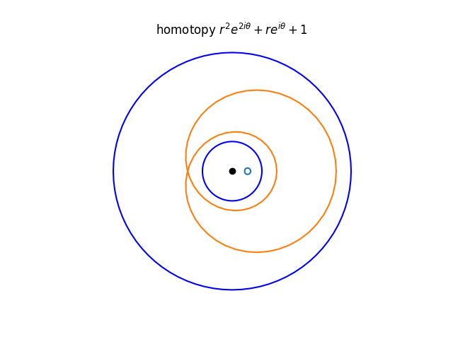

<!--
theme: gaia
class: gaia lead
headingDivider: 1
paginate: true
header: UGA 2025
footer: 
backgroundImage: linear-gradient(-20deg, rgba(0, 0, 0, 0.6), transparent)
_paginate: false
_header: ''
_footer: ''

style: |
  @keyframes marp-outgoing-transition-vertical-scroll {
    from { transform: translateY(0%); }
    to { transform: translateY(-100%); }
  }
  @keyframes marp-incoming-transition-vertical-scroll {
    from { transform: translateY(100%); }
    to { transform: translateY(0%); }
  }

  @keyframes marp-outgoing-transition-vflip {
    0% { animation-timing-function: ease-in; }
    50% {
      transform: perspective(100vw) translateZ(-100vw) rotateX(-90deg);
      opacity: 0.5;
      animation-timing-function: step-end;
    }
    100% { opacity: 0; }
  }
  @keyframes marp-incoming-transition-vflip {
    0% {
      animation-timing-function: step-start;
      opacity: 0;
    }
    50% {
      transform: perspective(100vw) translateZ(-100vw) rotateX(90deg);
      opacity: 0.5;
      animation-timing-function: ease-out;
    }
  }

  header, footer { text-align: center; color: currentcolor; }
  section.small-code pre { font-size: 68%; }

-->

# D'Alembert Gauss
<!-- _transition: glow -->
greg mc shane

# 

<!-- - **D'Alembert** a démontré que l'indice est un entier. -->
<!-- - **Gauss** a démontré que l'indice est un entier relatif. -->

- **Théoreme :** Soit $P(z)$ un polynôme complexe non constant. 
Alors $P$ admet une racine dans $\mathbb{C}$. 

- Soient $P(z) = a_nz^n + \cdots + a_1z + a_0$, $R = (n-1)\cdot{\rm max}(|a_0|, \cdots, |a_{n-1}|)\cdot r^{n-1}$
- si $a_0 = 0$, alors $0$ est une racine de $P$. On suppose que $a_0 \neq 0$ 
- On considère le lacet $\gamma_r(t) = P(re^{2\pi it})$ pour $t \in [0,1], r\geq 0$.
    - si $r=0$ alors $\gamma_r$ est constante et l'indice est $0$.
    - si $r$ est suffisamment grand, alors $\gamma_r$ est une courbe fermée contenue dans un anneau $|a_n|r^n - R\leq |z| \leq |a_n|r^n + R$.

#

## Exemple

- $P(z) = z^2 + z + 1$
    - $r=0.2$ bleu clair
    -  $r=2$ orange, 
-  $|a_n|r^n - R\leq |z| \leq |a_n|r^n + R$
- $1 \leq |(2 e^{it})^2 + 2 e^{it} + 1 | \leq 7$
- $|P(2e^{it})  - 4 e^{it}|=  | 2 e^{it} + 1 | \leq 3$

<!--  -->

#

- $r=1$ la courbe rouge 
- $(e^{it})^2 + e^{it} + 1$
passe par l'origine.

# Animations

(the proxy is too slow)

- [homotopy](https://htmlpreview.github.io/?https://github.com/macbuse/ALG_TOP/blob/master/SCRIPTS/Homotopy_to_a_circle.html)
- [not homotopy](https://htmlpreview.github.io/?https://github.com/macbuse/ALG_TOP/blob/master/SCRIPTS/Homotopy_to_a_circle.html)
<!-- https://htmlpreview.github.io/? -->

#

| **Lemme** |
|---|
|L'indice est invariant par homotopies.|

- $\gamma_0, \gamma_1 : [0,1] \to \mathbb{C}^*$ sont deux courbes fermées, 
homotopes par un chemin continu de courbes fermées 
Alors les indices de $\gamma_0$ et $\gamma_1$ sont égaux.

# 

- On suppose que $\gamma_0$ est un cercle de rayon $1$ centré en $0$
parcouru $n$ fois dans le sens trigonométrique.
$$\gamma_0(s) = e^{2\pi i  n s},\,
\dot{\theta(\gamma_0(s) )}
=  \frac{x \dot{y} - y \dot{x}}{x^2 + y^2} = 2\pi n$$
- et que $H(t,s) = (1-t)\gamma_0(s) + t\gamma_1(s)$ est une homotopie.

<!-- = \frac{\left(\frac{y(s)}{x(s)}\right)' }{1 + \left(\frac{y(s)}{x(s)}\right)^2} -->
#

# Exercices

[deplier un cube on Wolfram](https://demonstrations.wolfram.com/UnfoldingPolyhedronNets/)

1. Determiner les 4 figures qui se recollent pour former un cube.

1. Trouver les 11 facons de déplier un cube en un plan.

<!-- [solution](https://github.com/TotallyReal/Polyhedron-Nets) -->

#

3. Soit $P(z)$ un polynôme complexe non constant. 
Montrer que $P : \mathbb{C} \to \mathbb{C}$ est surjective.

4. On considere $f: z \mapsto z^2 - z + 1$ de $\mathbb{C} \to \mathbb{C}$.
    - Montrer que l'image de $\exp(it),\, t\in [0,2\pi]$ est une courbe avec un point d'auto-intersection.

# Bibliographie

- [prove me wrong](https://prove-me-wrong.com/mathematical-art/math-visualization-portfolio/)

