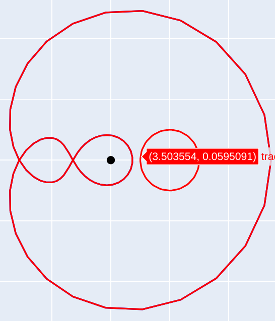

<!--
theme: gaia
class: gaia lead
headingDivider: 1
paginate: true
header: UGA 2025
footer: 
backgroundImage: linear-gradient(-20deg, rgba(0, 0, 0, 0.6), transparent)
_paginate: false
_header: ''
_footer: ''

style: |
  @keyframes marp-outgoing-transition-vertical-scroll {
    from { transform: translateY(0%); }
    to { transform: translateY(-100%); }
  }
  @keyframes marp-incoming-transition-vertical-scroll {
    from { transform: translateY(100%); }
    to { transform: translateY(0%); }
  }

  @keyframes marp-outgoing-transition-vflip {
    0% { animation-timing-function: ease-in; }
    50% {
      transform: perspective(100vw) translateZ(-100vw) rotateX(-90deg);
      opacity: 0.5;
      animation-timing-function: step-end;
    }
    100% { opacity: 0; }
  }
  @keyframes marp-incoming-transition-vflip {
    0% {
      animation-timing-function: step-start;
      opacity: 0;
    }
    50% {
      transform: perspective(100vw) translateZ(-100vw) rotateX(90deg);
      opacity: 0.5;
      animation-timing-function: ease-out;
    }
  }

  header, footer { text-align: center; color: currentcolor; }
  section.small-code pre { font-size: 68%; }

-->

# D'Alembert Gauss
<!-- _transition: glow -->
greg mc shane

# Homotopies

-  $f$ est **homotope** à $g$ 
s il existe une application continue
$H:X \times [0,1] \to Y$ 
telle que $H(x,0) = f(x)$ et $H(x,1) =
g(x)$. 

1. [keyframes and transitions](https://www.youtube.com/watch?v=VdH4TBDeCnI)
1. [tweening](https://en.wikipedia.org/wiki/Inbetweening)
1. transitions, morphing, interpolation
1. [student project](https://ccrma.stanford.edu/~jacobliu/368Report/index.html)

#

| **Théoreme :**|
|---|
|Soit $P(z)$ un polynôme complexe non constant. 
Alors $P$ admet une racine dans $\mathbb{C}$. |

#

- **Définition :** une application $f:X \to Y$ est **nul homotope** 
si il existe une homotopie $H : X \times [0,1]
\to Y$
telle que $H(x,0) = f(x)$ et $H(x,1) = c$ 
pour une constante $c$.

### Exemple 

- Si $f: X \to \mathbb{R}^n$ est continue, alors $f$ est nul homotope.
- Il suffit de prendre $H(x,t) = (1-t)f(x) + tc$.
- Tout lacet $\gamma:[0,1] \to \mathbb{C}$ est nul homotope.
- Le cercle $\{e^{is}, s\in[02\pi]\}\subset  \mathbb{C}^*$ n'est pas nul homotope.

#

### Encore des definitions

- $H(x,t) = (1-t)x + tc, H: X=\mathbb{R}^n\times [0,1] \to X$
est une **homotopie de rétraction**.
- $X$ est **rétractile** ssi l'application identité est nul homotope.
- $Y$ est **simplement connexe** ssi tout lacet $\gamma:[0,1] \to Y$ est nul homotope.

- $\mathbb{S}^2$ est simplement connexe, $\mathbb{C}^*$ ne l'est pas.
- $\mathbb{S}^2$ n'est pas rétractile.

#

| **Lemme (Cauchy)** |
|---|
|L'indice est invariant par homotopies.|

- $\gamma_0, \gamma_1 : [0,1] \to \mathbb{C}^*$ sont deux courbes fermées, homotopes par un chemin lisse de courbes fermées lisses.
Alors les indices de $\gamma_0$ et $\gamma_1$ sont égaux.

# 

- On suppose que $\gamma_1$ est un cercle de rayon $1$ centré en $0$
parcouru $n$ fois dans le sens trigonométrique.
$$\gamma_1(s) = e^{2\pi i  n s},\,
\dot{\theta(\gamma_1(s) )}
=  \frac{x \dot{y} - y \dot{x}}{x^2 + y^2} = 2\pi n$$
- et que $H(s,t)$ est une homotopie entre $\gamma_0$ et $\gamma_1$ de classe $C^1$.
- $(s,t) \mapsto \dot{\theta(H(s,t))}, [0,1] \times [0,1] \to \mathbb{R}$ est continue.
- $[0,1] \times [0,1]$ est compact, donc $\dot{\theta}$ est uniformément continue.

<!-- = (1-t)\gamma_0(s) + t\gamma_1(s)$ est une homotopie. -->
<!-- = \frac{\left(\frac{y(s)}{x(s)}\right)' }{1 + \left(\frac{y(s)}{x(s)}\right)^2} -->

#

- Pour tout $0< \epsilon <2\pi$, il existe $\delta > 0$ tel que
$|s - s'| + |t - t' | < 2\delta \Rightarrow | \dot{\theta(H(s,t))} - \dot{\theta(H(s',t'))} | < \epsilon$
    - $\Rightarrow \;\;\;\;\;\;\;|t - t' | < 2\delta \Rightarrow | \dot{\theta(H(s,t))} - \dot{\theta(H(s,t'))} | < \epsilon$

- Pour $\delta$ assez petit:
- $| Ind(\gamma_t) - Ind(\gamma_{t+\delta}) |$
 $= \frac{1}{2\pi} | \int_0^1 \dot{\theta(\gamma_t(s))} ds - \int_0^1 \dot{\theta(\gamma_{t + \delta}(s))} ds |$
$\leq \frac{1}{2\pi}\int_0^1 |\dot{\theta(\gamma_t(s))} -  \dot{\theta(\gamma_{t +
\delta}(s))} |ds$
$< \frac{1}{2\pi}\int_0^1 \epsilon ds 
< 1$ 

# 

<!-- - **D'Alembert** a démontré que l'indice est un entier. -->
<!-- - **Gauss** a démontré que l'indice est un entier relatif. -->

- **Théoreme :** Soit $P(z)$ un polynôme complexe non constant. 
Alors $P$ admet une racine dans $\mathbb{C}$. 

- Soient $P(z) = a_nz^n + \cdots + a_1z + a_0$, $R = (n-1)\cdot{\rm max}(|a_0|, \cdots, |a_{n-1}|)\cdot r^{n-1}$
- si $a_0 = 0$, alors $0$ est une racine de $P$. On suppose que $a_0 \neq 0$ 
- On considère le lacet $\gamma_r(s) = P(re^{2\pi is})$ pour $s \in [0,1], r\geq 0$.
    - si $r=0$ alors $\gamma_r$ est constante et l'indice est $0$.
    - si $r$ est suffisamment grand, alors $\gamma_r$ est une courbe fermée contenue dans un anneau $|a_n|r^n - R\leq |z| \leq |a_n|r^n + R$.

#

## Exemple

- $P(z) = z^2 + z + 1$
    - $r=0.2$ bleu clair
    -  $r=2$ orange, 
<!-- -  $|a_n|r^n - R\leq |z| \leq |a_n|r^n + R$ -->
- $1 \leq |(2 e^{is})^2 + 2 e^{is} + 1 | \leq 7$
- $|P(2e^{is})  - 4 e^{2is}|=  | 2 e^{is} + 1 | \leq 3$
- $H(s,t) = 2 ((e^{is})^2 + (1-t)(2 e^{is} + 1)$

<!--  -->

#

- $|P(2e^{is})  - 4 e^{2is}|=  | 2 e^{is} + 1 | \leq 3$
- $H(s,t) = t(2 e^{is})^2 + (1-t)(2 e^{is} + 1)$
    - $1 \leq |H(s,t)| \leq 7$
    - $H(s,0) = P(2e^{is})$
    - $H(s,1) = 4 e^{2is}$

$\Rightarrow$ l'indice de $H(s,t)$ est $2$.

#

- $r=1$ la courbe rouge 
- $(e^{it})^2 + e^{it} + 1$
passe par l'origine.

# Animations

(the proxy is too slow)

- [homotopy](https://htmlpreview.github.io/?https://github.com/macbuse/ALG_TOP/blob/master/SCRIPTS/Homotopy_to_a_circle.html)
- [not homotopy](https://htmlpreview.github.io/?https://github.com/macbuse/ALG_TOP/blob/master/SCRIPTS/Homotopy_to_a_circle.html)
<!-- https://htmlpreview.github.io/? -->

#

### Exos
1. Montrer que la sphère $\mathbb{S}^2$ est simplement connexe.
    - Projection stéréographique
    - Courbe de Peano
1.  Montrer que la courbe est nul homotope.

<!--  -->
<!--  -->

# Revêtements

$$z \mapsto \exp(z), \mathbb{C} \to \mathbb{C}^*$$
$$z \mapsto z^2, \mathbb{C}^* \to \mathbb{C}^*$$

#

- Une **application de revêtement** (ou **revêtement topologique**) est un type de fonction continue entre espaces topologiques qui, intuitivement, représente une version « dépliée » ou « en couches » d’un espace. 

- $p: \tilde{X} \to X$ surjective est appelée **application de revêtement** 
 si, pour tout point $x \in X$, il existe un voisinage ouvert $U \subset X$ (appelé **voisinage trivialisant**) tel que $p^{-1}(U)$ soit une union disjointe d'ouverts de $\tilde{X}$, chacun étant envoyé **homéomorphiquement** sur $U$ par $p$.  

- **L’application exponentielle** : $p: \mathbb{C} \to \mathbb{C}^*$ définie par $p(z) = e^{2\pi i z}$ est une application de revêtement où chaque point de $S^1$ possède une infinité de préimages.  

#

### Propriétés clés :  
1. **Structure localement homéomorphe** : Autour de chaque point de $X$, l’image réciproque sous $p$ ressemble à plusieurs « copies » d’un voisinage de $X$.  
2. **Fibres discrètes** : L’image réciproque $p^{-1}(x)$ est un **ensemble discret** de points.  
3. **Uniformité** : Le nombre de préimages de chaque point est constant sur les composantes connexes de $X$, supposant que $\tilde{X}$ est connexe.  

#

### Exemples :  
1. **L’application exponentielle** : La fonction $p: \mathbb{R} \to S^1$ définie par $p(t) = e^{2\pi i t}$ est une application de revêtement du réel $\mathbb{R}$ sur le cercle unité $S^1$, où chaque point de $S^1$ possède une infinité de préimages.  
2. **Le revêtement du tore sur la bouteille de Klein** : Le tore $\mathbb{T}^2 = \mathbb{R}^2 / \mathbb{Z}^2$ est un revêtement double de la bouteille de Klein.  
3. **Revêtement ramifié (non régulier)** : Une application comme $p: \mathbb{C} \to \mathbb{C}$, définie par $p(z) = z^n$, n'est pas un véritable revêtement car elle échoue à être localement homéomorphe en $z = 0$, où plusieurs « feuilles » fusionnent.  

#

2. **Le revêtement du tore sur la bouteille de Klein** : Le tore $\mathbb{T}^2 = \mathbb{R}^2 / \mathbb{Z}^2$ est un revêtement double de la bouteille de Klein.  

- [asteroids](https://en.wikipedia.org/wiki/Asteroids_(video_game))
- [play](https://www.echalk.co.uk/amusements/Games/asteroidsClassic/ateroids.html)

#

### Espaces quotients
- On considère un espace topologique Y ainsi que relation
d’équivalence ∼ entre les points de Y. On note
$p : Y \rightarrow Y/∼$
la surjection canonique de Y sur son espace quotient.
- On définit une topologie sur Y/∼ en décrétant que 
$U \subset Y/∼$ est ouvert si $p^{-1}(U) \subset Y$ est ouvert
- Pour cette topologie, la surjection canonique p est
tautologiquement continue.

#

- L’espace quotient Y/∼ n’est pas nécessairement séparé.
- Un espace topologique est dit SÉPARÉ si tout couple de
points distincts admet des voisinages disjoints.
- Le **saturé** d’un ensemble F ⊂ Y est l’ensemble
$p^{-1}(p(F))$, c’est-à-dire tous les points de Y qui sont en
relation par ∼ à un point de F.
- La relation d’équivalence ∼ est dite FERMÉE si le saturé
de toute partie fermée est fermée.

| Propriété |
|---|
| Si Y est compact et la relation d’équivalence ∼ fermée   alors Y/∼ est séparé.|
#

| Propriété |
|---|
| Si Y est compact et la relation d’équivalence ∼ fermée   alors Y/∼ est séparé.|

**Exemples**

- $H < G$ un sous-groupe fermé de $G$ 
 $x \sim y  \Leftrightarrow x^{-1}y \in H$
alors $G/H$ est séparé.
- $\mathbb{R}/\mathbb{Z} = \mathbb{S}^1$ est séparé.
- $\mathbb{R}^n/\mathbb{Z}^n = \mathbb{T}^n$ est séparé.
- $\mathbb{R}/\mathbb{Q}$ n'est pas séparé.

# 

### Espaces quotients

- La compacité est une hypothèse contraignante. 
Elle peut être remplacée par une propriété plus faible, 

- **Définition.** Un espace topologique X est dit *localement
compact* 
    1. s’il est séparé 
    1. et si tout point x élément de X admet un voisinage compact (autrement dit si x appartient à un ouvert relativement compact)

- Exemples. Sont relativement compacts, tous les
compacts, tous les espaces homéomorphes à $\mathbb{R}^n$ , toutes
les variétés topologiques, tous les espaces discrets.

# 
Propriété bis (rappel).– Si Y est relativement compact et
la relation d’équivalence ∼ fermée alors Y/∼ est séparé.

#

- **Proposition de transfert de continuité au quotient.**
Soit f : Y → Z une application continue telle que 
pour tout $(y_1, y_2) \in Y$  on ait $y_1 ∼ y_2 \Rightarrow   f(y_1) = f(y_2)$
Alors l’application $\bar{f} : Y/∼ \,\rightarrow   Z$ donnée par $\bar{f}([y]) = f(y)$ 
est bien définie et continue.

- **Démonstration.** Le caractère bien défini provient du fait
que f est constante sur chaque classe d’équivalence.
- Soit U un ouvert de Z. L’image réciproque $\bar{f}^{-1}(U) \subset Y/~$ est  ouvert  si et seulement si $p^{−1}(\bar{f}^{−1}(U)) \subset Y$ est ouvert. 
Or par construction :
$p^{−1}(\bar{f}^{−1}(U)) = (\bar{f}\circ p)^{−1}(U) = f^{−1}(U)$ est ouvert car f continue.

#
### Exemple : le cercle $\mathbb{S}^1$

- Soit Y = [0, 1] et ∼ la relation d’équivalence définie par
    - x ∼ y ⇔ x = y ou x = 0 et y = 1 ou x = 1 et y = 0.

| proposition |
|---|
| L’espace quotient Y/∼ est homéomorphe au cercle $\mathbb{S}^1$.|

- **Démonstration.** L’application $f : Y \rightarrow    \mathbb{S}^1$ définie par 
f(x) = exp(2iπx) est continue et constante sur les classes
d’équivalence. Elle induit donc une application continue.

#

- Soit Y un espace topologique et soit $A \subset Y$. 
On considère la relation d’équivalence suivante
$$y_1 ∼ y_2 \Leftrightarrow y_1 = y_2 \text{ ou } (y_1, y_2) \in A$$

- L’espace quotient Y/∼ est donc formé 
    - de la classe [a] où a ∈ A 
    - et des classes d’équivalence [y] avec y ∈ Y \ A.

- **Définition**.– L’espace quotient est noté Y/A et est appelé espace quotient de $Y$ par $A$.

#

- Soient X et Y deux espaces topologiques, A ⊂ Y et
f : A → X une application continue. 
On définit une relation d’équivalence ∼ 
sur la somme disjointe $Z = X \sqcup Y$ par $z_1 ∼ z_2$

- si $z_1 = z_2$
- ou $(z_1 ∈ A \text{ et } z_2 = f(z_1))$
- ou $(z_2 ∈ A \text{ et } z_1 = f(z_2))$

- **Définition**– L’espace quotient est noté $X \cup_f Y = X \sqcup Y/∼$
et s’appelle le RECOLLEMENT DE X À Y LE LONG DE f.

# Exercices

# Bibliographie

- [prove me wrong](https://prove-me-wrong.com/mathematical-art/math-visualization-portfolio/)

