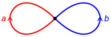
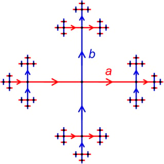
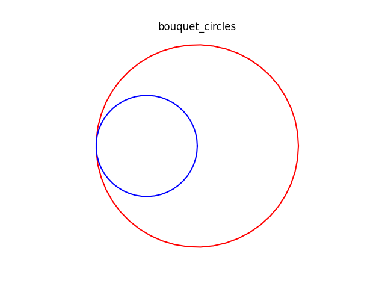
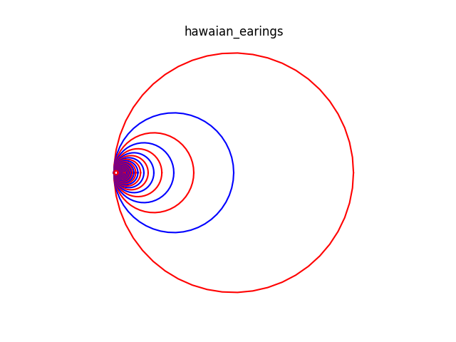
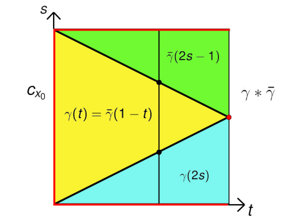
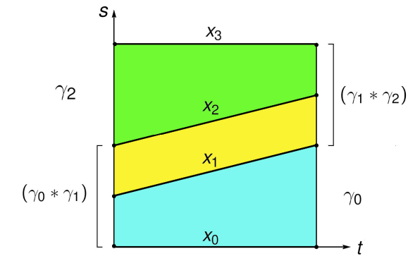
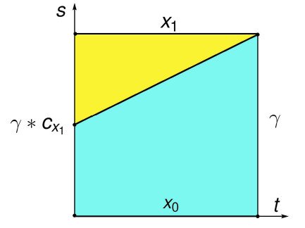
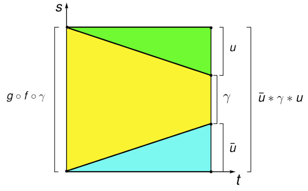

<!--
theme: gaia
class: gaia lead
headingDivider: 1
paginate: true
header: UGA 2025
footer: 
backgroundImage: linear-gradient(-20deg, rgba(0, 0, 0, 0.6), transparent)
_paginate: false
_header: ''
_footer: ''

style: |
  @keyframes marp-outgoing-transition-vertical-scroll {
    from { transform: translateY(0%); }
    to { transform: translateY(-100%); }
  }
  @keyframes marp-incoming-transition-vertical-scroll {
    from { transform: translateY(100%); }
    to { transform: translateY(0%); }
  }

  @keyframes marp-outgoing-transition-vflip {
    0% { animation-timing-function: ease-in; }
    50% {
      transform: perspective(100vw) translateZ(-100vw) rotateX(-90deg);
      opacity: 0.5;
      animation-timing-function: step-end;
    }
    100% { opacity: 0; }
  }
  @keyframes marp-incoming-transition-vflip {
    0% {
      animation-timing-function: step-start;
      opacity: 0;
    }
    50% {
      transform: perspective(100vw) translateZ(-100vw) rotateX(90deg);
      opacity: 0.5;
      animation-timing-function: ease-out;
    }
  }

  header, footer { text-align: center; color: currentcolor; }
  section.small-code pre { font-size: 68%; }

-->

# Homotopie
<!-- _transition: glow -->
greg mc shane

# 

## Lacets et chemins

**Hatcher pp 25-39**

1. $X$ espace topologique, separé,  connexe par arcs, localement compact.
1. $\pi_1(X, x_0) := \Omega(X, x_0)/ \simeq_\partial = 
\text{lacets}/\text{homotopie}$
    1. $\tilde{X}$ espace recouvrant universel de $X$
    1. $X = \tilde{X}/\pi_1(X, x_0)$
1. Exos :
    - Hatcher pp 47 (pdf)
    - [Borelli en francais](./exos_gpe_fonda.pdf)

#

1. $\mathbb{S}^1 = \mathbb{R}/\mathbb{Z}$.
1. $\mathbb{T}^2 = \mathbb{S}^1 \times \mathbb{S}^1 = \mathbb{R}^2 / (\mathbb{Z}\times\mathbb{Z})$
1. $\mathbb{S}^1 \vee \mathbb{S}^1 = \text{un arbre} / (\mathbb{Z}*\mathbb{Z}).$
    - $\mathbb{Z}\times\mathbb{Z}$ groupe libre abélien de rang 2.
    - $\mathbb{Z}*\mathbb{Z}$ groupe libre (non abélien) de rang 2.

- CW complexe de dimension 1
    - 1 0-cellule
    - 2 1-cellules

#

- un **arbre** est un graphe acyclique et connexe
- tout arbre est un CW complexe de dimension 1 contractile.

- [Bass, Serre : arbres, amalgames et $sl_2$](http://www.numdam.org/item/AST_1983__46__1_0.pdf)
- [geometric group theory](https://en.wikipedia.org/wiki/Geometric_group_theory)

#

$\pi_1$ est un groupe libre.

#

[hawaiian earings](https://fr.wikipedia.org/wiki/Boucle_d%27oreille_hawa%C3%AFenne) pas localement connexe,
$\pi_1$ n'est pas  un groupe libre.

# La concaténation des chemins

#

- **Définition**.– Soit X un espace topologique et $x_0, x_1 \in X$. 
- On appelle **chemin joignant** $x_0$ à $x_1$ tout application continue 
$\gamma : [0, 1] \to X$ telle que $\gamma(0) = x_0$ et $\gamma(1) = x_1$.
- On appelle **lacet basé en** $x_0$ tout chemin tel que
$\gamma(0) = \gamma(1) = x_0$.

#

- **Notations.**– On note
    - $L(X, x_0, x_1)$ l’ensemble des chemins joignant $x_0$ à $x_1$ et
    - $\Omega(X, x_0)$ l’ensemble des lacets basés en $x_0$.

- **Définition.–** On dit qu’un espace topologique X est
**connexe par arcs** si tout couple de point 
$(x_1, x_2) \in X \times X$
peut être joint par un chemin X, autrement dit si 
$L(X, x_1, x_2)$ est non vide.

#

- **Notations.**– On note
    - $L(X, x_0, x_1)$ l’ensemble des chemins joignant $x_0$ à $x_1$ et
    - $\Omega(X, x_0)$ l’ensemble des lacets basés en $x_0$.

- Sur ces espaces, on note $\simeq_\partial$ la relation d’**homotopie pointée,** 
- $\gamma_1 \simeq_\partial \gamma_2$ signifie qu’il existe une homotopie $H : [0, 1] \times [0, 1] \to X$ telle que :
    - $\forall t \in [0, 1], H(0, t) = x_0$ et $H(1, t) = x_1$
    - et $H(s, 0) = \gamma_1(s)$ et $H(s, 1) = \gamma_2(s)$.

# 4 propositions

- homotopie respecte la concaténation
- concatenation avec le chemin inverse triviale
- associativité de la concaténation
- élément neutre

#

- Soit $x_0, x_1, x_2 \in X$. 
    - Si $\gamma_1 : [0, 1] \to X$ est un chemin de $x_0$ à $x_1$ 
    - et $\gamma_2 : [0, 1] \to X$ est un chemin de $x_1$ à $x_2$,
- alors la concaténation de $\gamma_1$ et $\gamma_2$ est 
le chemin $\gamma_2 * \gamma_1 : [0, 1] \to X$ défini par
$
\gamma_2 * \gamma_1(t) = \begin{cases}
\gamma_1(2s) & \text{si } 0 \leq s \leq \frac{1}{2}, \\
\gamma_2(2s-1) & \text{si } \frac{1}{2} \leq s \leq 1.
\end{cases}
$

- **Proposition 1.**– Soient 
$\gamma_1, \delta_1 \in L(X, x_0, x_1)$ et $\gamma_2, \delta_2 \in L(X, x_1, x_2)$. 
Alors $
(\gamma_1 \simeq_\partial \delta_1 \text{ et } \gamma_2 \simeq_\partial \delta_2) \Rightarrow \gamma_1 * \gamma_2 \simeq_\partial \delta_1 * \delta_2.
$

#

- **Proposition 1.**– Soient 
$\gamma_1, \delta_1 \in L(X, x_0, x_1)$ et $\gamma_2, \delta_2 \in L(X, x_1, x_2)$. 
Alors $
(\gamma_1 \simeq_\partial \delta_1 \text{ et } \gamma_2 \simeq_\partial \delta_2) \Rightarrow \gamma_1 * \gamma_2 \simeq_\partial \delta_1 * \delta_2.
$

- **Démonstration**.– Soient 
    - $H_1$  l’homotopie entre $\gamma_1$ et $\gamma_2$ 
    - $H_2$  entre $\delta_1$ et $\delta_2$
- L’application

$$
H(s, t) = \begin{cases}
H_1(2s, t) & \text{si } s \in [0, \frac{1}{2}], \\
H_2(2s - 1, t) & \text{si } s \in [\frac{1}{2}, 1]
\end{cases}
$$

- définit une homotopie entre $\gamma_1 * \gamma_2$ et $\delta_1 *  \delta_2$. $\blacksquare$

#

- **Notations.** 
    1. On note $c_{x_0} \in \Omega(X, x_0)$ le **lacet constant** :
$c_{x_0}(s) = x_0,\,\forall s \in [0, 1]$

    2.  Soit $\gamma \in L(X, x_0, x_1)$, on note $\bar{\gamma}$ le **chemin inversé** :
$\bar{\gamma}(s) = \gamma(1 - s),\,\forall s \in [0, 1]$

- **Proposition 2.**– Soit $\gamma \in L(X, x_0, x_1)$. 
Alors $\gamma * \bar{\gamma} \simeq_\partial c_{x_0} \text{ et } \bar{\gamma} * \gamma \simeq_\partial c_{x_1}.$

#

### Inverses de chemins

- **Proposition 2.**– Soit $\gamma \in L(X, x_0, x_1)$. 
Alors $\gamma * \bar{\gamma} \simeq_\partial c_{x_0} \text{ et } \bar{\gamma} * \gamma \simeq_\partial c_{x_1}.$

- **Démonstration**.– L’application 

$$H(s, t) = \begin{cases}
\gamma(2s) & \text{si } s \leq  \frac{t}{2}, \\
\gamma(t) & \text{si } \frac{t}{2}\leq s \leq 1 - \frac{t}{2}, \\
\bar{\gamma}(2s - 1) & \text{si } s \geq 1 - \frac{t}{2}
\end{cases}$$

- définit une homotopie entre $\gamma * \bar{\gamma}$ et $c_{x_0}$. $\blacksquare$

#

- Description visuelle de l’homotopie H. 
    - La couleur rouge souligne les points envoyés sur $x_0$. 
    - La verticale t = 0 correspond à $c_{x_0}$
    - et la verticale t = 1 à la concatenation $\gamma * \bar{\gamma}$.

#

### Associativité de la concaténation

- **Proposition 3 .** Soient 
$\gamma_0 \in L(X, x_0, x_1)$, $\gamma_1 \in L(X, x_1, x_2)$ et $\gamma_2 \in L(X, x_2, x_3)$. 
Alors $
(\gamma_0 * \gamma_1) * \gamma_2 \simeq_\partial \gamma_0 * (\gamma_1 * \gamma_2).$

- **Démonstration**.– L’application $H: [0, 1] \times [0, 1] \to X$ définie par

$$
H(s, t) = \begin{cases}
\gamma_0(2s) & \text{si } s \leq \frac{1}{2} - \frac{t}{4}, \\
\gamma_1(4s - t - 1) & \text{si } \frac{1}{2} - \frac{t}{4} \leq s
\leq \frac{1}{2} + \frac{t}{4}, \\
\gamma_2(4s - t - 2) & \text{si } s \geq \frac{1}{2} + \frac{t}{4}
\end{cases}
$$
- est une homotopie entre $(\gamma_0 * \gamma_1) * \gamma_2$ et $\gamma_0 * (\gamma_1 * \gamma_2)$. $\blacksquare$

#

Description visuelle de l’homotopie H.

#

### élément neutre

- **Proposition 4.**– Soit $\gamma \in L(X, x_0, x_1)$ 
Alors $\gamma * c_{x_1} \simeq_\partial \gamma \text{ et } c_{x_0} \gamma \simeq_\partial \gamma.$

- On va démontrer la première égalité
<!-- l’autre étant similaire. -->

- **Démonstration.** L’application $H: [0, 1] \times [0, 1] \to X$ définie par 
$H(s, t) = \begin{cases}
\gamma_0(\frac{2s}{t+1}
) & \text{si } s \in [0,\frac{t+1}{2}], \\
x_1 & \text{si } s \in [\frac{t+1}{2}, 1]
\end{cases}$
est une homotopie entre $(\gamma * c_{x_1})$ et $\gamma$

#

Description visuelle de l’homotopie H.

#

- **Démonstration.** L’application $H: [0, 1] \times [0, 1] \to X$ définie par 
$H(s, t) = \begin{cases}
\gamma_0(\frac{2s}{t+1}
) & \text{si } s \in [0,\frac{t+1}{2}], \\
x_1 & \text{si } s \in [\frac{t+1}{2}, 1]
\end{cases}$
est une homotopie entre $(\gamma * c_{x_1})$ et $\gamma$

- D’après la proposition 2 :
$c_{x_0} * \gamma \simeq_\partial \gamma^- * \gamma
\simeq_\partial c_{x_1} * \gamma \simeq_\partial \gamma$

- D’après la proposition 3:
$\gamma * c_{x_1} 
\simeq_\partial \gamma *( {\bar{\gamma}*\gamma}) 
\simeq_\partial (\gamma * {\bar{\gamma})*\gamma} 
\simeq_\partial  c_{x_0} * \gamma \simeq_\partial \gamma$
$\blacksquare$

# Le groupe fondamental

#

###  Définition

- On note : $\pi_1(X, x_0) := \Omega(X, x_0)/ \simeq_\partial$
et on munit cet ensemble d'un produit ” · ” par
$$[γ_1] \cdot [γ_2] := [γ_1 ∗ γ_2].$$

-  La **Proposition 1** montre que ce produit est bien défini, il
ne dépend pas des éléments choisis pour représenter
chaque classe.

#

$$\pi_1(X, x_0) := \Omega(X, x_0)/ \simeq_\partial$$

- **Théorème 1.** – L’ensemble $\pi_1(X, x_0)$ muni du produit $\cdot$ est un groupe (non commutatif en général).

- **Démonstration**. 
    - **Proposition 3** assure l’associativité du produit.
    - **Proposition 4** montre que l’élément neutre est la classe $[c_{x_0}]$ du lacet constant. 
    -  **Proposition 2** que tout élément $[γ]$ a pour inverse $[\bar{γ}]$ 
    $\blacksquare$

#

- Notons que l’on ne dit pas : "le groupe fondamental de la
paire (X, x0)". Ceci est justifié par la proposition suivante.

- **Proposition 5**.– Soit $u : [0, 1] \to X$ un chemin joignant $x_0$ à $x_1$.
On note $x_0 := u(0)$ et $x_1 := u(1)$. Alors, l’application
$$\beta_u :\pi_1(X, x_0) \to \pi_1(X, x_1)$$
$$[γ] \mapsto [\bar{u} ∗ γ ∗ u]$$
- est isomorphisme de groupes.

Démonstration : admise

#

- **Corollaire 1**.– Soient X connexe par arcs et $x_0, x_1 ∈ X$. 
Alors $\pi_1(X, x0)$ et $\pi_1(X, x1)$ sont isomorphes.
- **Observation.** En général, cet isomorphisme n’est pas
canonique car $\beta_u$ dépend de la classe dans $L(X, x_0, x1)$ du
chemin u choisi pour joindre $x_0$ à $x_1$.

- **Définition.** Un espace topologique X est dit **simplement
connexe** s’il est connexe par arcs et s’il existe 
$x_0 ∈ X$ tel que $\pi_1(X, x_0) = {[c_{x_0}]}$

#

- **Remarque.**– D’après le corollaire 1, si X est simplement
connexe, alors pour tout point $x \in X$, on a $\pi_1(X, x) = {[c_{x}]}$.

- **Exemple 1.**– L’espace $X = \{x_0\}$ est simplement connexe.
- **Exemple 2.**– Tout espace contractile X est simplement
connexe. L’homotopie joignant $\gamma ∈ \Omega(X, x_0)$ à $c_{x_0}$ est induite par l’homotopie joignant $id_X$ à la fonction constante $c_{x_0}: x\mapsto x_0$.

<!-- idX à i ◦ r où i : {x0} ⊂ X et -->
<!-- r : X → {x0}. -->

#

- Soient $f : X → Y$ une application continue,
et $x_0 ∈ X$ et $y_0 = f(x_0)$. On définit une application
$$f_* : \pi_1(X, x_0) \to \pi_1(Y, y_0)$$
$$f([\gamma]) := [f \circ \gamma].$$
- cette application est bien définie 
car si $\gamma \simeq_\partial \delta$ alors $f \circ \gamma \simeq_\partial f \circ \delta$.

- **Proposition 6.**– L’application $f_∗$ est un morphisme de
groupes.

#

- **Proposition 7.**– On a $(id_X)_∗ = id_{\pi_1(X, x_0)}$ 

- Soient $f_1, f_2 ∈ C^0((X, x_0), (Y, y_0))$ Alors
$$f_1 \simeq_\partial f_2 \Rightarrow f_{1*} = f_{2*}$$
- Soient $f ∈ C^0((X, x_0), (Y, y_0))$ et $g ∈ C^0((Y, y_0), (Z, z_0))$ alors
$$(g \circ f)_∗ = g_∗ \circ f_∗$$
- En particulier, si f est inversible alors $f_∗$ l’est et
$$f_{∗}^{-1} = (f^{-1})_{∗}$$

#

- **Théorème 2.**– Soient X et Y connexes par arcs. 
Si X et Y ont même type d’homotopie alors 
$\pi_1(X, x_0)$ et $\pi_1(Y, y_0)$ sont isomorphes 
pour tout choix $(x_0, y_0) ∈ X \times Y$ .

-  En particulier si X et Y sont homéomorphes (et c.p.a.)
alors leurs groupes fondamentaux sont isomorphes.

#

- **Démonstration**.– Puisque $X \simeq Y$, il existe 
$f ∈ C^0(X, Y)$ et $g ∈ C^0(Y, X)$ tels que
$g \circ f \simeq id_X$ et $f \circ g \simeq id_Y$.
Nous
allons montrer que
    - $g_∗ ◦ f_∗ : \pi_1(X, x_0) → \pi_1(X, g(f(x_0)))$
    -  $f_∗ ◦ g_∗ : \pi_1(Y, y_0) → \pi_1(Y, f(g(y_0)))$

sont des isomorphismes. Ceci implique en effet que $f_∗$ et 
$g_∗$ sont des isomorphismes.

#

- Montrons d’abord que $g_∗ \circ  f_∗ = \beta_u$ 
où u le chemin joignant $x_0$ à $g(f(x_0))$ 
défini par $u(s) = H(x_0, 1 − s)$
 où H est l’homotopie joignant $g \circ f$ à $id_X$ .
- Soit $\gamma \in \Omega(X, x_0)$. L’application F définie par

$$F(s, t) = \begin{cases}
\bar{u}(3s) & \text{si } s \leq \frac{t}{3}, \\
H(\gamma(\frac{3s − t}{3-2t})) & \text{si } \frac{t}{3} \leq s \leq 1 −
\frac{t}{3}, \\
u(3s − 2) & \text{si } s \geq 1 − \frac{t}{3}
\end{cases}$$
est une homotopie entre $g \circ f \circ \gamma = H(.,0$ et $\bar{u} ∗ \gamma ∗ u = H(.,1)$.

#

Description visuelle de l’homotopie F.

#

**Démonstration (suite)**

- On en déduit $[g \circ f \circ γ] = [\bar{u} ∗ γ ∗ u]$
soit encore $(g_∗ \circ f_∗)([γ]) = \beta_u([\gamma])$
pour tout $\gamma$.
-  D’après la **Proposition 5**, l’application $\beta_u$ est un
isomorphisme de groupes. On en déduit que $g_* \circ f_*$ est un
isomorphisme de groupes.
-  On montre que $f_∗ ∘ g_∗$ est un isomorphisme de groupes
par un raisonnement similaire. $\blacksquare$

