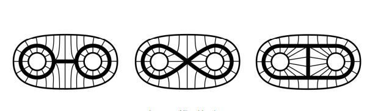

<!--
theme: gaia
class: gaia lead
headingDivider: 1
paginate: true
header: UGA 2025
footer: 
backgroundImage: linear-gradient(-20deg, rgba(0, 0, 0, 0.6), transparent)
_paginate: false
_header: ''
_footer: ''

style: |
  @keyframes marp-outgoing-transition-vertical-scroll {
    from { transform: translateY(0%); }
    to { transform: translateY(-100%); }
  }
  @keyframes marp-incoming-transition-vertical-scroll {
    from { transform: translateY(100%); }
    to { transform: translateY(0%); }
  }

  @keyframes marp-outgoing-transition-vflip {
    0% { animation-timing-function: ease-in; }
    50% {
      transform: perspective(100vw) translateZ(-100vw) rotateX(-90deg);
      opacity: 0.5;
      animation-timing-function: step-end;
    }
    100% { opacity: 0; }
  }
  @keyframes marp-incoming-transition-vflip {
    0% {
      animation-timing-function: step-start;
      opacity: 0;
    }
    50% {
      transform: perspective(100vw) translateZ(-100vw) rotateX(90deg);
      opacity: 0.5;
      animation-timing-function: ease-out;
    }
  }

  header, footer { text-align: center; color: currentcolor; }
  section.small-code pre { font-size: 68%; }

-->

# Homotopie
<!-- _transition: glow -->
greg mc shane

# 

**Hatcher Chapitre 0**

- homotopies d'applications
- équivalences d'homotopie
- rétractes
- rétraction
- rétraction par déformation
- [exos](./exos_homotopy.pdf)

#

## Idée

- homotopie = chemin continu qui relie 
deux fonctions continues ($f \simeq g$)
- $[X,Y]:= (C^0(X, Y)/\simeq)$ est l'ensemble des classes d'homotopie
-  = composante connexe par arc de $C^0(X, Y)$

# Homotopies d'applications

#

- **Définition**.– Soient X et Y deux espaces topologiques et
$f, g : X \to Y$ deux applications continues. 
Une HOMOTOPIE ENTRE f ET g est une application continue
$H : X × [0, 1] \to  Y$ telle que
    - $\forall x \in X, H(x, 0) = f(x)$
    - $\forall x \in X, H(x, 1) = g(x)$

- Soit A ⊂ X. On dit que l’homotopie H est RELATIVE À A si
de plus
    - $\forall x \in A, \forall t \in [0, 1], H(x, t) = f(x) = g(x)$
- Observons que pour qu’une telle homotopie soit possible il
faut nécessairement $f|_A = g|_A$.

#

- **Proposition.**– Deux applications $f, g : X \to \mathbb{R}^n$
 sont toujours homotopes. Autrement dit, l’ensemble $[X, \mathbb{R}^n]$ est l'unique composante connexe par arc de $C^0(X, \mathbb{R}^n)$.

- **Démonstration.** Il suffit de considérer
$$H(x, t) = t f(x) + (1 − t)g(x)$$
- Cette démonstration reste valide si les applications
$f, g : X \to Y$ ou $Y \subset R^n$ sous-espace convexe

- Si $Y$ n’est pas un sous-espace convexe
alors l’interpolation linéaire entre f et g ne fournit plus une homotopie. Il faut en chercher une autre, si elle existe.

#

- **On définit** une relation binaire $\simeq$  dans 
$C^0(X, Y)$ par $f \simeq g \Leftrightarrow$ il existe une homotopie entre f et g
- Similairement, $f \simeq_A g$ si l’homotopie est relative à A.

- **Proposition**.– Les relations $\simeq$ et $\simeq_A$ sont des relations d’équivalence.
**Démonstration** : Notons que $\simeq$ est un cas particulier de
$\simeq_A$ avec $A = \emptyset$. On ne considère donc que $\simeq_A$.
- La relation est **réflexive**. Il suffit de prendre H(x, t) := f(x).
- La relation est **symétrique**. Si H est une homotopie
relative joignant f à g alors $\tilde{H}(x, t) = H(x, 1 − t)$
est une homotopie relative joignant g à f.

#

### Transitivité

-  $H_1$ est une homotopie joignant $f$ à $g$, 
-  $H_2$ est une homotopie joignant $g$ à $h$, 
    - On suppose que $H_1$ et $H_2$ sont définies comme suit :
$
\quad H_1(x,t) \text{ avec } H_1(x,0) = f(x) \text{ et } H_1(x,1) = g(x)
$
$
\quad H_2(x,t) \text{ avec } H_2(x,0) = g(x) \text{ et } H_2(x,1) = h(x)
$

- construire une homotopie $H$ joignant $f$ à $h$ 
en **concaténant** $H_1$ et $H_2$.

#

### Concaténation

- On définit $H$ sur $X \times [0,1]$ par :
$$H(x,t) =
\begin{cases}
H_1(x, 2t), & \text{si } 0 \leq t \leq \frac{1}{2} \\
H_2(x, 2t - 1), & \text{si } \frac{1}{2} \leq t \leq 1
\end{cases}$$
- L'idée est que :
    - Pour $0 \leq t \leq \frac{1}{2}$, on suit $H_1$ mais en "accélérant"
    le temps ($t$ est multiplié par 2).
    - Pour $\frac{1}{2} \leq t \leq 1$, on suit $H_2$ en ajustant aussi 
    le paramètre de temps.

#
$$H(x,t) =
\begin{cases}
H_1(x, 2t), & \text{si } 0 \leq t \leq \frac{1}{2} \\
H_2(x, 2t - 1), & \text{si } \frac{1}{2} \leq t \leq 1
\end{cases}$$

### **Vérifications**
* $H(x,0) = H_1(x,0) = f(x)$ ✅
* $H(x,1) = H_2(x,1) = h(x)$ ✅
* $H(x,\frac{1}{2}) = H_1(x,1) = g(x) = H_2(x,0)$,
* donc la transition entre $H_1$ et $H_2$ est bien continue ✅

#

### Groupes d'homotopie des sphères

- $\pi_n(\mathbb{S}^m):= [\mathbb{S}^n, \mathbb{S}^m]$ admet une structure de groupe abélien.

[Source](https://fr.wikipedia.org/wiki/Groupes_d%27homotopie_des_sph%C3%A8res)

|$\pi_n(S^m)$  | $n < m$  | $n = m$  | $n = m+1$  | $n > m+1$ (quelques cas) |
|----------------|-------------|-------------|-------------|------------------|
| $\pi_1(S^1)$  | $\mathbb{Z}$ | - | - | - |
| $\pi_2(S^2)$  | $0$ | $\mathbb{Z}$ | - | - |
| $\pi_3(S^2)$  | $\mathbb{Z}$ | - | $\mathbb{Z}$ | - |
| $\pi_3(S^3)$  | $0$ | $\mathbb{Z}$ | $\mathbb{Z}$ | - |

#

La structure générale suit les règles suivantes :
- $\pi_n(S^m) = 0$ pour $n < m$.
- $\pi_m(S^m) = \mathbb{Z}$ grâce à l'application identité.
- $\pi_{m+1}(S^m) = \mathbb{Z}$ (fibration de Hopf pour $S^2$ et $S^3$).
- Pour $n > m+1$, les groupes deviennent beaucoup plus compliqués, avec des termes de torsion.

[hopf fibration](https://www.youtube.com/watch?v=PYR9worLEGo)

# Équivalence d’homotopie 

#
- **Définition.**– Soit $f \in C^0 (X, Y).$ On dit que f est 
une **équivalence d’homotopie** s’il existe une application
$g \in C^0 (X, Y).$ telle que $f \circ g \simeq id_Y$ et $g \circ f \simeq id_X$ .

- Si une telle application existe, on dit 
    - que g est un **inverse homotopique** de f 
    - et que X et Y ont **même type d’homotopie**
    ou qu’ils sont **homotopiquement équivalents.** 
    - on note $X \simeq Y$.

#

### FAIT

Deux espaces sont homotopiquement équivalents si et seulement s'ils sont tous deux **rétracts par déformation** d'un même espace.

[Source](https://fr.wikipedia.org/wiki/%C3%89quivalence_d%27homotopies)

- Un cercle est homotopiquement équivalent au plan privé d'un point et au ruban de Möbius.
- Le tore $\mathbb{T}^2$ privée d'un point est homotopiquement équivalente à un bouquet de deux cercles.

#

- **Exemple 1**.– L’espace $\mathbb{R}^n$ et le singleton $\{O\} \subset \mathbb{R}^n$ ont même type d’homotopie :  
l’inclusion $i : {O} \hookrightarrow \mathbb{R}^n$ est une équivalence d’homotopie 
dont un inverse homotopique est l’application constante 
$r : \mathbb{R}^n \to {O}$ telle que $r(x) = O$.

- **Exemple 2.**– Les espaces $\mathbb{R}^n \setminus \{O\}$ et $S^{n−1}$ 
ont même type d’homotopie : l’inclusion $i : S^{n−1} \hookrightarrow \mathbb{R}^n \setminus \{O\}$ 
est une équivalence d’homotopie dont un inverse homotopique 
est l’application $r : \mathbb{R}^n \setminus \{O\} \to S^{n−1}$ telle que $r(x) = \frac{x}{||x||}$.

# Rétractions

#

- **Définition.**– Soit $i : A \hookrightarrow X$ une inclusion, $r \in C^0 (X, A)$ est 
    - une RÉTRACTION PAR DÉFORMATION si $i \circ r \simeq id_X$ 
    - une RÉTRACTION **FORTE** PAR DÉFORMATION si $i \circ r \simeq_A id_X$ .

-  Toutes les applications notées r dans les exemples
précédents sont des rétractions fortes par déformation.

- **Proposition.**– $r : X → A$ est une rétraction par déformation
alors c'est une équivalence d'homotopie et donc $A \simeq X$.

- **Démonstration.**– Soit $i : A \in X$ l’inclusion. On a 
$i \circ r \simeq id_X$ par hypothèse. Par transitivité, on a $r
\simeq i$. 
Puisque i est une équivalence d’homotopie, $r \circ i \simeq id_A$ 
et donc que r est une équivalence d’homotopie.

#

- **Exemple d’application 1.**– Si $r : X \to A$ est une rétraction
et si A n’a pas le type d’homotopie de X alors r n’est pas
une rétraction par déformation.

-  En particulier si $x \in X$ et si X n’est pas connexe alors
l’application constante $c : X \to \{x\}$ est une rétraction qui
n’est pas une rétraction par déformation.
- En effet, si c’était le cas alors {x} et X auraient le même
type d’homotopie. D’après une propriété vue plus haut,
puisque {x} est connexe, ceci impliquerait que X est
connexe. Contradiction

#

- **Exemple d’application 2.**– Les trois CW-complexes
figurés ci-dessus ont même type d’homotopie. En effet, ce
sont tous les trois des  rétracts par déformation la sphère
privée de trois disques disjoints. On peut les décrire
$$X := S^2 \setminus (D^2_1 \cup D^2_2 \cup D^2_3)$$

# Espaces contractiles

#

- **Définition.** -  On dit qu’un espace X est CONTRACTILE s’il a
le type d’homotopie d’un singleton $\{pt\}$.

## Exemples.

- **Exemples.** – Les domaines étoilés sont contractiles, en p

#

- **Lemme**-  X est contractile ssi il existe 
$x_0 \in X$ telle que l’application constante 
$x \mapsto  c_X (x) = x_0$ est homotope à $id_X$.

- **Démonstration**.  
X contractile signifie qu’il existe $x_0 \in X$ 
telle que l’inclusion $i : \{x_0\} \to X$ 
est une équivalence d’homotopie.

- L’inverse homotopique ne peut être que l’application
$r : X \to \{x_0\}$ et par conséquent $i \circ r \simeq id_X$ .
Puisque $i \circ r$ est précisément l’application constante $c_X$, 
on en déduit que celle dernière est homotope à $id_X$. 
La réciproque est tout aussi aisée.

# 

- **Proposition.** – Si Y est contractile et si $f, g \in C^0(X, Y)$ 
alors f et g sont homotopes $f \simeq g$. 
Autrement dit, l’ensemble $[X, Y]$ est un singleton.

- **Remarque.** – Cette proposition généralise le résultat
obtenu en début de leçon énonçant que si Y est partie
convexe de $\mathbb{R}^n$ alors deux applications $f, g \in C^0(X, Y)$ sont toujours homotopes.

#

- **Lemme**-  X est contractile ssi il existe 
$x_0 \in X$ telle que l’application constante 
$x \mapsto  c_X (x) = x_0$ est homotope à $id_X$.

- **Proposition.** – Si Y est contractile et si $f, g \in C^0(X, Y)$ 
alors f et g sont homotopes $f \simeq g$. 

- **Démonstration.** – Supposons Y contractile. D’après le lemme, il existe 
    - $y_0  \in Y$ et une homotopie
    - $H : Y × [0, 1] \to Y$ joignant $id_Y$ à application constante $y \mapsto y_0$.

- Alors $(x,t) \mapsto H(f(x), t)$ est une homotopie joignant f à
l’application constante $x \mapsto c_X(x) = y_0$. Ainsi
$f \simeq c_X$. De meme $g \simeq c_X$ et par transitivité $f \simeq g$

# Exercices

#

1. On suppose que X et Y sont homéomorphes. Montrer
qu’ils ont même type d’homotopie. Réciproque ?
2. a) Soit [a, b] un segment de $\mathbb{R}$. Montrer que [a, b] est un rétract de $\mathbb{R}$.
    - b) Soit X un espace topologique (séparé), montrer que la diagonale $\Delta_X = \{(x, x)| x \in X\} \subset X × X$ est un fermé de X × X.
    - c) Soit r : X → X une rétraction sur A ⊂ X. Montrer que
l’ensemble de coïncidence S de $id_X$ et de r :
    $S = \{x \in X | r(x) = id_X(x)\}$ est un fermé de X.
    - d) En déduire que A est un fermé de X.
    - e) Montrer que ]a, b[ n’est le rétract d’aucun intervalle le contenant strictement.
