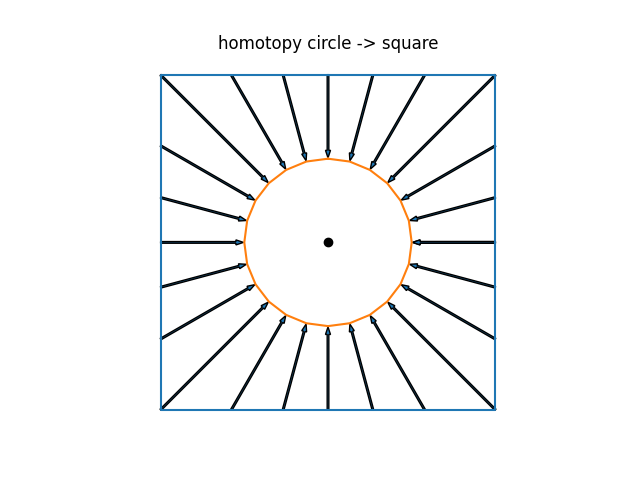
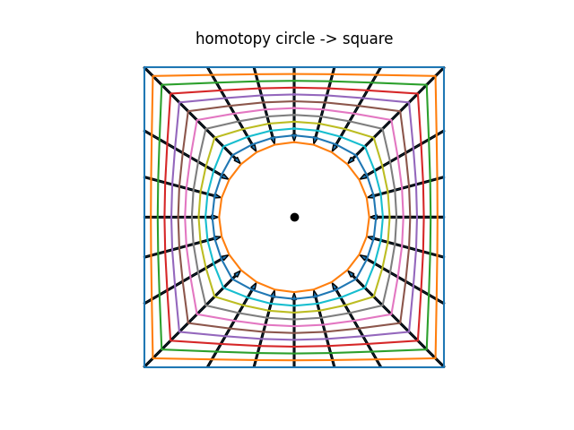
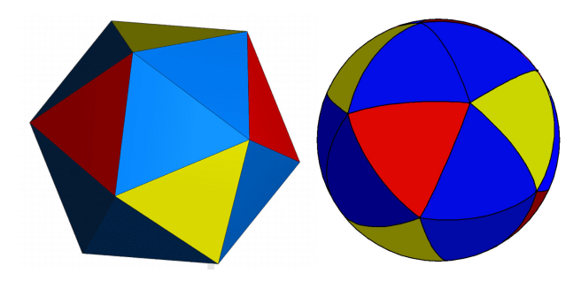
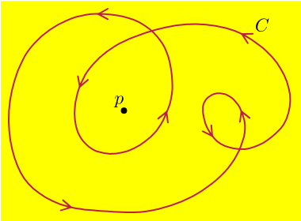
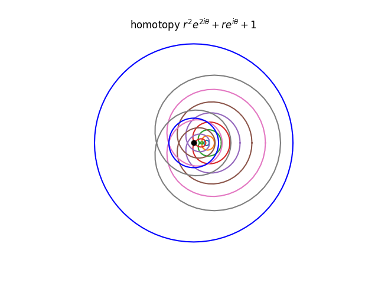
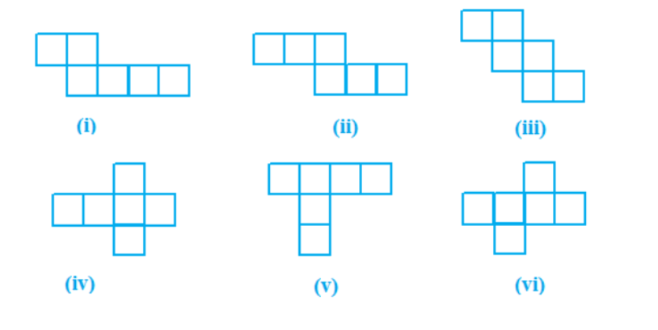

<!--
theme: gaia
class: gaia lead
headingDivider: 1
paginate: true
header: UGA 2025
footer: 
backgroundImage: linear-gradient(-20deg, rgba(0, 0, 0, 0.6), transparent)
_paginate: false
_header: ''
_footer: ''

style: |
  @keyframes marp-outgoing-transition-vertical-scroll {
    from { transform: translateY(0%); }
    to { transform: translateY(-100%); }
  }
  @keyframes marp-incoming-transition-vertical-scroll {
    from { transform: translateY(100%); }
    to { transform: translateY(0%); }
  }

  @keyframes marp-outgoing-transition-vflip {
    0% { animation-timing-function: ease-in; }
    50% {
      transform: perspective(100vw) translateZ(-100vw) rotateX(-90deg);
      opacity: 0.5;
      animation-timing-function: step-end;
    }
    100% { opacity: 0; }
  }
  @keyframes marp-incoming-transition-vflip {
    0% {
      animation-timing-function: step-start;
      opacity: 0;
    }
    50% {
      transform: perspective(100vw) translateZ(-100vw) rotateX(90deg);
      opacity: 0.5;
      animation-timing-function: ease-out;
    }
  }

  header, footer { text-align: center; color: currentcolor; }
  section.small-code pre { font-size: 68%; }

-->

# Algebraic Topology
<!-- _transition: glow -->
greg mc shane

<!-- # -->
<!-- <!-1- _transition: cube -1-> -->

# Plan

- [Caractéristique d'Euler](#caractéristique-d'Euler)
- Indice d'un point par rapport à un lacet
- Revetements
- Groupes, homologie et homotopie

# 

### Acquis

- sphère $\mathbb{S}^n = \{\vec{x} = (x_0\dots x_n) , \|\vec{x}\| = 1  \} \subset \mathbb{R}^{n+1}$

- $\gamma:[0,1] \to \mathbb{C}^*$  courbe paramétrée
- $\gamma(t) = x(t) + iy(t)$
- $\gamma'(t) = \dot{x}(t) + i\dot{y}(t)$ vecteur tangent
- lacet ssi $\gamma(0) = \gamma(1)$

#

## Applications continues

- $X$ est un espace topologique, $Y$ est un espace topologique, $f:X \to Y$ est une application continue.
- $f$ est **homéomorphisme** si elle est bijective et que $f$ et $f^{-1}$ sont continues.
- $f$ est **homotope** à $g$ si il existe une application continue
$H:X \times [0,1] \to Y$ telle que $H(x,0) = f(x)$ et $H(x,1) =
g(x)$. 
<!-- On note $f \simeq g$. -->

- Objectif : Classifier les espaces topologiques 
    - à homéomorphisme près
    - à homotopie près

#

#

#

[Koch -> triangle homotopie](https://github.com/macbuse/koch/blob/master/tt.gif)

#

[horned sphere](https://github.com/macbuse/horned-sphere/blob/master/alexanderSphere2019.stl)

#

### Solides de Platon

- $X \subset \mathbb{R}^3$ est un solide de Platon si $X$ est convexe,
compact et que les faces de $X$ sont des polygones réguliers
identiques.

- $f:\vec{v} \mapsto \frac{\vec{v}}{||\vec{v}||}, X \to
\mathbb{S}^2$ est un homéomorphisme.

#

### Indice d'un point par rapport à un lacet

<!-- **Définition informelle** --> 
= nombre de fois que le lacet s'enroule autour du point [animation](https://commons.wikimedia.org/wiki/File:Winding_Number_Animation_Small.gif?uselang=fr)
<!-- - $X \subset \mathbb{C}^*$ est un lacet. -->
- $\gamma_1:[0,1] \to \mathbb{C}^*, t \mapsto exp(2\pi it)$ 
- $\gamma_2:[0,1] \to \mathbb{C}^*, t \mapsto exp(4\pi it)$
- $\gamma_3:[0,1] \to \mathbb{C}^*, t \mapsto \exp(2\pi it) +
3\cdot exp(4\pi it)$

|lacet | indice de 0|
|---|---|
|$\gamma_1$|1 tour|
|$\gamma_2$|2 tours|
|$\gamma_2$|2 tours|

# La mauvaise réponse de la maitresse

- [caractéristique d'Euler](https://analysis-situs.math.cnrs.fr/-Caracteristique-d-Euler-Poincare-92-.html)
- **solides de Platon** et les éléments classiques selon le *Timée* de Platon   
- [the 5 elements according to the Timaeus](https://en.wikipedia.org/wiki/Timaeus_(dialogue)#The_elements)

# 

| **Solide**     | **Élément**    | **Description**                                              | **Faces** | **Faces**       | 
|--------------------------|----------------|--------------------------------------------------------------|-----------|---------------------------|
| **Tétraèdre**             | Feu            | Pointu et énergique                 | 4         | Triangle équilatéral       | Transformation, énergie et chaleur             |
| **Cube (Hexaèdre)**       | Terre          | Solide et immuable | 6         | Carré                      |
| **Octaèdre**              | Air            | Léger, mobile,  | 8         | Triangle équilatéral       | 
| **Icosaèdre**             | Eau            | Fluide, coulant et adaptable | 20        | Triangle équilatéral       | 
| **Dodécaèdre**            | Éther (ou Cosmos) | Représentant l’univers et les cieux                        | 12        | Pentagone régulier         | 

# Notes supplémentaires :
- **L’éther** (ou **aether**) était souvent considéré comme le « cinquième élément » ou la **quintessence**, représentant la substance des sphères célestes et du divin.  
- Le **nombre de faces** et leurs propriétés symétriques rendaient ces solides uniques et leur donnaient des correspondances avec les caractéristiques des éléments.  
- Le **dodécaèdre** était particulièrement mystique pour les Grecs, car il symbolisait l’ensemble du cosmos.

# Viruses

To maximise its information, the volume of the protective capsid must be as large as possible, and must be formed by just a few different proteins  and clusters of them are distributed over the polyhedral capsid, as symmetric as possible.

This insight led Watson and Crick to the ‘genetic economy’-proposal that most sphere-like viruses will have an icosahedral capsid because the icosahedron is the Platonic solid with the largest volume and rotational symmetry group. They argued that the capsid is most likely constructed from a single subunit (capsomere), which is repeated many times to form the protein shell.

[Viruses](http://www.neverendingbooks.org/gov-1-geometry-of-viruses/)

# 
- **Définition** Un polyèdre convexe est un **solide de Platon** 
si et seulement si

1. Toutes ses faces sont des polygones 
réguliers convexes isométriques
1. Aucune de ses faces ne se coupe, 
excepté sur les arêtes
1. Le même nombre de faces se rencontre 
à chacun de ses sommets.

<!-- - p = le nombre de côtés de chaque face (ou le nombre de sommets sur chaque face) et -->
<!-- - q = le nombre de faces se rencontrant à chaque sommet (ou le nombre d'arêtes se rencontrant à chaque sommet). -->

#

| Solide Platonicien   | Nombre de Faces | Nombre d'Arêtes | Nombre de Sommets |
|-----------------------|-----------------|------------------|-------------------|
| Tétraèdre             | 4               | 6                | 4                 |
| Cube (Hexaèdre)       | 6               | 12               | 8                 |
| Octaèdre              | 8               | 12               | 6                 |
| Dodécaèdre            | 12              | 30               | 20                |
| Icosaèdre             | 20              | 30               | 12                |
| Sphère             | ???             | ???              | ???
|

# Caractéristique d'Euler

- La caractéristique d'Euler $\chi$ est une **invariante topologique** des polyèdres convexes et d'autres objets géométriques. 

|Formule de la caractéristique d'Euler|
|-------------------------------------|
|$\chi = S - A + F$|

| Où :  |
|-------------------------------------|
| ( S ) est le nombre de sommets (vertices)|
| ( A ) est le nombre d'arêtes (edges) |
| ( F ) est le nombre de faces (faces) |

<!-- - \( S \) est le nombre de sommets (vertices), -->  
<!-- - \( A \) est le nombre d'arêtes (edges), -->  
<!-- - \( F \) est le nombre de faces (faces). -->  

#

Pour un polyèdre convexe, la caractéristique d'Euler vaut toujours $\chi = 2$, conformément au théorème d'Euler.

- Exemple avec un cube (hexaèdre) :  
  S = 8  ,  A = 12  ,   F = 6 .   
En appliquant la formule :  $\chi = S - F+ A = 8 - 12 + 6 = 2$

# Cas des autres polyèdres convexes :

| Solide Platonicien   | Caractéristique d'Euler |
|-----------------------|-----------------|
| **Tétraèdre** | $\chi = 4 - 6 + 4 = 2$  |
| **Octaèdre** | $\chi = 6 - 12 + 8 = 2$  |
| **Dodécaèdre** | $\chi = 20 - 30 + 12 = 2$  |
| **Icosaèdre** | $\chi = 12 - 30 + 20 = 2$  |

La caractéristique d'Euler est aussi utile pour les surfaces plus complexes, mais sa valeur peut varier en fonction de la topologie   (par exemple, pour un tore, $\chi = 0$)

# L'erreur de la maitresse

| Solide Platonicien   | Nombre de Faces | Nombre d'Arêtes | Nombre de Sommets |
|-----------------------|-----------------|------------------|-------------------|
| Cube (Hexaèdre)       | 6               | 12               | 8                 |
| Sphère (maitresse)             | 1|0|0 |
| Sphère (ballon)             | 1|0|1 |
| Sphère (carte)             | 2|1|1 |
| Cercle|0|1|1|

#

# Craster parabolic

#
## indice d'un point par rapport à un lacet

# Definition et formule

Le **indice** d’une courbe fermée $\gamma$ autour de l’origine $(0, 0)$ 
est défini comme le nombre de fois que la courbe s’enroule 
autour de l’origine dans le sens antihoraire. 

La formule pour le "nombre d’enroulements" est :

$$\text{indice} = \frac{1}{2\pi} \int_{\gamma} \frac{x \, dy - y \, dx}{x^2 + y^2}$$

#

- $\gamma$ est donnée sous forme paramétrique par 
- $\gamma(t) = (x(t), y(t))$ pour $t \in [a, b]$, 

<!-- | | -->
<!-- |-------------------------------------| --> 
<!-- |$\text{indice} = \frac{1}{2\pi} \int_{a}^{b} \frac{d\theta(t)}{dt} \, dt$| -->

 $$\text{indice} = \frac{1}{2\pi} \int_{a}^{b} \frac{d\theta(t)}{dt} \, dt$$

où $\theta(t) = \tan^{-1}\left(\frac{y(t)}{x(t)}\right)$ est l’angle polaire du point $(x(t), y(t))$.

$$\frac{d}{dt}\theta(t) =\frac{d}{dt} \tan^{-1}
\left(\frac{y(t)}{x(t)}\right) 
= \frac{\left(\frac{y(t)}{x(t)}\right)' }{1 + \left(\frac{y(t)}{x(t)}\right)^2}

=  \frac{x \dot{y} - y \dot{x}}{x^2 + y^2}$$

#

### Exemple : cercle de rayon $R$

- $\gamma$ est un cercle de centre l'origine, de rayon $R>0$
- $\gamma(t) = R(\cos(t),\sin(t))$ pour $t \in [0,2\pi]$, 
- $\gamma'(t) = (\dot{x},\dot{y}) = R(-\sin(t),\cos(t))$ 

 $$\frac{d}{dt}\theta(t) =  \frac{x \dot{y} - y \dot{x}}{x^2 + y^2} =
\frac{\cos^2(t) + \sin^2(t)}{\cos^2(t) + \sin^2(t)} = 1$$

$$\Rightarrow \text{indice} = \frac{1}{2\pi} \int_{0}^{2\pi} 1\, dt  = 1$$

# 

[animation](https://commons.wikimedia.org/wiki/File:Winding_Number_Animation_Small.gif?uselang=fr)

# 

L'origine de l'indice est une lettre de Gauss à un ami, le
mathématicien allemand Bessel:

$$x\in \mathbb{R}_+,\, \int_1^x \frac{du}{u} = \log(x) \text{ et }
\exp(\log(x)) = x $$
$$z\in \mathbb{C}^*,\,\int_1^z \frac{dw}{w} = \log(z) = \log(|z|) + i\arg(z)$$
<!-- $$\gamma(t) = x(t) + iy(t)$$ --> 

<!-- $$ -->
<!-- \text{indice} = \frac{1}{2\pi i} \int_{a}^{b} \frac{\gamma'(t)}{\gamma(t)} \, dt -->
<!-- $$ -->

<!-- où $\gamma'(t)$ désigne la dérivée de $\gamma(t)$ par rapport à $t$. -->

Cette dernière forme est souvent utilisée en analyse complexe. Elle calcule combien de fois la courbe entoure l’origine en intégrant la dérivée logarithmique de la fonction complexe le long de la courbe.

#

$$z\in \mathbb{C}^*,\,\int_1^z \frac{dw}{w} = \log(z) = \log(|z|) + i\arg(z)$$

- Gauss comprend que l’intégrale,
le logarithme complexe $\log z$, est multivaluée. 
Ceci contraste avec son inverse $\exp(z)$ qui est définie de façon univoque.
- Le graphe de $\arg z$ est un **revetement** de $\mathbb{C}^*$.
<!-- - Le graphes de $\log z$ est une surface de Riemann, un **revetement** de $\mathbb{C}^*$. -->

# 

## D'Alembert Gauss

<!-- - **D'Alembert** a démontré que l'indice est un entier. -->
<!-- - **Gauss** a démontré que l'indice est un entier relatif. -->

- **Théoreme :** Soit $P(z)$ un polynôme complexe non constant. 
Alors $P$ admet une racine dans $\mathbb{C}$. 

- Soient $P(z) = a_nz^n + \cdots + a_1z + a_0$, $R = (n-1)\cdot{\rm max}(|a_0|, \cdots, |a_{n-1}|)\cdot r^{n-1}$
- si $a_0 = 0$, alors $0$ est une racine de $P$. On suppose que $a_0 \neq 0$ 
- On considère le lacet $\gamma_r(t) = P(re^{2\pi it})$ pour $t \in [0,1], r\geq 0$.
    - si $r=0$ alors $\gamma_r$ est constante et l'indice est $0$.
    - si $r$ est suffisamment grand, alors $\gamma_r$ est une courbe fermée contenue dans un anneau $|a_n|r^n - R\leq |z| \leq |a_n|r^n + R$.

#

## Exemple

- $P(z) = z^2 + z + 1$
    - $r=0.2$ bleu clair
    -  $r=2$ orange, 
-  $|a_n|r^n - R\leq |z| \leq |a_n|r^n + R$
- $1 \leq |(2 e^{it})^2 + 2 e^{it} + 1 | \leq 5$

<!--  -->

#

- $r=1$ la courbe rouge 
- $(e^{it})^2 + e^{it} + 1$
passe par l'origine.

# Exercices

[deplier un cube on Wolfram](https://demonstrations.wolfram.com/UnfoldingPolyhedronNets/)

1. Determiner les 4 figures qui se recollent pour former un cube.

1. Trouver les 11 facons de déplier un cube en un plan.

<!-- [solution](https://github.com/TotallyReal/Polyhedron-Nets) -->

#

3. Soit $P(z)$ un polynôme complexe non constant. 
Montrer que $P : \mathbb{C} \to \mathbb{C}$ est surjective.

4. On considere $f: z \mapsto z^2 - z + 1$ de $\mathbb{C} \to \mathbb{C}$.
    - Montrer que l'image de $\exp(it),\, t\in [0,2\pi]$ est une courbe avec un point d'auto-intersection.

# Bibliographie

- [prove me wrong](https://prove-me-wrong.com/mathematical-art/math-visualization-portfolio/)

