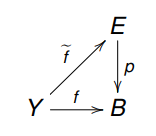

<!--
theme: gaia
class: gaia lead
headingDivider: 1
paginate: true
header: UGA 2025
footer: 
backgroundImage: linear-gradient(-20deg, rgba(0, 0, 0, 0.6), transparent)
_paginate: false
_header: ''
_footer: ''

style: |
  @keyframes marp-outgoing-transition-vertical-scroll {
    from { transform: translateY(0%); }
    to { transform: translateY(-100%); }
  }
  @keyframes marp-incoming-transition-vertical-scroll {
    from { transform: translateY(100%); }
    to { transform: translateY(0%); }
  }

  @keyframes marp-outgoing-transition-vflip {
    0% { animation-timing-function: ease-in; }
    50% {
      transform: perspective(100vw) translateZ(-100vw) rotateX(-90deg);
      opacity: 0.5;
      animation-timing-function: step-end;
    }
    100% { opacity: 0; }
  }
  @keyframes marp-incoming-transition-vflip {
    0% {
      animation-timing-function: step-start;
      opacity: 0;
    }
    50% {
      transform: perspective(100vw) translateZ(-100vw) rotateX(90deg);
      opacity: 0.5;
      animation-timing-function: ease-out;
    }
  }

  header, footer { text-align: center; color: currentcolor; }
  section.small-code pre { font-size: 68%; }

-->

# Relèvements des chemins
<!-- _transition: glow -->
greg mc shane

# 

**Hatcher Chapitre 1.3**

- Rappels
- Lemme de Lebesgue
- Lemme de coïncidence
- Propriété de relèvement des applications
- Theorème de l’injectivité de $p_∗$

#

- **Théorème de l’injectivité de $p_∗$**  
Soit $p : (E, x_0) → (B,b_0)$ un revêtement. 
    - L’application induite $p_∗ : \pi_1(E, x_0) \to \pi_1(B, b_0)$ est injective. 
    - Le sous-groupe image $p_∗(\pi_1(E, x_0))$ est
constitué des classes de lacets de B, basés en $b_0$, 
et dont les relèvements sont des lacets de E.

# 

### Homotopies d'applications

- **Définition**.– Soient X et Y deux espaces topologiques et
$f, g : X \to Y$ deux applications continues. 
Une HOMOTOPIE ENTRE f ET g est une application continue
$H : X × [0, 1] \to  Y$ telle que
    - $\forall x \in X, H(x, 0) = f(x)$
    - $\forall x \in X, H(x, 1) = g(x)$

- Soit A ⊂ X. On dit que l’homotopie H est RELATIVE À A si
de plus
    - $\forall x \in A, \forall t \in [0, 1], H(x, t) = f(x) = g(x)$

#

<!-- _transition: glow -->

- **On définit** une relation binaire $\simeq$  dans 
$C^0(X, Y)$ par $f \simeq g \Leftrightarrow$ il existe une homotopie entre f et g
- Similairement, $f \simeq_A g$ si l’homotopie est relative à A.

# Relèvements des chemins

<!-- _transition: cube -->

#

- **Lemme de Lebesgue**. Soit (X, d) un espace métrique compact et 
$\{U_\alpha,\alpha\in A\}$ un recouvrement de X par des ouverts. 
Alors, il existe un nombre δ > 0, appelé **nombre de Lebesgue**,
tel que pour tout Y ⊂ X, si le diamètre de Y est plus petit que δ 
alors Y est inclus dans l’un des $U_\alpha$

#

- **Démonstration du lemme de Lebesgue**.– 
Puisque $\{U_α\},\alpha \in A$ est un recouvrement,
pour tout x ∈ X, il existe $U_\alpha$ tel que $x \in U_\alpha$

- Puisque $U_\alpha$ est ouvert, il existe une boule B(x, r) centrée en x et de rayon r = \epsilon(x) incluse dans $U_\alpha$.
- Les boules $B(x, \epsilon(x)), x\in X$ de rayon moitié
forment un recouvrement de X.
- Puisque X est compact, il existe $x_1, ..., x_n$
tels que $X= \bigcup_{i=1}^n B(x_i, \epsilon(x_i))$.
On pose $\delta := \min\{\epsilon(x_i)| i = 1, ..., n\}$.
$\Box$

#

### Relèvements des chemins
- **Définition**.– Soient p un revêtement et f : Y → B une application continue. Un **relèvement** de f est toute application continue 
$\tilde{f} : Y \to E$ telle que $p \circ \tilde{f} = f.$

-  On a déjà rencontré la notion de relèvement dans le cas particulier du revêtement $p : \mathbb{R} \to \mathbb{S}^1$ 
- Nous allons généraliser cette propriété de relèvement 

#

### Propriété de relèvement des chemins.
- Soit $p : (E, x_0) \to (B, b_0)$ un revêtement 
et soit $\gamma : [0, 1] → B$ un chemin partant de $\gamma(0) = b_0$, 
alors il existe un unique relevé $\tilde{\gamma}$ de $\gamma$ tel que $\tilde{\gamma}(0) = x_0$ 

- De même, si $H : [0, 1]^2 \to B$ est une homotopie relative
joignant deux chemins $\gamma_1, \gamma_2 ∈ L(B, b_0, b_1)$ alors il existe
une unique homotopie $H : [0, 1]^2 \to E$ joignant $\tilde{\gamma}_1$ à $\tilde{\gamma}_2$, 
telle que $\tilde{H}(0, t) = x_0$ et $p\circ \tilde{H} = H$

#

- La démonstration de la propriété de relèvement est facilité
si l’on dispose du lemme suivant :

- **Lemme de coïncidence**.– Soient $\tilde{f}_1$ et $\tilde{f}_2$ deux relèvements
de f : Y → B alors l’ensemble de coïncidence
$S := \{y ∈ Y | \tilde{f}_1(y) = \tilde{f}_2(y)\}$
est à la fois ouvert et fermé dans Y. 
Si Y est connexe alors $S = \emptyset$ ou S = Y.
- **Démonstration du lemme.**– Soit
$\phi : Y \to  E \times E$ $y \mapsto (\tilde{f}_1(y), \tilde{f}_2(y))$.
- Notons que $S = \phi^{-1}(\Delta_E)$ où $\Delta_E = \{(x, x) | x ∈ E\} \subset  E^2$ est la diagonale

#

- Rappelons que 
    - $\Delta_E$ est fermé $\Leftrightarrow$ E est séparé
    - l’espace total E est toujours implicitement supposé séparé. 
    - On en déduit que S est fermé puisque $\phi$ est
continue.
-  Montrons que S est ouvert. Soit $y\in S$ et $b = f(y)$
Il existe un ouvert U contenant b qui est trivialisant,
c’est-à-dire tel que
    - $p^{-1}(U) = \sqcup_{\alpha \in A} V_\alpha$ 
    - Il existe donc un indice α(y) tel que 
$\tilde{f}_1(y) = \tilde{f}_2(y) \in V_\alpha$.

#

- Par continuité, il existe un voisinage $U' \subset U$ tel que
$\forall y' \in U', \tilde{f}_1(y') \in V_\alpha$ existe

- Puisque $\tilde{f}_1$ et $\tilde{f}_2$ sont des relèvements de f, on a
$\forall y' \in U', p(\tilde{f}_1(y')) = p(\tilde{f}_2(y')) = f(y')$.
- Comme l’application p restreinte à $V_\alpha(y)$ est bijective 
sur son image U, on a pour tout $\forall y' \in U', p(\tilde{f}_1(y')) = p(\tilde{f}_2(y'))$.
$\Rightarrow ( p|V_\alpha(y))^{-1} \circ p \circ \tilde{f}_1(y') =
( p|V_\alpha(y))^{-1} \circ p \circ \tilde{f}_2(y')$.
$\Rightarrow \tilde{f}_1(y') = \tilde{f}_2(y')$.

- Ainsi $U \subset S$ et donc S est ouvert.

#

- **Démonstration de la propriété de relèvement a)**. 
- Pour tout point b ∈ B, on note U' un ouvert trivialisant
c’est-à-dire tel que 
$p^{-1}(U) = \sqcup_{\alpha \in A} V_\alpha$ 
au sens de la définition d’un revêtement. 
On a trivialement
$B = \sqcup_{b \in A} U_b$
-  Ainsi, en prenant la preimage de ce recouvrement par γ,
on obtient un recouvrement de $[0, 1]$ par des ouverts
$[0, 1] = \sqcup_{b \in A} \gamma^{-1}(U_b)$

#

- Puisque $[0, 1]$ est compact (et évidemment métrique), par le lemme de Lebesgue )
- il existe une subdivision $[0, 1] = \sqcup_{n=0}^{N−1} I_n$ avec $I_n = [\frac{n}{N}, \frac{n + 1}{N}]$
pour laquelle, pour tout n, il existe p(n) ∈ B telle que
$\gamma(I_n) \subset U_n$ où $U_n:= U_{p(n)}$

-  On va définir $\tilde{\gamma}$ sur chaque intervalle $I_n$ n ∈ {0, ..., N − 1}. 
Commençons par $I_0 = [0, \frac{1}{N}]$.
-  Notons $V^0_\alpha$ les ouverts au dessus de $U_0$ et: $p^{-1}(U_0) = \bigsqcup_{\alpha \in A} V^0_\alpha$.

#

- Puisque $γ(I_0) ⊂ U_0$, on a nécessairement $b_0 = \gamma(0) \in U_0$ 
et donc il existe un indice $\alpha_0$ tel que $x_0 \in V^0_{\alpha_0}$ 
-  La définition d’un revêtement implique que l’application
$p|V^0_{\alpha_0} : V^0_{\alpha_0} \to U_0$ est un homéomorphisme.

 - **Définissons** $\tilde{\gamma}$ sur $I_0$ en posant $\forall s\in I_0,\tilde{\gamma}(s) :=p|V^0_{\alpha}$ $^{-1}\circ \gamma.$
-  Par construction, $p  \circ \tilde{\gamma} = \gamma$
et donc $\tilde{\gamma}$ est un relèvement de γ sur $I_0$.
-  On poursuit sur $I_1$ en considérant 
$b_1 := \gamma(\frac{1}{N}) ⊂ U_1$ et $x_1 := \tilde{\gamma}(\frac{1}{N})$ 
pour prolonger $\tilde{\gamma}$ sur $I_1$. Et ainsi de suite.

#
<!-- _transition: glow -->

- Supposons que $\tilde{\gamma}_1$ et $\tilde{\gamma}_2$ soient deux relèvements
tels que $\tilde{\gamma}_1(0) = \tilde{\gamma}_2(0)$
alors $0\in S:= \{s ∈ [0, 1] | \tilde{\gamma}_1(s) = \tilde{\gamma}_2(s)\} \neq \emptyset$
 
D’après le lemme, l’ensemble S est donc $[0, 1]$ ce qui entraîne 
que $\tilde{\gamma}_1(s) = \tilde{\gamma}_2(s)$ pour tout s ∈ [0, 1] 
- La démonstration du point **b)** est tout à fait similaire. 
Elle est laissée en exercice. $\Box$

# Revetements et groupes fondamentaux

<!-- _transition: cube -->

#

- **Théorème de l’injectivité de $p_∗$** – 
Soit $p : (E, x_0) → (B,b_0)$ un revêtement. 
    - L’application induite $p_∗ : \pi_1(E, x_0) \to \pi_1(B, b_0)$ est injective. 
    - Le sous-groupe image $p_∗(\pi_1(E, x_0))$ est
constitué des classes de lacets de B, basés en $b_0$, 
et dont les relèvements sont des lacets de E.

- **Observation**.– Ce théorème est très surprenant car on a
construit des revêtements dont le groupe fondamental de
l’espace total E semble bien plus gros que celui de la base B. 

Par exemple, si E est la triple boucle et B est le bouquet $S^1
\wedge
S^1$ alors $\pi_1(E) = \mathbb{Z}*\mathbb{Z}*\mathbb{Z}$ et $\pi_1(B) = \mathbb{Z}*\mathbb{Z}$.

#

- **Démonstration du théorème de l’injectivité** de $p_∗$ 
Soit $\tilde{\gamma} : [0, 1] → E$ un lacet basé en $x_0$ tel que
$p_∗([\tilde{\gamma}]) = [c_{b_0}]$. 

- Cela signifie que $\gamma = p \circ \tilde{\gamma}$ homotope à $c_{b_0}$ dans B.
Soit $H : [0, 1]^2 → B$ une homotopie de lacets basés en $b_0$
telle que $H(0, ·) = \gamma$ et $H(1, ·) = b_0$.
-  D’après la propriété de relèvement, il existe une
homotopie $H : [0, 1]^2 → E$ telle que
$p \circ \tilde{H} = H$ et $H(0, ·) = \tilde{\gamma}$ et $H(1, ·) = \tilde{c}_{x_0}$.
où $\tilde{c}_{x_0}$ est le relevé du lacet constant.

#

- Montrons que les chemins $s\mapsto \tilde{\gamma}(s) := \tilde{H}(1, s)$
sont des lacets basés en $x_0$. En effet, l’application
$t \mapsto \tilde{H}(t, 1)$ est continue à valeur dans l’espace discret 
$F_{b_0} := p^{-1} (b_0).$ Elle est donc constante. 
Puisque $\tilde{\gamma}(1) = \tilde{H}(1, 0) = \tilde{H}(1, 1) = x_0$,
c’est donc que tous les γet sont des lacets basés en $x_0$.
- Or le chemin constant $c_{x_0}$ est un relevé de $c_{b_0}$ 
-  Par unicité du relèvement $\tilde{c}_{b_0} = \tilde{H}(1, ·) = c_{x_0}$ 
- Donc $\tilde{\gamma}$ est homotope à $c_{x_0}$ dans E
et donc $[\tilde{\gamma}]$ est l’élément neutre du $\pi_1(E, x_0)$ et $p_*$ est injectif.

#

- Supposons maintenant que $p_∗([\delta]) = [\gamma]$ avec $\delta
\in \Omega(E,x_0)$ et $\gamma \in \Omega(B, b_0)$.
Par conséquent p ◦ δ et γ sont homotopes dans B.
- Le relèvement de cette homotopie fournit une homotopie
$\tilde{H}$ entre $\tilde{H}(0, s) = \delta(s)$ et $\tilde{\gamma}:= \tilde{H}(1, s)$
- Notons $\delta_t:= \tilde{H}(t, ·)$ pour t ∈ [0, 1]. ainsi $\delta_0 = \delta$ et $\delta_1 = \tilde{\gamma}$.
Pour une raison similaire à celle développée plus haut,
les chemins $\delta_t$ sont en fait des lacets basés en $x_0$. 
En particulier $\tilde{\gamma}$ est en un lacet.
- Réciproquement, si $\tilde{\gamma}$ est un lacet basé en $x_0$  
son image $\gamma = p \circ \tilde{\gamma}$ est un lacet basé en $b_0$. $\Box$

#

<!-- ### Le problème du relèvement -->
<!-- - On va généraliser de la propriété de relèvement des -->
<!-- chemins γ : [0, 1] → B aux applications f : Y → B. Il nous -->
<!-- faudra cependant supposer certaines propriétés -->
<!-- topologiques sur Y. -->
<!-- Définition. – On dit qu’un espace Y est LOCALEMENT -->
<!-- CONNEXE PAR ARCS si pour tout point y ∈ Y et tout -->
<!-- voisinage V de y, il existe un sous-voisinage V0 ⊂ V de y -->
<!-- connexe par arcs. -->
<!-- - R -->
<!-- n ainsi que tous ses ouverts sont localement connexes -->
<!-- par arcs. -->
<!-- - Le sous-espace [−2, −1] ∪ [1, 2] de R est localement -->
<!-- connexe par arcs mais pas connexe par arcs. -->

