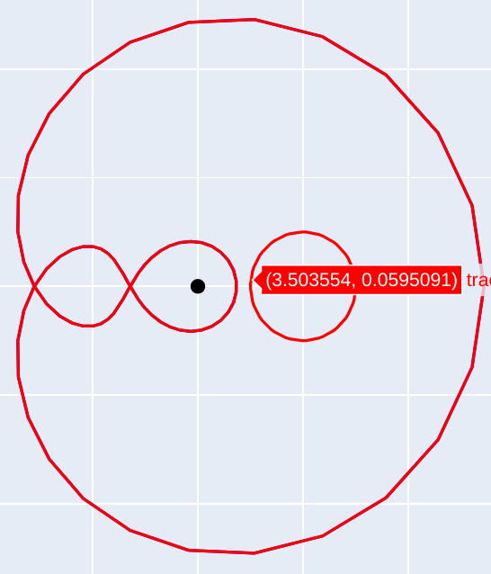
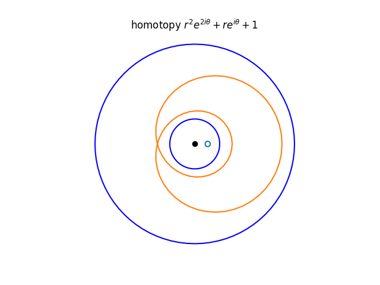
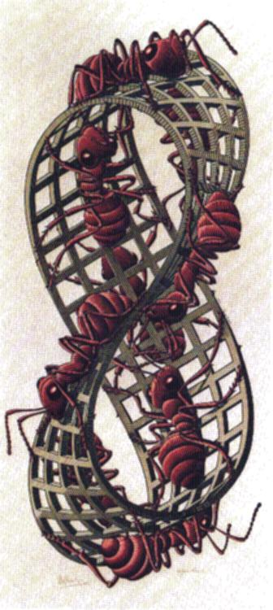
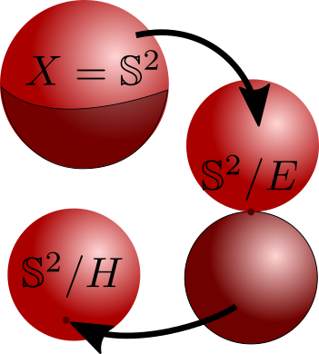
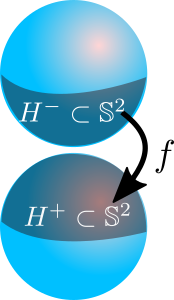

<!--
theme: gaia
class: gaia lead
headingDivider: 1
paginate: true
header: UGA 2025
footer: 
backgroundImage: linear-gradient(-20deg, rgba(0, 0, 0, 0.6), transparent)
_paginate: false
_header: ''
_footer: ''

style: |
  @keyframes marp-outgoing-transition-vertical-scroll {
    from { transform: translateY(0%); }
    to { transform: translateY(-100%); }
  }
  @keyframes marp-incoming-transition-vertical-scroll {
    from { transform: translateY(100%); }
    to { transform: translateY(0%); }
  }

  @keyframes marp-outgoing-transition-vflip {
    0% { animation-timing-function: ease-in; }
    50% {
      transform: perspective(100vw) translateZ(-100vw) rotateX(-90deg);
      opacity: 0.5;
      animation-timing-function: step-end;
    }
    100% { opacity: 0; }
  }
  @keyframes marp-incoming-transition-vflip {
    0% {
      animation-timing-function: step-start;
      opacity: 0;
    }
    50% {
      transform: perspective(100vw) translateZ(-100vw) rotateX(90deg);
      opacity: 0.5;
      animation-timing-function: ease-out;
    }
  }

  header, footer { text-align: center; color: currentcolor; }
  section.small-code pre { font-size: 68%; }

-->

#

### Exos
1. Montrer que la sphère $\mathbb{S}^2$ est simplement connexe.
    - Projection stéréographique
    - Courbe de Peano
1.  Montrer que la courbe est nul homotope.
1.  [11 nets de cubes](https://www.open.edu/openlearncreate/mod/oucontent/view.php?id=153807&section=2.5)

<!--  -->
<!--  -->

#

1. revetements
1. quotients
1. recollement

- **IMPORTANT :** $X$ est toujours un espace topologique  **separé**
 càd tout couple de points distincts admet des voisinages disjoints.

# 

<!-- _transition: cube -->

### Compacité

- La compacité est une hypothèse **contraignante**.
Elle peut être remplacée par une propriété plus faible, 

- **Définition.** Un espace topologique X est dit **localement
compact**
    1. s’il est séparé 
    1. et si tout point x élément de X admet un voisinage compact (autrement dit si x appartient à un ouvert relativement compact)

- **Exemples :** Sont localement compacts, tous les
compacts, tous les espaces homéomorphes à $\mathbb{R}^n$. 

# Shape of the world

<!-- _transition: slide -->

#

<!-- _transition: slide -->

# ... shape of the universe

<!-- _transition: slide -->
- compact ? ouvert ? simplement connexe ? plat ?

[shape of the universe](https://en.wikipedia.org/wiki/Shape_of_the_universe)
- In a universe with **zero curvature**, the local geometry is flat. The most familiar such global structure is that of Euclidean space, which is infinite in extent. Flat universes that are finite in extent include the **torus** and **Klein bottle.** 
- In three dimensions, there are 10 finite compact flat 3-manifolds, of which 6 are orientable and 4 are non-orientable.

#
<!-- _transition: cube -->

-  Flat universes that are finite in extent include the torus and Klein bottle. Moreover, in three dimensions, there are 10 finite closed flat 3-manifolds, of which 6 are orientable and 4 are non-orientable.

- [J. Weeks dodecahedral space](https://arxiv.org/abs/astro-ph/0310253)
- [Wiki page](https://fr.wikipedia.org/wiki/Espace_dod%C3%A9ca%C3%A9drique_de_Poincar%C3%A9)

# Revêtements

<!-- _transition: slide -->

|application|symmetrie|
|---|---|
|$z \mapsto \exp(z), \mathbb{C} \to \mathbb{C}^*$| $z \mapsto z + 2\pi i$ |
|$z \mapsto z^2, \mathbb{C}^* \to \mathbb{C}^*$| $z \mapsto -z$|

#

- Une **application de revêtement** (ou **revêtement topologique**) est un type de fonction continue entre espaces topologiques qui, intuitivement, représente une version « dépliée » ou « en couches » d’un espace. 

- $p: \tilde{X} \to X$ surjective est appelée **application de revêtement** 
 si, $\forall x \in X, \exists U_x \subset X$ un voisinage ouvert (**voisinage trivialisant**) tel que $p^{-1}(U_x)$ soit une union disjointe d'ouverts de $\tilde{X}$, chacun étant envoyé **homéomorphiquement** sur $U_x$ par $p$.  

<!-- - $p: \tilde{X} \to X$ surjective est appelée **application de revêtement** --> 
<!--  si, pour tout point $x \in X$, il existe un voisinage ouvert $U \subset X$ (appelé **voisinage trivialisant**) tel que $p^{-1}(U)$ soit une union disjointe d'ouverts de $\tilde{X}$, chacun étant envoyé **homéomorphiquement** sur $U$ par $p$. -->  

#

### Exemples
- $z \mapsto e^{2\pi i z}, \mathbb{C} \to \mathbb{C}^*$ est une application de revêtement où chaque point possède une infinité de préimages.  
- $n \neq 0$
  - $z \mapsto z^n, \mathbb{C}^* \to \mathbb{C}^*$ est une application de revêtement où chaque point possède exactement $n$ préimages.
- $n \neq 0,\pm 1$
  - $z \mapsto z^n, \mathbb{C} \to \mathbb{C}$ 
n'est pas un véritable revêtement car elle échoue à être localement homéomorphe en $z = 0$, où plusieurs « feuilles » fusionnent autrement dit $0$ n'as pas de voisinage trivialisant 
  ( **revêtement ramifié** )

#

### Exercices

1. Completer le tableau suivant

|  $f$|$\tilde{X}\to X$|$f^{-1}(re^{i\theta})$                                     | vois triv |
|--------------------------------|--------------------------|---------------------------------------------------------------|-----------------------------------------|
| $e^{z}$  | $\mathbb{C} \to \mathbb{C}^*$  | $\log(r) + i(\theta + 2\pi  k), k\in \mathbb{Z}$                      |   |
| $z^n$           | $\mathbb{C}^* \to \mathbb{C}^*$ |  | |

<!-- | $z^n$           | $\mathbb{C}^* \to \mathbb{C}^*$ | $e^{2\pi i (\theta +  k)/n},\, 0 \leq k \leq n-1$ | | -->

2. Montrer que $0$ ne possede pas de voisinage trvilisant pour $z \mapsto z^n, \mathbb{C} \to \mathbb{C}$.

#

### Propriétés clés :  
1. **Structure localement homéomorphe** : Autour de chaque point de $X$, l’image réciproque sous $p$ ressemble à plusieurs « copies » d’un voisinage de $x$
2. **Fibres discrètes** : L’image réciproque $p^{-1}(x)$ est un **ensemble discret** de points.  
3. **Uniformité** : Le nombre de préimages de chaque point est constant sur les composantes connexes de $X$, supposant que $\tilde{X}$ est connexe.  

- **Définition** $X$ est connexe $\text{card}(p^{-1}(x))=$  degré du revêtement.

# 

### Principe

- $\{ \tilde{X} \text{ revetements de X} \} \longleftrightarrow \{ \text{sous-groupes }
 H < \pi_1(X) \}$
    - $\pi_1(X)$ est **le groupe fondamental de $X$.**
$:=\{ \text{lacets } \gamma, \gamma(0) = x_0 \}/\text{homotopies}= \{ [\gamma] \}$
    - $[\gamma_0] = [\gamma_1] \Leftrightarrow \exists H(s,t),$
    $H(0,t) = \gamma_0(s), H(1,t) = \gamma_1(s)$

- $\pi_1(X)$ est un invariant topologique de $X$.
    - $\pi_1(\mathbb{C}^*) \simeq \pi_1(\mathbb{S}^1) \simeq \mathbb{Z}$
    - $\pi_1(\mathbb{S}^2)$ comme pour tout espace 
    simplement connexe est trivial.
#

<!-- _transition: cube -->
### Exemples 

- Tout revetement de $\mathbb{S}^2$ est homéomorphe à $\mathbb{S}^2$.
- Le cylindre $\mathbb{S}^1 \times \mathbb{R}$ est un revêtement du tore  $\mathbb{T}^2 = \mathbb{S}^1\times \mathbb{S}^1$.
- L'anneau est  revetement double d'une bande de Möbius (model ??)
- Le tore $\mathbb{T}^2 = \mathbb{R}^2 / \mathbb{Z}^2$ est revêtement double de la bouteille de Klein.  

- [video game asteroids](https://en.wikipedia.org/wiki/Asteroids_(video_game)) and  [play](https://www.echalk.co.uk/amusements/Games/asteroidsClassic/ateroids.html) and [abel douzal](https://arxiv.org/pdf/2306.02041)

# Espace quotient

<!-- _transition: cube -->

#

<!-- _transition: slide -->
- **Definition :** une **relation d'équivalence** $(\sim)$ 
sur un ensemble $X$ est une relation binaire 
qui satisfait les 3 propriétés suivantes $\forall x, y, z \in X$ :  

1. **Réflexivité** : $x \sim x$ 
1. **Symétrie** : si $x \sim y$, alors $y \sim x$ 
1. **Transitivité** : Si $x \sim y$ et $y \sim z$, alors $x \sim z$ 

- Une relation d'équivalence divise $X$ en **classes d'équivalence**$[x]:= \{ y\in X, y \sim x\}$, 
Les classes forment un **ensemble quotient** 
$X / \sim\, :=\{[x],\, x\in X \}$.

#
<!-- _transition: cube -->
### Exemples

1. $X = \mathbb{Z}$, $x \sim y \Leftrightarrow x - y \in 2\mathbb{Z}$
1. $X = \mathbb{R}$, $x \sim y \Leftrightarrow x - y \in \mathbb{Z}$
1. $X = G$ un groupe, $H < G$ un sous-groupe, $x \sim y \Leftrightarrow
x^{-1}y \in H$
1. $X = \mathbb{S}^2$ et $x \sim y \Leftrightarrow x = y$ 
    1. ou $x$ et $y$ sont dans l'hemisphère sud.
    1. ou $x$ et $y$ sont dans l'equateur.

#

<!-- _transition: slide -->
### Espace quotient
- On considère un espace topologique Y ainsi que relation
d’équivalence ∼ entre les points de Y. On note
$p : Y \rightarrow Y/∼$
la surjection canonique de Y sur son espace quotient.
- On définit une topologie sur Y/∼ en décrétant que 
$U \subset Y/∼$ est ouvert si $p^{-1}(U) \subset Y$ est ouvert
- Pour cette topologie, la surjection canonique p est
**tautologiquement continue.**

#

## Trois types d'espaces quotients

1. quotient par un sous ensemble $A \subset Y$.
1. recollement de $X$ à $Y$ le long de $f$.
1. quotient par un groupe d'homéomorphismes.

#

<!-- _transition: cube -->
- Soit Y un espace topologique et soit $A \subset Y$. 
On considère la relation d’équivalence suivante
$y_1 ∼ y_2 \Leftrightarrow y_1 = y_2 \text{ ou } (y_1, y_2) \in A$

- L’espace quotient Y/∼ est donc formé 
    - de la classe [a] où a ∈ A 
    - et des classes d’équivalence [y] avec y ∈ Y \ A.

- **Définition**.– L’espace quotient est noté Y/A 
et est appelé **espace quotient de $Y$ par $A$.**

-  **Exemple(s)** : $X = \mathbb{S}^2$ et 
    1. $A$ = l'equateur.
    1. $A$ = l'hemisphère sud.

#
<!-- _transition: cube -->

-  **Exemple(s)** : $X = \mathbb{S}^2$ et 
    1. $E$ = l'equateur.
    1. $H$ = l'hemisphère sud.

#
<!-- _transition: slide -->

-  **Exemple(s)** : $X = \mathbb{S}^2$ et 
    1. $E$ = l'equateur.

### Not right!!!!

#

<!-- _transition: cube -->

-  **Exemple(s)** : $X = \mathbb{S}^2$ et 
    1. $E$ = l'equateur.
    1. $H$ = l'hemisphère sud.

#

<!-- _transition: slide -->
- Soient X et Y deux espaces topologiques,
$A \subset Y$ et $f : A \to X$ une application continue. 
On définit une relation d’équivalence ∼ 
sur la somme disjointe $Z = X \sqcup Y$ par $z_1 ∼ z_2$

- si $z_1 = z_2$
 ou $(z_1 ∈ A \text{ et } z_2 = f(z_1))$
 ou $(z_2 ∈ A \text{ et } z_1 = f(z_2))$

- **Définition**– L’espace quotient est noté $X \cup_f Y = X \sqcup Y/∼$
et s’appelle le **recollement de $X$ à $Y$ le long de f.**

#

<!-- _transition: cube -->

<!--  -->
-  **Exemple** : somme connexe de deux spheres
    - $H^-$ = l'hemisphère sud 
    - $H^+$ = l'hemisphère nord 

#

-  **Exemple** : somme connexe de deux spheres
    - $H^-$ = l'hemisphère sud 
    - $H^+$ = l'hemisphère nord 

= **the double bubble**

# 

### Exemple : action d'un groupe

<!-- Propriété bis (rappel).– Si Y est relativement compact et -->
<!-- la relation d’équivalence ∼ fermée alors Y/∼ est séparé. -->

- Soient $X$ un espace muni d'une action d'un groupe $G$ 
par homéomorphisme. L'action est :

- **libre** si pour tout $x \in X$,
$g \in G$ on a $g \neq e \Rightarrow g.x \neq x$.
- **propre** si pour tout compact $K \subset X$,
l'ensemble $\{g \in G, g.K \cap K \neq \emptyset\}$ est compact (fini).
- **l'orbite de $x$ sous $G$** est noté $G\cdot x := \{g.x, g \in G\}$.
- **les orbites de l'action** noté $G/X$ est l'espace quotient de $X$ par $G$.

#

- L’espace quotient Y/∼ n’est pas nécessairement séparé.
- Un espace topologique est dit **séparé** si tout couple de
points distincts admet des voisinages disjoints.
- Le **saturé** d’un ensemble F ⊂ Y est l’ensemble
$p^{-1}(p(F))$, c’est-à-dire tous les points de Y qui sont en
relation par ∼ à un point de F.
- La relation d’équivalence ∼ est dite **fermée** si le saturé
de toute partie fermée est fermée.

| Propriété |
|---|
| Si Y est compact et la relation d’équivalence ∼ fermée   alors Y/∼ est séparé.|

#

| Propriété |
|---|
| Si Y est compact et la relation d’équivalence ∼ fermée   alors Y/∼ est séparé.|

**Exemples**

- $H < G$ un sous-groupe fermé de $G$ 
 $x \sim y  \Leftrightarrow x^{-1}y \in H$
alors $G/H$ est séparé.
- $\mathbb{R}/\mathbb{Z} = \mathbb{S}^1$ est séparé.
- $\mathbb{R}^n/\mathbb{Z}^n = \mathbb{T}^n$ est séparé.
- $\mathbb{R}/\mathbb{Q}$ n'est pas séparé.

#

### Ruban de Möbius

<!-- -  l'anneau $X = \{ z \in \mathbb{C}, 1/2 \leq |z| \leq  2\}$ --> 
<!-- est un revêtement double du ruban de Möbius --> 
<!-- - $G = \langle  z\mapsto 1/z \rangle$ est un groupe de homéomorphismes de $X$. -->

- bande $X = \{-1 < \text{Im }(z) < 1\}\subset \mathbb{C}$ (pas un groupe)
- $G = \langle g:z \mapsto \bar{z} + 2\pi  \rangle$ est un groupe de homéomorphismes de $X$.
    - $X/G$ est un ruban de Möbius 
    - $X/H,\,H= \langle g^2 \rangle$ un cylindre.
- take a paper strip and twist it once before joining the ends.

$$
\begin{matrix}
  X &  &  \\
  \downarrow{p_H} & \searrow{p_G}  &\\ 
 X/H  \xrightarrow{\bar{p}} & X/G
\end{matrix}
\;p_G = \bar{p}\circ p_H$$  

#

- **Proposition de transfert de continuité au quotient.**
Soit f : Y → Z une application continue telle que 
pour tout $(y_1, y_2) \in Y$  on ait $y_1 ∼ y_2 \Rightarrow   f(y_1) = f(y_2)$
Alors l’application $\bar{f} : Y/∼ \,\rightarrow   Z$ donnée par $\bar{f}([y]) = f(y)$ 
est bien définie et continue.

$$
\begin{matrix}
  Y & &  \\
  \downarrow{\pi} & \searrow{f}  &\\ 
Y / \sim & \xrightarrow{\bar{f}} & Z
\end{matrix}
\;f = \bar{f}\circ \pi$$  

#

- **Démonstration.** Le caractère bien défini provient du fait
que f est constante sur chaque classe d’équivalence.
- Soit U un ouvert de Z. L’image réciproque $\bar{f}^{-1}(U) \subset Y/~$ est  ouvert  si et seulement si $\pi^{−1}(\bar{f}^{−1}(U)) \subset Y$ est ouvert. 
Or par construction $f = \bar{f}\circ \pi$  :
$$\pi^{−1}(\bar{f}^{−1}(U)) = (\bar{f}\circ \pi)^{−1}(U) = f^{−1}(U)$$
- est ouvert car f continue. $\Box$

#
### Exemple : le cercle $\mathbb{S}^1$

- Soit Y = [0, 1] et ∼ la relation d’équivalence définie par
    - x ∼ y ⇔ x = y ou x = 0 et y = 1 ou x = 1 et y = 0.

| proposition |
|---|
| L’espace quotient Y/∼ est homéomorphe au cercle $\mathbb{S}^1$.|

- **Démonstration.** L’application $f : Y \rightarrow    \mathbb{S}^1$ définie par 
f(x) = exp(2iπx) est continue et constante sur les classes
d’équivalence. Elle induit donc une application continue.

# Exercices

1. Démontrer la proposition : 

| Propriété |
|---|
| Si Y est compact et la relation d’équivalence ∼ fermée   alors Y/∼ est séparé.|

# Bibliographie

- [prove me wrong](https://prove-me-wrong.com/mathematical-art/math-visualization-portfolio/)

